<h1>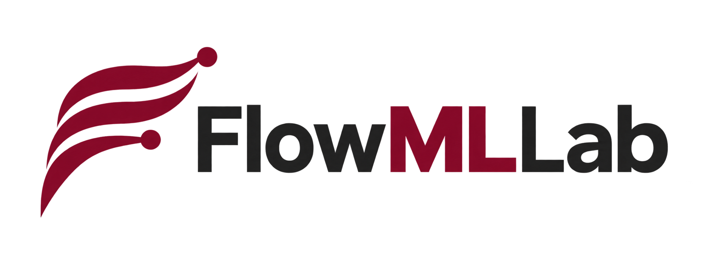</h1>

**New in v1.9.0:** Week 16 now includes NASA SEEB-ALR original geometry and reference records, a frozen-prediction neural audit, and detailed guides that distinguish cone verification, experimental CFD validation and surrogate testing. The notebook runs from a clean checkout. [Release notes](RELEASE_NOTES_v1.9.0.md).

**Week 16:** [Supersonic shape optimization](notebooks/week16/README.md):
44 new Gmsh/SU2 axisymmetric Euler cases, an executed learning-and-design notebook,
an expanded lecture, and fresh CFD verification of the optimized geometry.
On the finer mesh, peak near-field Cp decreases by 20.8% and pressure drag by 4.5%.
These are near-field results; atmospheric propagation and ground loudness are not computed.

**Week 14:** [RANS, PINN and neural turbulence closures](notebooks/week14/README.md)
based on Lars Davidson's pyCALC-RANS workflow: an executed teaching notebook,
[seven-page lecture](lectures/week14_rans_pinn_nn.pdf), and a transparent reproduction
audit. Full paper-level numerical reproduction is not claimed.

Learn scientific machine learning through reproducible fluid-mechanics experiments:
generate numerical data, compare transparent baselines with learned models, and
check both prediction error and physical fidelity.

Developed for **MIE 690A: AI in Fluid Mechanics**, University of Massachusetts
Amherst. The course now includes **44 notebooks and 27 lecture PDFs**; every module
has a row in the course table below.

## Start here

**Research provenance:** the article-linked DSMC cases were produced in earlier
research by Ehsan Roohi and collaborators, then brought into FlowMLLab for
teaching. The course adds new code and baselines, not a new origin for those
data. See [per-case papers, data lineage, reuse limits and AI-assistance
disclosure](DATA_PROVENANCE.md).

| Your goal | Open |
| --- | --- |
| Start the guided-project evidence chain after Week 4 | [Launch the 20-minute P0 Colab](https://colab.research.google.com/github/Ehsan-Roohi/FlowMLLab/blob/main/notebooks/week05_06/P0_Project_Setup.ipynb) |
| Follow the course | [Course map](COURSE_MAP.md) · [All notebooks](notebooks/README.md) · [Lectures](lectures/README.md) · [Glossary](docs/GLOSSARY.md) |
| Install and reproduce the results | [Setup and validation](START_HERE.md) |
| Explore the scientific evidence | [Results and technical guide](docs/RESULTS_GUIDE.md) · [Interactive cavity demo](demo/README.md) |

## Continue through the course

Each week has its own row, including the incremental laboratories.
Weeks 5 and 6 share a project pack and lecture guide, but have separate learning goals.

| Week | Topic | Notebook / lab | Lecture |
| --- | --- | --- | --- |
| [1](#week-1--numerical-foundations) | Python, numerical methods and CFD validation | [Week 1 labs](notebooks/week01/) | [Lecture 1](lectures/week01_numerical_foundations.pdf) |
| [1.1](#week-11--ai-assisted-scientific-software) | Specification, verification, physical gates and accountable AI use | [Week 1.1 lab](notebooks/week01_1/W1_1_AI_Assisted_Scientific_Software.ipynb) | [Lecture 1.1](lectures/week01_1_ai_assisted_scientific_software.pdf) |
| [2](#week-2--supervised-learning-and-rarefaction) | Features, scaling, baselines and model validity | [Week 2 lab](notebooks/week02/AI_in_Fluids_Week2_Colab_Expanded.ipynb) | [Lecture 2](lectures/week02_supervised_learning_rarefaction.pdf) |
| [2.1](#week-21--probabilistic-uncertainty) | Bayesian prediction, calibration and uncertainty | [Week 2.1 lab](notebooks/week02_1/Probabilistic_UQ_CFD.ipynb) | [Lecture 2.1](lectures/week02_1_probabilistic_uq.pdf) |
| [3](#week-3--kinetic-theory-and-dsmc) | Maxwellian sampling and particle simulation | [Week 3 labs](notebooks/week03/) | [Lecture 3](lectures/week03_kinetic_dsmc.pdf) |
| [4](#week-4--cavity-surrogates-and-deeponet) | CFD datasets, field surrogates and operator learning | [Week 4 labs](notebooks/week04/) | [Lecture 4](lectures/week04_cavity_surrogates_deeponet.pdf) |
| [4.1](#week-41--classical-reduced-order-models) | POD–Galerkin and POD–DEIM | [Week 4.1 lab](notebooks/week04/W4_1_Classical_ROM_Cavity.ipynb) | [Week 4 companion](lectures/week04_cavity_surrogates_deeponet.pdf); theory in lab |
| [4.2](#week-42--stokes-to-navier-stokes-correction) | Matched Stokes input and learned Navier–Stokes correction | [Week 4.2 lab](notebooks/week04/W4_Lab4_Stokes_to_Navier_Stokes.ipynb) | [Week 4.2 companion](lectures/week04_2_stokes_to_navier_stokes.pdf) |
| [5](#week-5--physics-guided-projects) | POD, physics-guided learning and frozen project protocols | [Week 5 project setup and tracks](notebooks/week05_06/README.md) | [Shared Weeks 5–6 guide](lectures/week05_06_project_guide.pdf) |
| [6](#week-6--physical-validation-and-final-evidence) | Closure testing, physical validation and reproducibility | [Week 6 closure track](notebooks/week05_06/P6_FP_Cavity_Closure.ipynb) · [All tracks](notebooks/week05_06/README.md) | [Shared Weeks 5–6 guide](lectures/week05_06_project_guide.pdf) |
| [7](#week-7--unsteady-cylinder-wakes) | LBM, vortex shedding and autonomous surrogates | [Week 7 lab](notebooks/week07/W7_Lattice_Boltzmann_Cylinder_Student.ipynb) | [Lecture 7](lectures/week07_cylinder_lbm_neural_surrogate.pdf) |
| [7.1](#week-71--rarefied-hypersonic-cylinder) | DSMC fields and Mach-to-field operators | [Week 7.1 lab](notebooks/week07_1/W7_1_Hypersonic_Rarefied_Cylinder_DeepONet.ipynb) | [Lecture 7.1](lectures/week07_1_hypersonic_rarefied_cylinder.pdf) |
| [7.2](#week-72--sparse-sensor-state-estimation) | Causal filtering of a cylinder wake from noisy sparse sensors | [Week 7.2 lab](notebooks/week07_2/README.md) | [Lecture 7.2](lectures/week07_2_cylinder_state_estimation.pdf) |
| [7.3](#week-73--self-supervised-pretraining-and-label-efficiency) | Masked-autoencoder pretraining on unlabelled wakes; error versus number of labelled frames against gappy POD | [Week 7.3 lab](notebooks/week07_3/README.md) | [Lecture 7.3](lectures/week07_3_masked_pretraining.pdf) |
| [7.4](#week-74--diverse-wake-pretraining) | Representation transfer and target-label efficiency for lift | [Week 7.4 lab](notebooks/week07_4/README.md) | [Lecture 7.4](lectures/week07_4_diverse_wake_pretraining.pdf) |
| [8](#week-8--gas-dynamics-and-sciml) | Exact compressible-flow branches and learned inverse maps | [Week 8 labs](notebooks/week08/README.md) | [Lecture 8](lectures/week08_gas_dynamics_sciml.pdf) |
| [9](#week-9--rarefied-micro-step-and-micro-nozzle) | Geometry-dependent and shock-aligned operators | [Week 9 labs](notebooks/week09/README.md) | [Lecture 9](lectures/week09_rarefied_deeponet_case_studies.pdf) |
| [10](#week-10--dsmc-cavity-and-molecular-shocks) | Cavity and mono/diatomic shock reproduction | [Week 10 lab](notebooks/week10/README.md) | [Lecture 10](lectures/week10_dsmc_data_driven_surrogates.pdf) |
| [10.1](#week-101--ab-initio-collision-deeponet) | Molecular scattering and DSMC cylinder contours | [CPU scattering lab](notebooks/week10_1/W10_1_Collision_Map_Surrogate_Audit.ipynb) · [Research fields](results/abinitio_deeponet_cylinder/README.md) | [Lecture companion](lectures/week10_1_abinitio_collision_deeponet.md) |
| [11](#week-11--shock-and-vortex-identification) | Shock/vortex identification; alpha and pressure methods for vapor clouds | [Week 11 lab](notebooks/week11/README.md) | [Lecture 11](lectures/week11_shock_vortex_identification.pdf) |
| [12](#week-12--dsmc-moment-reconstruction) | Additive moments, observation-conditioned reconstruction and support | [Week 12 lab](notebooks/week12/README.md) | [Lecture 12](lectures/week12_dsmc_moment_reconstruction.pdf) |
| [13](#week-13--rectangular-cavity-pinn-research-audit) | Streamfunction PINNs: build one on CPU, then audit deep-cavity and four-case research runs | [Week 13 lab](notebooks/week13/README.md) | [Lecture 13](lectures/week13_rectangular_cavity_pinn.pdf) |
| [14](#week-14---rans-inverse-pinn-and-neural-turbulence-closures) | Davidson-based RANS, inverse PINN and neural closures | [Week 14 lab](notebooks/week14/README.md) | [Lecture 14](lectures/week14_rans_pinn_nn.pdf) |
| [15](#week-15--geometry-aware-neural-operators) | Geometry and topology generalization across DeepONet, Geom-DeepONet, Geo-FNO, SMART, GeoTransolver and DoMINO | [Complete Week 15 notebook](notebooks/week15/W15_Complete_Geometry_Generalization.ipynb) | [Expanded Lecture 15](lectures/week15_geometry_generalization.pdf) |
| [16](#week-16--supersonic-shape-optimization) | Supersonic shape optimization with verified Gmsh/SU2 CFD | [Week 16 notebook](notebooks/week16/W16_Supersonic_Shape_Optimization.ipynb) | [Lecture 16](lectures/week16_supersonic_shape_optimization.pdf) |

## Results gallery · in course order

The figures below connect each week to an experiment or teaching example.
Follow the captions for data provenance and validity limits; the
[technical guide](docs/RESULTS_GUIDE.md) retains the detailed protocols and metrics.

### Week 1 — Numerical foundations

**Problem:** Lid-driven cavity benchmark. 
**CFD / data:** FlowMLLab finite-difference streamfunction–vorticity Navier–Stokes solver. 
**Learning method:** No neural network; CFD is checked against Ghia centreline data.

Start with a numerical solution and an independent benchmark: cavity fields,
centerlines and Ghia comparisons establish what a useful training label means.
[Figure contract](ARTICLE_FIGURE_MAP.md)

### Week 1.1 — AI-assisted scientific software

**Problem:** Verify cavity diagnostics and physical constraints. 
**CFD / data:** Analytic manufactured solution and a retained FlowMLLab cavity field. 
**Learning method:** No trained network; independent tests verify AI-proposed code.

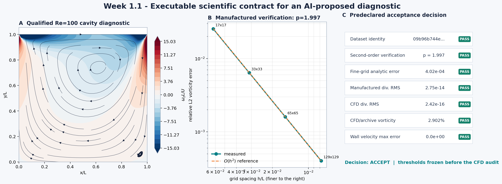

An independently derived manufactured solution establishes second-order
convergence before the accepted `Re=100` cavity case is opened. Seven frozen gates
then bind array semantics, vorticity convention, incompressibility, wall
conditions, thresholds and the complete data hash into one machine-readable
decision. [Run the lab](notebooks/week01_1/W1_1_AI_Assisted_Scientific_Software.ipynb)
· [Read the scientific specification](notebooks/week01_1/SCIENTIFIC_SPEC.md)
· [Complete the agent-assisted GitHub assignment](notebooks/week01_1/ASSIGNMENT.md)
· [Inspect the retained evidence](results/week01_1_scientific_software/README.md)

### Week 2 — Supervised learning and rarefaction

**Problem:** Predict response across Knudsen number and accommodation. 
**CFD / data:** Synthetic teaching equation; no CFD/DSMC run. 
**Learning method:** Ridge regression, not a neural CFD model.

The Week-2 notebook's synthetic response illustrates how Knudsen number and
accommodation affect the learning problem. This is a teaching equation, not a
CFD/DSMC result. [Run the lab](notebooks/week02/AI_in_Fluids_Week2_Colab_Expanded.ipynb)

### Week 2.1 — Probabilistic uncertainty

**Problem:** Predict cavity quantities and fields with uncertainty. 
**CFD / data:** Retained FlowMLLab cavity CFD data. 
**Learning method:** Bayesian regression and POD–Gaussian processes; non-neural models.

Bayesian and POD–Gaussian-process predictions are checked with proper scores
and blind coverage; the retained under-coverage is part of the lesson.
[UQ evidence](results/probabilistic_uq/README.md)

### Week 3 — Kinetic theory and DSMC

**Problem:** Predict wall pressure from molecular motion. 
**CFD / data:** FlowMLLab hard-sphere DSMC with no-time-counter (HS–NTC) collisions. 
**Learning method:** No network in the displayed particle-solver validation.

Connect molecular sampling to a macroscopic observable through the executed
HS–NTC wall-pressure validation.
[Validation contract](ARTICLE_FIGURE_MAP.md)

### Week 4 — Cavity surrogates and DeepONet

**Problem:** Map Reynolds number to cavity fields. 
**CFD / data:** FlowMLLab finite-difference streamfunction–vorticity Navier–Stokes solver. 
**Learning method:** POD–DeepONet: learned parameter-to-coefficient map with a fixed POD spatial basis.

Complete-case testing combines field error, wall/divergence checks, reference
centerlines and measured inference cost.
[Model and validation evidence](results/pod_deeponet/README.md)

### Week 4.1 — Classical reduced-order models

**Problem:** Evolve cavity flow in a reduced state space. 
**CFD / data:** The Week-4 cavity equations and finite-difference full-order model. 
**Learning method:** POD–Galerkin and POD–DEIM; neither is a neural network.

Compare reduced dynamics, hyper-reduction, blind trajectories and the offline/online
cost tradeoff. [Run the ROM lab](notebooks/week04/W4_1_Classical_ROM_Cavity.ipynb)

### Week 4.2 — Stokes-to-Navier-Stokes correction

**Problem:** Predict the nonlinear cavity-flow correction from a matched Stokes field. 
**CFD / data:** Constant and spatially diverse lid conditions, solved independently on 25 × 25 and 51 × 51 grids. 
**Learning method:** A POD-based neural correction conditioned on the Stokes field and Reynolds number; pressure is recovered afterwards.

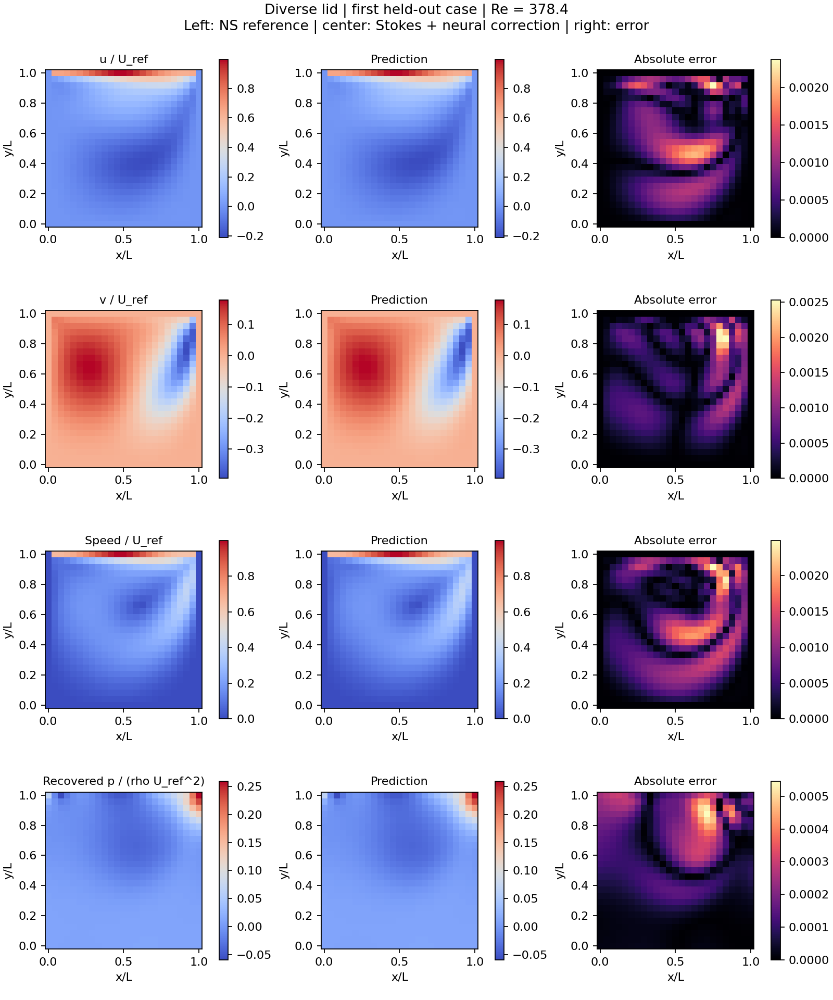

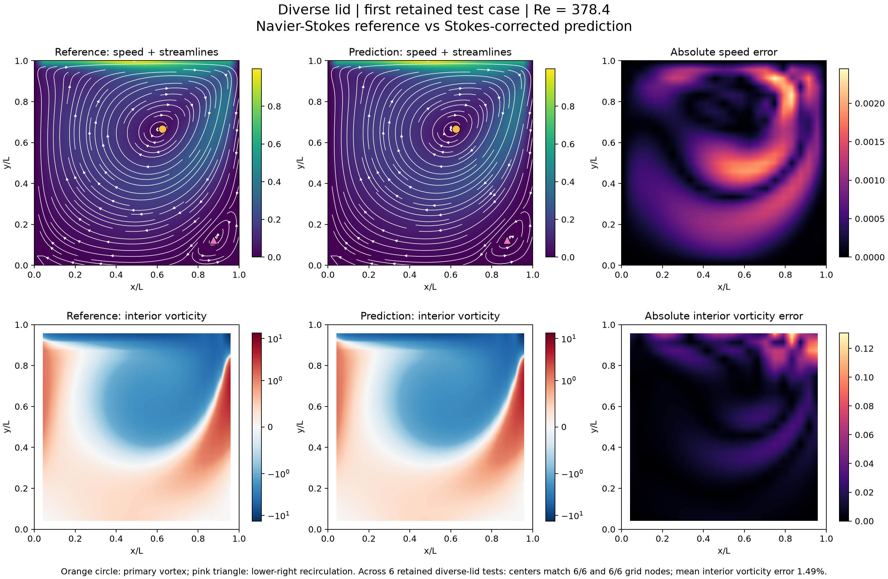

This held-out diverse-lid example shows reference fields, predictions and absolute
errors, including speed streamlines and interior vorticity. Across six retained
same-family tests per lid type, the primary and lower-right recirculation centers
match the reference grid nodes in all cases; mean interior vorticity errors are
0.12% for constant lids and 1.49% for diverse lids. The contours are linearly
interpolated for display; errors use the original 25 × 25 samples. These same-grid
regression tests do not establish grid-independent CFD accuracy or independently
validated corner vortices. [See the constant-lid vortex figure](figures/Cavity_constant_streamlines_vorticity.png)
· [Run the Week 4.2 lab](notebooks/week04/W4_Lab4_Stokes_to_Navier_Stokes.ipynb)
· [Read the ten-page companion](lectures/week04_2_stokes_to_navier_stokes.pdf)
· [Inspect the retained results](results/stokes_refined/README.md)

The 51 × 51 refinement solves all 184 cases again and retrains the selected
three-seed POD correction. Mean same-family velocity errors are 0.097% for
constant lids and 0.810% for diverse lids, compared with 0.107% and 0.917%
at 25 × 25. The 25-to-51 CFD velocity change is still about 20.6% for constant
tests and 17.8% for diverse tests when the fine solution is sampled on the
coarse grid. This is a better resolved surrogate experiment, not a claim of
mesh-independent CFD accuracy.

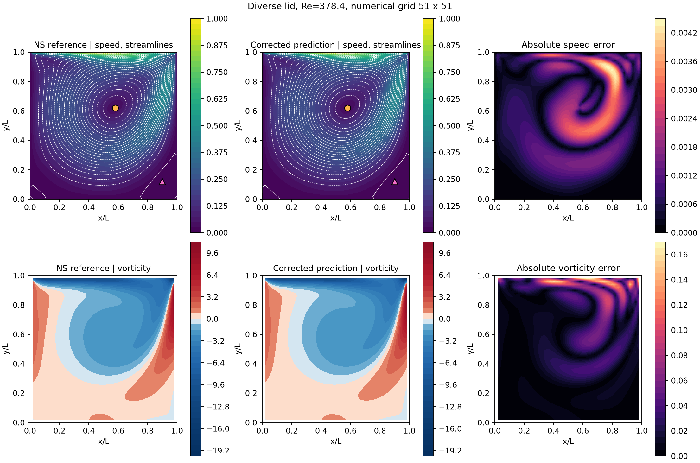

[Open the 51 × 51 validation notebook](notebooks/week04/W4_Lab4_Grid51_Validation.ipynb)
· [Read the 51 × 51 PDF addendum](lectures/week04_2_grid51_validation.pdf)
· [Inspect the refined data and metrics](results/stokes_grid51/README.md)

### Week 5 — Physics-guided projects

**Problem:** Build a cavity surrogate or reconstruct a wake from sparse sensors. 
**CFD / data:** FlowMLLab cavity CFD for the animation; D2Q9–TRT LBM for the wake extension. 
**Learning method:** POD–DeepONet for the animation; gappy POD, sensor placement and SINDy in the extension.

Use this retained cavity experiment as a project starting point: freeze a baseline,
change one modeling choice and evaluate complete unseen cases.
[Project pack](notebooks/week05_06/README.md) · [Interactive demo](demo/README.md)

Extend the project with the [sparse sensing lab](notebooks/week05_06/W5_Lab2_Sparse_Sensing_Dynamics.ipynb):
reconstruct fields from limited measurements and inspect the
[retained modal-method comparisons](results/modal_labs/README.md).
This companion uses the Week 7 cylinder-wake data and should be taken after
the Week 7 module.

### Week 6 — Physical validation and final evidence

**Problem:** Recover and validate cavity pressure. 
**CFD / data:** FlowMLLab cavity CFD with least-squares pressure-gradient reconstruction. 
**Learning method:** No neural model in this pressure-recovery figure.

This existing pressure benchmark illustrates the independent physical checks
expected in a final evidence bundle; it is not a learned Fokker–Planck result.
Week 6 completes the selected Week-5 track, including optional closure testing.
[Project completion guide](notebooks/week05_06/README.md)

### Week 7 — Unsteady cylinder wakes

**Problem:** Predict future cylinder-wake vorticity. 
**CFD / data:** FlowMLLab D2Q9–TRT lattice Boltzmann solver (LBM). 
**Learning method:** The lead result is a phase-stable learned Fourier decoder, not an autoregressive CNN; POD and CNN baselines are linked below.

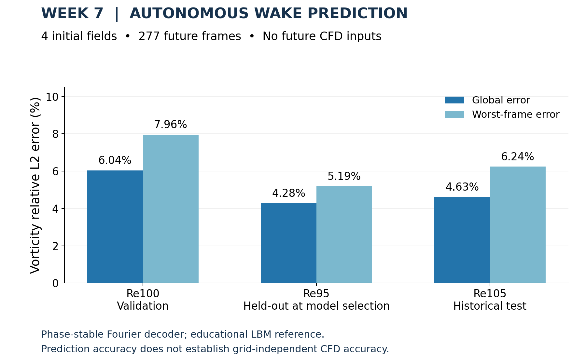

[Watch the LBM/decoder wake animation](results/cylinder_phase/re095_phase_stable_lbm_vs_decoder.webp)

Four initial fields seed **277 autonomous future frames** at unseen **Re = 95**,
with **4.281% global vorticity error** against educational LBM labels.
The grid study passes practical fine-pair limits but fails the formal
asymptotic/GCI gate; these labels are not high-fidelity DNS.
[Video](results/cylinder_phase/re095_phase_stable_lbm_vs_decoder.mp4)
· [Model evidence](results/cylinder_phase/README.md)
· [Grid study](results/cylinder_grid_convergence/README.md)

Continue with the [modal forecasting lab](notebooks/week07/W7_Lab2_Modal_Forecasting.ipynb)
and its [reproducible evidence](results/modal_labs/README.md).
The [Re100 D40 dataset](results/cylinder_d40/README.md) provides force histories,
final fields and a three-grid comparison. A separate
[frozen-model Re115 evaluation](results/cylinder_re115_evaluation/README.md)
reports 3.17% global vorticity error, with sampling and pressure limitations.

### Week 7.1 — Rarefied hypersonic cylinder

**Problem:** Predict cylinder fields as Mach number varies. 
**CFD / data:** Author-supplied DSMC archives; exact source/checkpoint attribution remains subject to the linked audit. 
**Learning method:** 3×96 tanh MLP versus Mach interpolation; separate from the article's Fusion-DeepONet.

The original **400 × 400 Mach-8.5** fields are rendered with continuous contours.
Error panels compare against Mach-8/Mach-9 interpolation; gray marks the masked
solid/sentinel region.
[Figure provenance](results/hypersonic_cylinder_week7_1/cylinder_homepage_provenance.json)

Across the five held-out cases in the **compact teaching dataset**, interpolation
errors are **0.398% / 0.609% / 0.779%** for local Mach, temperature and pressure.
The trained **3×96 tanh MLP** gives **1.53% / 2.70% / 2.50%**, with training
errors **1.26% / 2.21% / 1.82%**. Interpolation still wins; the earlier
underfit random-feature ridge is no longer the default classroom comparison.
These are new teaching runs, not the published model's accuracy.
[Data and paper](data/hypersonic_cylinder/README.md) · [MLP metrics](results/hypersonic_cylinder_week7_1/mlp_metrics.json)

### Week 7.2 — Sparse-sensor state estimation

**Problem:** Estimate a wake from noisy velocity sensors. 
**CFD / data:** Retained FlowMLLab D2Q9–TRT LBM Re110 trajectory. 
**Learning method:** POD–DMD dynamics and a Kalman filter; no neural network in this estimator.

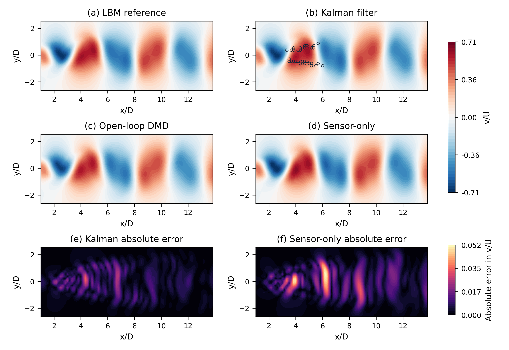

A validation-selected rank-8 Kalman filter assimilates 32 noisy transverse-velocity
sensors on the retained Re110 wake. Mean test relative L2 is **2.18%**, versus
**3.16%** for matched sensor-only POD reconstruction and **4.36%** for open-loop
DMD. Its nominal 95% marginal intervals cover only **55.1%** of sampled values;
the overconfidence is retained as a model failure.
[Protocol, all baselines and limits](results/week07_2_state_estimation/README.md)

### Week 7.3 — Self-supervised pretraining and label efficiency

**Problem:** Complete a wake field from 25% of its patches for a new trajectory with few labelled frames. 
**CFD / data:** The four retained FlowMLLab D2Q9–TRT LBM wakes (Re = 90, 100, 105, 110). 
**Learning method:** A masked autoencoder pretrained on the unlabelled Re90/Re100 wakes (He et al., 2022; the MAPA protocol of Tang, Spalding and Cogan, 2026), used zero-shot, with a frozen linear probe, fine-tuned and from scratch; gappy POD with transferred, target-only and pooled bases as the matched classical baselines.

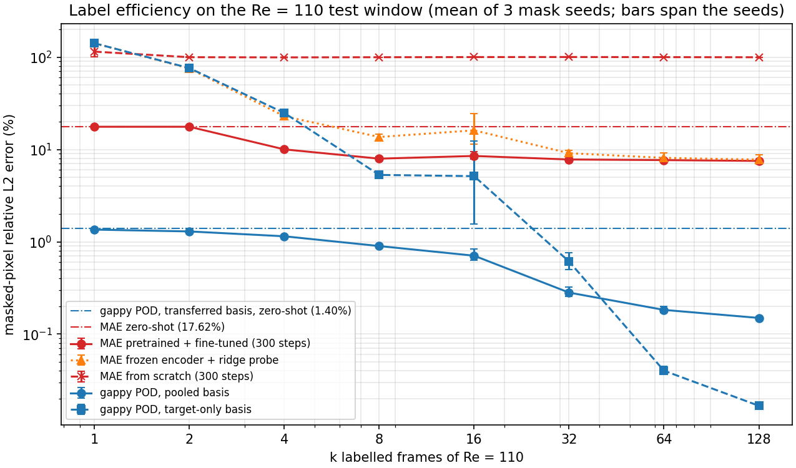

The pretrained pipeline beats the same architecture from scratch at every label
count under the matched 300-step downstream budget. At `k = 1, 2`, validation
early stopping keeps the zero-shot pretrained weights; label-driven improvement
starts at `k = 4`. With the full pretraining budget the from-scratch model still
fails at `k = 2`. Gappy POD with a basis transferred from the unlabelled wakes is
nevertheless an order of magnitude more accurate (**about 1.4%** zero-shot
against **about 18%** for the network), and its pooled basis improves with every
label. The classical win is retained and explained: this periodic wake is low-rank.
[Protocol, all methods and limits](results/week07_3_pretraining/README.md)

### Week 7.4 — Diverse-wake pretraining

**Problem:** Decode instantaneous lift on Reynolds trajectories excluded from pretraining. 
**CFD / data:** Sixteen compact D2Q9-TRT LBM trajectories, Re60-135; eleven development cases, Re105 validation, four target cases. 
**Learning method:** Frozen pretrained and random encoders plus ridge, compared with POD-32 plus ridge.

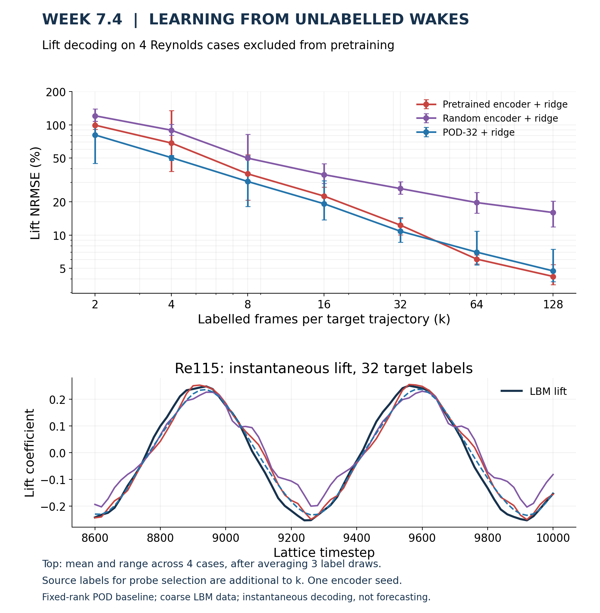

The retained pretrained encoder achieves **12.31% mean lift NRMSE with 32 target labels**, versus **16.02% for the random encoder with 128**: better mean accuracy with one-quarter as many target labels. POD-32 leads through k=32; the pretrained encoder has lower mean error at k=64 and 128. This is a MAPA-inspired teaching result, not a reproduction of MAPA or a universal neural advantage. Source labels used in ridge selection are additional to k. One encoder initialization and coarse, fixed-geometry CFD limit the claim.
[Protocol, per-trajectory results and limitations](results/week07_4_diverse_pretraining/README.md)

### Week 8 — Gas dynamics and SciML

**Problem:** Predict and invert compressible-flow relations. 
**CFD / data:** Exact gas-dynamics relations and numerical root finding; no spatial CFD run. 
**Learning method:** MLP inverse maps versus interpolation and radial-basis-function baselines.

Preserve physical branches while comparing exact solvers, interpolation and
learned inverse maps under matched budgets.
[Benchmarks and validity limits](results/gas_dynamics_week8/README.md)

### Week 9 — Rarefied micro-step and micro-nozzle

**Problem:** Predict geometry-dependent step fields and pressure-dependent nozzle fields. 
**CFD / data:** Author-supplied DSMC archives; the nozzle uses modified Bird-family exports with a documented boundary defect. 
**Learning method:** Step: geometry/coordinate MLP. Nozzle: shock-aligned POD with polynomial or tanh-MLP coefficient maps. Article and experimental DeepONet results are distinguished in the linked reports.

The independent H44 teaching model uses geometry and coordinates only.
[Step evidence and provenance](results/mahdavi_deeponet/README.md)

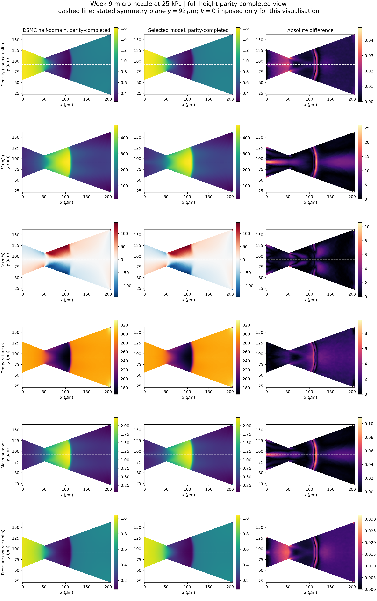

The selected registered-POD polynomial model and trained neural branches are
compared with the original interpolation baseline. The displayed transverse
velocity on the symmetry plane is the prescribed **V = 0** boundary condition,
not a learned accuracy result. The full-height field view is a parity-completed
visualisation about that plane, not new CFD. Raw exports have a documented symmetry defect;
these are historical-holdout regression results, not fresh blind validation.
[Nozzle report](results/nozzle_transport/README.md)
· [Raw boundary audit](results/nozzle_transport/symmetry_boundary_audit.png)

#### Week 9 Lab 3 — Moving-throat data-alignment audit

**Problem:** Detect a silent branch/trunk correspondence error before fitting a nozzle operator. 
**Reference:** Independent quasi-1D isentropic solutions for three moving-throat geometries. 
**Learning method:** Matched 2×48 tanh MLP surrogates isolate the effect of correct versus corrupted trunk-coordinate pairing.

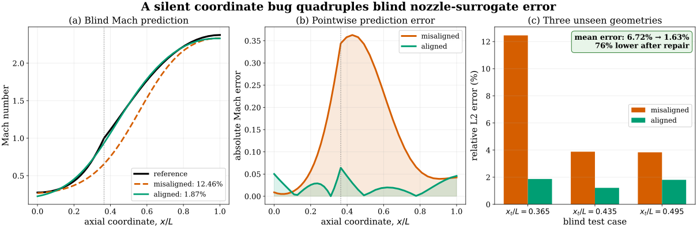

In a controlled quasi-1D stress test, reusing the first nozzle's coordinates
for every target preserves array shape but raises mean relative L2 error on
three unseen geometries from **1.63% to 6.72%**. Correct pairing reduces blind
error by **76%** under the same architecture, training cases and random seed.
This isolates the value of the pre-fit audit; it is not a DSMC accuracy claim.
[Run the audit](notebooks/week09/W9_Lab3_Nozzle_Data_Alignment_Audit.ipynb) ·
[Metrics and protocol](results/nozzle_alignment_audit/README.md) ·
[Companion notes](lectures/week09_3_nozzle_data_alignment.pdf)

### Week 10 — DSMC cavity and molecular shocks

**Problem:** Reconstruct rarefied cavity and mono/diatomic shock data. 
**CFD / data:** Author-supplied article DSMC tables, not new particle-solver runs. 
**Article learning method:** the cavity uses a family of coordinate MLP experts,
one per training Kn: fixed Fourier features of $(x,y)$ feed three 256-unit
Swish dense layers, and neighboring experts are fused by log-Kn interpolation.
It is **not DeepONet**. The article uses DeepONet for its diatomic-shock study. 
**Displayed course reproduction:** direct log-Kn interpolation for the cavity and
POD–polynomial profile surrogates for the shocks. These displayed predictions do
not rerun the article's trained neural networks.

The article-data experiment retains **1.281% maximum primary cavity NRMSE**
and **1.018% maximum shock-profile relative L2 error**, with the data contract
and regeneration workflow available for inspection.
[Article (Roohi & Shoja-Sani, 2026)](https://doi.org/10.1016/j.ast.2025.110785)
· [Reproduction evidence](results/aescte_dsmc/README.md)
· [Data contract](data/aescte_dsmc/README.md)

### Week 10.1 — Ab initio collision DeepONet

**Problem:** Compute cylinder flow using a collision-angle surrogate. 
**CFD / data:** Author-supplied DS2V-based DSMC research runs. 
**Learning method:** DeepONet supplies scattering-angle tables, not whole-field predictions; the CPU lab is a separate Lennard-Jones analog.

Author-supplied research fields from the later DeepONet collision-angle package,
related to [Roohi, Shoja-sani and Stefanov, PoF 38, 057123 (2026)](https://doi.org/10.1063/5.0328463).
DSMC generates these fields using exact-derived or DeepONet-derived angle tables;
this is not a whole-field neural prediction or reproduction of the article's MLP.
Shared colors, **different times and sampling windows**: qualitative comparison only.
[All four colored fields and provenance](results/abinitio_deeponet_cylinder/README.md)
· [Surface pressure and heat flux](results/abinitio_deeponet_cylinder/README.md#surface-pressure-and-heat-flux)
· [Week 10.1 lecture companion](lectures/week10_1_abinitio_collision_deeponet.md)

[Run the CPU collision-map lab](notebooks/week10_1/W10_1_Collision_Map_Surrogate_Audit.ipynb):
solve a reduced Lennard-Jones scattering problem, check analytic limits and
audit a fitted surrogate using transport integrals. This executable analog is
separate from the Jäger research fields above; it does not reproduce the
article's potential or network.

### Week 11 — Shock and vortex identification

**Problem:** Identify shocks/vortex cores and test reconstruction before detection. 
**CFD / data:** Archived ShockVortexML compressible fields for the lead figure; FlowMLLab D2Q9–TRT LBM for the wake extension. The lead archive's exact producing-solver revision is not established here. 
**Learning method:** Harmonized Joint (HJ), a custom shared-encoder, multi-branch
encoder-decoder with specialist shock, vortex-core, wake/shear and expansion
paths. The displayed masks use the frozen task-preserving HJ shock-repair
checkpoint: the shared encoder and complete vortex pathway remain fixed while
the shock-specific path is adapted. HJ-joint and a capacity-matched U-Net are
comparison models, not the network shown here. A separate lab uses U-Net for
velocity-field reconstruction before physical vortex identification.

Six fresh fixed-checkpoint forward passes on existing airfoil and cylinder fields from
Roohi's [ShockVortexML research](https://github.com/Ehsan-Roohi/ShockVortexML).
ML-only outputs; previously inspected development-test cases, not human-validated accuracy.
[All six full-size figures and provenance](results/week11_research/README.md) ·
[Notebook and lecture](notebooks/week11/README.md).
Synthetic controls remain as the warm-up.

**Watch the extended research pipeline — airfoil and cylinder**

[▶ Watch the airfoil video (S9)](https://www.youtube.com/watch?v=ULA8x2jUEvA)
· [▶ Watch the cylinder video (S10)](https://www.youtube.com/watch?v=opVMf1OVdM4)
· [Explore both examples on Hugging Face](https://huggingface.co/spaces/ehsanroohi/ShockVortexML-Demo)
· [Download original-quality movies and provenance](https://github.com/Ehsan-Roohi/ShockVortexML/releases/tag/movies-localfront-v2-20260909)

Click the preview to open the video on YouTube. The left panel shows numerical
density schlieren; the right shows localized learned shock fronts, vortex-core
candidates, wake/shear and expanding-flow regions. These movies use the extended
local-front model with retained core/wake branches and the PM-v4 expansion-region
branch, a different configuration from the HJ control checkpoint described above.
Blue denotes expanding flow, not a validated centred Prandtl–Meyer fan.
These inspected research examples retain detection errors; their visual coverage
is not an independent accuracy measurement.

**Real-field extension:** [U-Net reconstruction followed by vortex identification](results/week11_reconstruction/README.md)
compares interpolation, reconstructed velocity plus swirling strength, and direct
mask prediction on the same retained LBM wake cases. Three training seeds, loss
histories and saved-checkpoint audits are included. These are weak-reference
vortex scores on coarse incompressible data, not shock accuracy or a blind test.

#### Hydrofoil vapor-cloud detection

**Problem:** Detect attached cavities and disconnected vapor clouds around a hydrofoil. 
**CFD / data:** The author's existing Fluent fields: 158 original alpha-input
snapshots, plus 16 shared moving-case snapshots for comparing the methods. 
**Methods:** Alpha-input context U-Net, fixed pressure threshold, pressure-only
3×3 model, pressure U-Net and pressure topology U-Net. The notebook reruns the
original saved models, including all three pressure-model seeds.

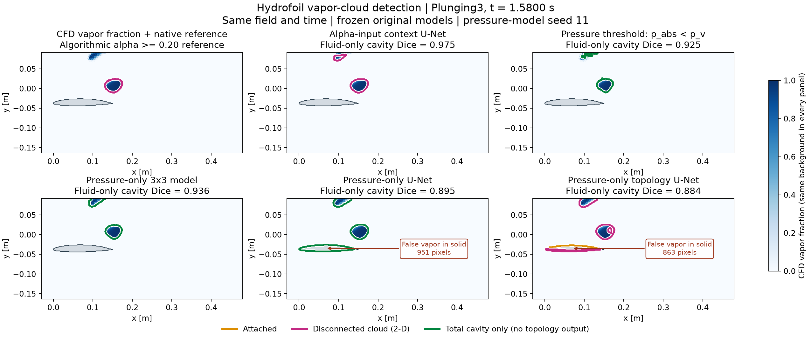

All panels show the same CFD field, geometry and time. Orange/magenta denote
attached/disconnected classes; green denotes total cavity for methods without
a topology output. Pressure models receive no alpha input. Colored contours
have white contrast halos; arrows mark erroneous vapor predictions
inside the solid hydrofoil. The displayed Dice excludes solid/uncertain support.
The illustrated frame has the largest valid CFD cavity area in this retained trajectory and
uses the first seed (11); the notebook includes all 16 frames and three seeds.
These inspected nontraining cases use algorithmic weak references and different
input information, so this is not a blind or matched-input accuracy ranking.

[Open in Colab](https://colab.research.google.com/github/Ehsan-Roohi/FlowMLLab/blob/main/notebooks/week11/W11_Cavitation_Cloud_Detection.ipynb)
· [Notebook](notebooks/week11/W11_Cavitation_Cloud_Detection.ipynb)
· [Detection and training code](flowmllab/cavitation_detection.py)
· [Alpha/pressure comparison code](flowmllab/cavitation_methods.py)
· [Results and provenance](results/week11_cavitation/README.md)
· [Expanded Lecture 11](lectures/week11_shock_vortex_identification.pdf)

### Week 12 — DSMC moment reconstruction

**Problem:** Reduce cavity heat-flux sampling noise. 
**CFD / data:** Author-supplied multi-seed DSMC with an independent finite-sample reference. 
**Learning method:** Archived observation-conditioned estimator in the lead figure; a separate 64×32 tanh patch MLP in the Noise2Noise lab.

Existing author-supplied DSMC cavity results associated with
[Roohi, arXiv:2609.01637](https://doi.org/10.48550/arXiv.2609.01637).
Eight seeds, both heat-flux components, 80 recomputed errors; no new DSMC or neural training.
Mean reference NRMSE for qy: Raw(3) 17.61%, Raw(10) 9.80%, conditioned estimator 4.34%.
[Full comparisons, profiles and all-seed errors](results/week12_research/README.md) ·
[Notebook and lecture](notebooks/week12/README.md). The independent reference still has sampling noise.

The companion [Noise2Noise-style MLP lab](results/week12_noise2noise/README.md)
trains on raw DSMC observations, compares seven estimators and reports both
held-out seeds. Its training results are documented separately from the
archived research reconstruction shown above.

### Week 13 — Rectangular-cavity PINN research audit

The front page retains only two representative comparisons. The notebook has three parts:
build and train a small streamfunction PINN on CPU and judge it against the Week 1 CFD
reference; inspect the deep-cavity field beside CFD; audit the four-case research matrix.
Complete fields, loss histories and the audit tables are in the [Week 13 notebook](notebooks/week13/W13_Rectangular_Cavity_PINN_Research.ipynb).

**Problem:** Solve square and deep lid-driven cavities. 
**CFD / data:** Nektar++ CFD and PINN fields are shown in separate, labelled rows on a common grid. The square case retains a near-matched CFD/PINN validation panel. 
**Learning method:** Streamfunction PINN with hard wall constraints, trained using Adam then SSBroyden2 in float64.

The Week 13 module develops streamfunction PINNs for square and deep lid-driven
cavities. Compare **Re = 100 and 400**, **H/L = 1 and 2**, and **Adam followed
by SSBroyden2** using retained float64 A100 runs, exact wall constraints and
independent residual checks. The selected D/W=2.2 comparison uses Nektar++ at
t=120 and PINN checkpoint 55118. Its 3.59% velocity relative L2 is not a final
mesh/steady-convergence claim: the retained lid profiles differ.

[Lecture](lectures/week13_rectangular_cavity_pinn.pdf) ·
[Notebook and results](notebooks/week13/README.md) ·
[Reproduction protocol](qa/WEEK13_PINN_MATRIX_PROTOCOL.md)

Preparatory reading covers [PINN residuals and hard boundary constraints](lectures/week04_2_pinn_cavity.pdf)
(this reading and its `results/week04_2_pinn_cavity/` evidence keep their original
Week 4.2 file numbering; the Week 4.2 row of the course table is the
Stokes-to-Navier-Stokes lab),
including [McDevitt's DeepPlasma cavity code](https://github.com/cmcdevitt2/DeepPlasma/tree/fcb1566eaa3253d4a4108fbac9d49a38fd10ad6b/LDC),
used with his permission. The earlier [Re=100 qualification and CFD comparison](results/week04_2_pinn_cavity/README.md)
provides supporting evidence for this module.

**Selected case A — Re=1000, D/W=2.2:** CFD and PINN speed/streamlines and
mean-zero pressure use common scales. The pressure scale is symmetric-log and
retains the full range.

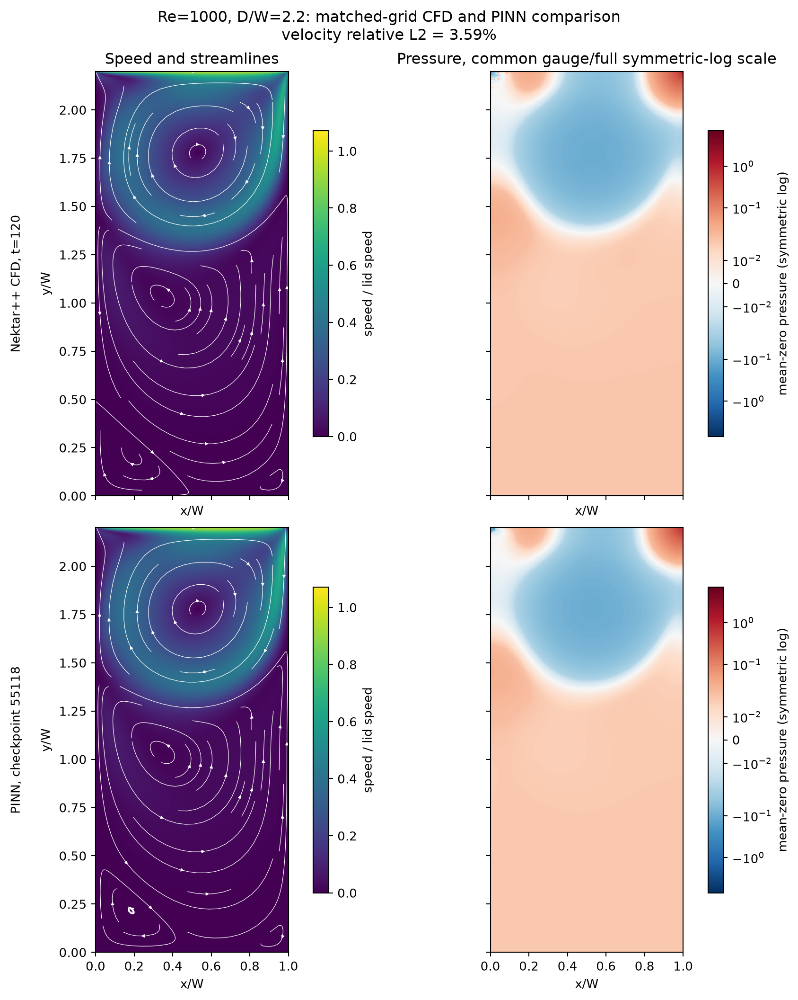

**Selected case B — Re=100, D/W=1:** the PINN fields, pointwise velocity
difference and CFD/PINN centreline profiles are kept as the compact square-case
qualification. This selected near-matched run has 3.10% interior velocity
relative L2; the separate frozen four-case matrix reports 3.343% for its
`Re=100`, `D/W=1` checkpoint.

### Week 14 - RANS, inverse PINN and neural turbulence closures

**Problem:** Improve turbulent kinetic energy without confusing a coefficient fit
with a validated coupled flow solution. 
**CFD / data:** Lars Davidson's pyCALC-RANS source-checkpoint channel restarts;
Lee-Moser DNS reference statistics. 
**Learning method:** Inverse PINN diffusion inference and the original small
ReLU coefficient-regression protocol, with a separately labeled interpolation control.

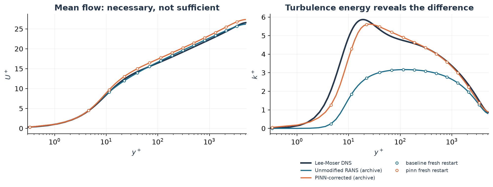

[Executed notebook and CPU setup](notebooks/week14/README.md) ·
[Lecture](lectures/week14_rans_pinn_nn.pdf) ·
[Run ledger](results/week14_validation/README.md) ·
[Paper-claim alignment](docs/WEEK14_PAPER_ALIGNMENT.md).

This completed teaching audit retains unsuccessful convergence criteria and
source-target regeneration differences. The plotted table-based PINN comparison
is **not** a verified reproduction of the paper's final PINN-NN curves.
The notebook reruns the small NN fit and checks retained CFD evidence; it does
not silently present saved solver fields as a fresh Run-All CFD calculation.

### Week 15 — Geometry-aware neural operators

[Complete executed notebook](notebooks/week15/W15_Complete_Geometry_Generalization.ipynb) ·
[data and reproduction guide](notebooks/week15/README.md) ·
[24-page lecture](lectures/week15_geometry_generalization.pdf) ·
[post-audit evidence summary](results/week15_postaudit/README.md).

The frozen split contains 100 training, 8 validation and 19 retrospective
double-step test cases, with the three cases of geometry `g005` quarantined:
its floor drops in two steps and then rises again, so it shares the test
family's two-descending-step motif without belonging to the test family, and it
is kept out of training, validation and the test alike. The split was
reconstructed from the masks: no training or validation mask contains the two
consecutive descending steps that define the test family. The enlarged training
examples appear first inside the comparison figure, with solid gray, fluid white,
and the physical 5:1 aspect ratio.

The displayed `g049/Re=100` comparison, selected because its larger vortex is
easier to inspect on the course homepage, places the CFD field above historical
ordinary DeepONet, historical Geom-DeepONet, historical Geo-FNO, and the
validation-tuned Geom-DeepONet, SMART and DoMINO models. Every row uses its own
streamlines, one shared banded speed scale, and no reverse-flow threshold overlay.

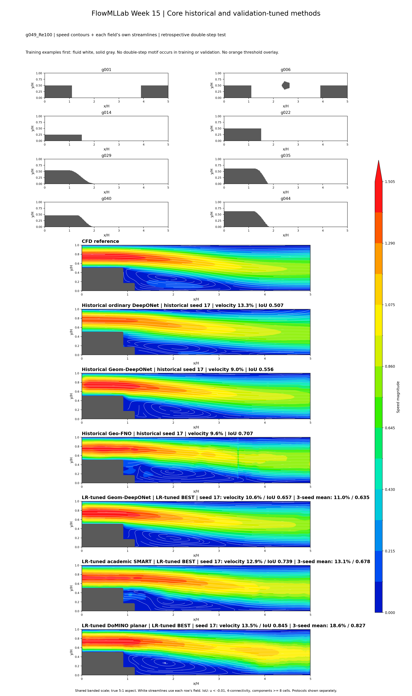

The historical seed-17 Geom-DeepONet run remains best in global velocity error
(9.86%), while
the learning-rate-selected Geom model is the strongest new global-field model
(10.53%). DoMINO has the best mean reverse-flow IoU in the tuned suite (0.534),
but its test velocity error is 15.59%, so this is a topology-localized gain rather
than the best overall field reconstruction.
The main unresolved failure is Reynolds-stratified: historical Geom has only
0.096 IoU at Re=25, increasing to 0.628 at Re=100. Tuned Geom, SMART and DoMINO
improve the Re=25 IoU to 0.261, 0.299 and 0.357, respectively, but still
overpredict reverse-flow magnitude. The training data contain no Re=25
single-step case below 0.5H, so this regime extrapolates in both geometry and
the Reynolds-number/step-height combination.

The learning-rate sweep uses only non-double-step validation cases and selects
`1e-3` over `3e-4` and `1e-4` for Geom, SMART and DoMINO within a three-point
grid whose best point is its upper edge. At Re=25, tuned Geom's selected-seed
IoUs are approximately 0.19, 0.24 and 0.36, so the seed-17 figures should not be
read as the three-seed mean. Fresh single-stage training at either `3e-4` or
`1e-3`, rather than learning-rate tuning alone, improves the historical footprint
detection. Company-inspired
PhysicsX and LIFT variants are explicitly transparent proxies, not proprietary
implementations. The public LR archive retains the common-scale ablation and
failed vortex cases; zonal and fixed-context ablations remain in the author's
private complete handoff and are not claimed as public release assets.

## Reuse and contribute

The installable Python package, numerical solvers, notebooks, and teaching
materials are open source. See [contribution guidelines](CONTRIBUTING.md), the
[roadmap](ROADMAP.md), and [source/attribution policy](THEORY_SOURCE_POLICY.md).
The [branch and release procedure](docs/BRANCH_AND_RELEASE_POLICY.md) describes
evidence promotion and reproducible notebook HTML.
Student submissions are not included.

[Read the software manuscript](manuscript/FlowMLLab_v1.1.0_Original_Software_Article.pdf)
· [Citation metadata](CITATION.cff)
· [Workshop, support, and consulting details](docs/RESULTS_GUIDE.md#workshops-support-and-consulting)

Current release: **v1.8.4** · [GitHub release](https://github.com/Ehsan-Roohi/FlowMLLab/releases/tag/v1.9.0)
· [all-version Zenodo DOI 10.5281/zenodo.22074169](https://doi.org/10.5281/zenodo.22074169)
· [Release notes](RELEASE_NOTES_v1.8.4.md).
The frozen v1.8.0 evidence archive remains at
[10.5281/zenodo.22840293](https://doi.org/10.5281/zenodo.22840293).
Previous v1.7.0 archive DOI: [10.5281/zenodo.22836172](https://doi.org/10.5281/zenodo.22836172);
the archived v1.6.1 record remains available at [10.5281/zenodo.22831809](https://doi.org/10.5281/zenodo.22831809).
For earlier versions and their archived records, see the
[release history](https://github.com/Ehsan-Roohi/FlowMLLab/releases).
The [all-versions DOI](https://doi.org/10.5281/zenodo.22074169) resolves to the latest published archive.

**Ehsan Roohi** · University of Massachusetts Amherst · [roohie@umass.edu](mailto:roohie@umass.edu)

Copyright © 2026 Ehsan Roohi. [MIT License](LICENSE).

### Week 16 — Supersonic shape optimization

**Problem:** Reduce near-field peak pressure at fixed body volume while constraining pressure drag.
**CFD / data:** 44 new Gmsh/SU2 8.5.0 axisymmetric Euler cases at Mach 1.8, plus cone, mesh/domain and off-design checks.
**Learning:** POD with ridge regression, MLP and Gaussian process; validation-selected MLP; fresh CFD design confirmation.

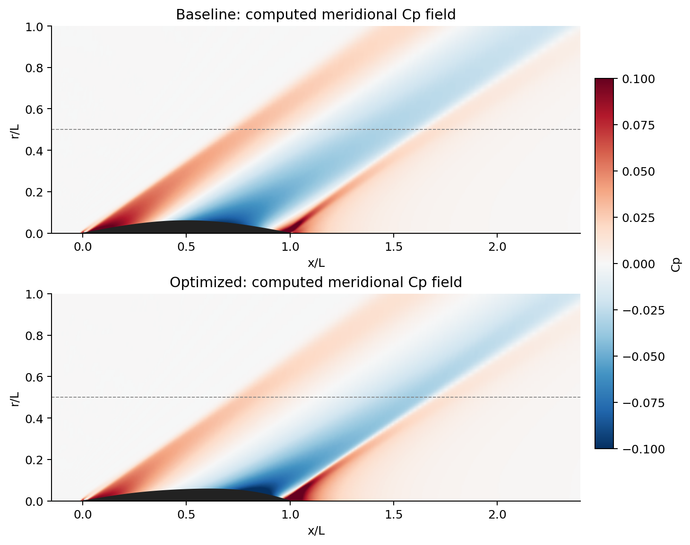

The best design retains 20.8% peak-Cp reduction and 4.5% pressure-drag reduction on the finer mesh. One alternative violates the drag constraint after CFD despite its surrogate prediction. The complete evidence reports both outcomes and separates interpolation from extrapolation.
[Notebook and assignment](notebooks/week16/README.md) · [Lecture](lectures/week16_supersonic_shape_optimization.pdf) · [Numerical evidence](results/week16_lowboom/README.md)
