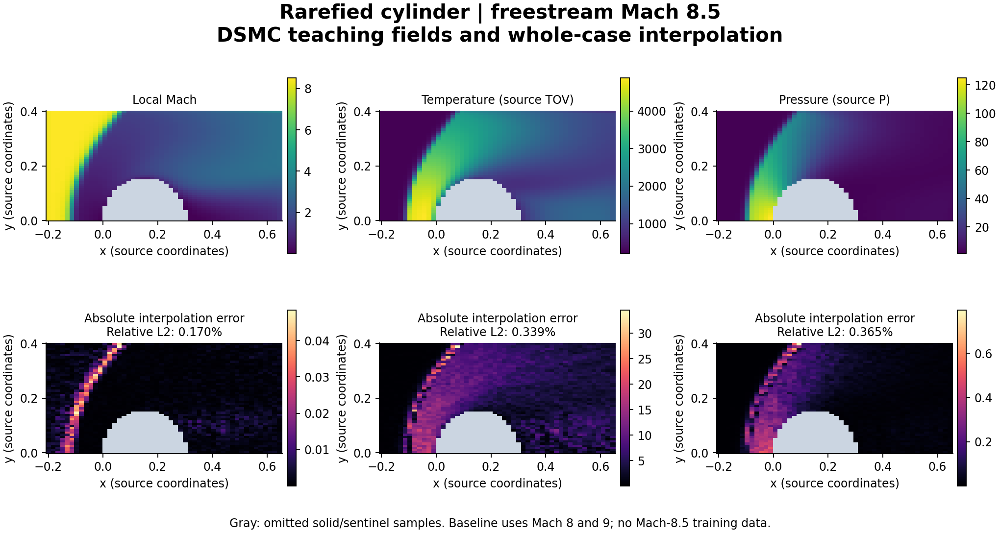
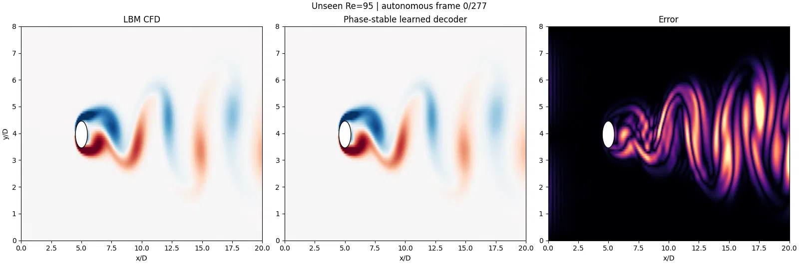

# FlowMLLab

Learn scientific machine learning through reproducible fluid-mechanics experiments:
generate numerical data, compare transparent baselines with learned models, and
check both prediction error and physical fidelity.

Developed for **MIE 690A: AI in Fluid Mechanics**, University of Massachusetts
Amherst. The course includes **25 notebooks and 12 lectures** (11 PDFs), from
numerical foundations to continuum and rarefied-flow research examples.

## Start here

| Your goal | Open |
| --- | --- |
| Run a first experiment in 20 minutes | [Launch the introductory Colab](https://colab.research.google.com/github/Ehsan-Roohi/FlowMLLab/blob/main/notebooks/week05_06/P0_Project_Setup.ipynb) |
| Follow the course | [Course map](COURSE_MAP.md) · [All notebooks](notebooks/README.md) · [Lectures](lectures/README.md) |
| Install and reproduce the results | [Setup and validation](START_HERE.md) |
| Explore the scientific evidence | [Results and technical guide](docs/RESULTS_GUIDE.md) · [Interactive cavity demo](demo/README.md) |

## Featured experiments

### Rarefied hypersonic cylinder · Week 7.1

Follow a bow shock through the author's DSMC fields and test prediction at an
unseen freestream Mach number. The figure uses the retained **Mach 8.5** case;
gray cells mark omitted solid/sentinel samples in the compact teaching grid.

Across the five held-out interpolation cases, the field-interpolation baseline
has **0.398% local-Mach, 0.609% temperature, and 0.779% pressure relative L2 error**.
The CPU teaching operator performs worse (19.6%, 28.1%, and 38.0%): students
investigate that result alongside Fusion-DeepONet architecture and uncertainty.
These scores refer to the compact DSMC derivative; they do not reproduce the
published full-model accuracy.

[Run Week 7.1 in Colab](https://colab.research.google.com/github/Ehsan-Roohi/FlowMLLab/blob/main/notebooks/week07_1/W7_1_Hypersonic_Rarefied_Cylinder_DeepONet.ipynb)
· [Lecture](lectures/week07_1_hypersonic_rarefied_cylinder.pdf)
· [Data and provenance](data/hypersonic_cylinder/README.md)
· [Full metrics](results/hypersonic_cylinder_week7_1/metrics.json)

### Unsteady cylinder wake · Week 7

Four initial fields seed a learned decoder that predicts **277 future frames**
at unseen **Re = 95**, with **4.281% global vorticity error** against the educational
LBM labels. The separate grid study passes practical fine-pair limits but fails
the formal asymptotic/GCI gate; these labels are not high-fidelity DNS.

[Watch the video](results/cylinder_phase/re095_phase_stable_lbm_vs_decoder.mp4)
· [Model evidence](results/cylinder_phase/README.md)
· [CFD grid study](results/cylinder_grid_convergence/README.md)

## Continue through the course

| Topic | Learning material | Results |
| --- | --- | --- |
| Numerical methods, supervised learning, kinetic theory | [Weeks 1–4 and incremental UQ / ROM labs](notebooks/README.md) | [Cavity POD–DeepONet](results/pod_deeponet/README.md) · [UQ](results/probabilistic_uq/README.md) |
| Physics-guided learning and research projects | [Weeks 5–6 project pack](notebooks/week05_06/README.md) | [Validation guide](docs/RESULTS_GUIDE.md#pod-deeponet-validation-result) |
| Exact gas dynamics and learned inverse maps | [Week 8](notebooks/week08/README.md) | [Benchmarks and limits](results/gas_dynamics_week8/README.md) |
| Rarefied micro-step and micro-nozzle flows | [Week 9](notebooks/week09/README.md) | [Step evidence](results/mahdavi_deeponet/README.md) · [Nozzle evidence](results/nozzle_transport/README.md) |
| DSMC cavity and mono/diatomic shocks | [Week 10](notebooks/week10/README.md) | [Article-data reproduction](results/aescte_dsmc/README.md) |

Every experiment separates complete physical cases, fits preprocessing on
development data, and compares with a non-neural baseline. Validation limits and
negative results remain part of the evidence. The
[technical guide](docs/RESULTS_GUIDE.md) contains the complete figure gallery,
metrics, reproduction commands, and known data defects.

## Reuse and contribute

The installable Python package, numerical solvers, notebooks, and teaching
materials are open source. See [contribution guidelines](CONTRIBUTING.md), the
[roadmap](ROADMAP.md), and [source/attribution policy](THEORY_SOURCE_POLICY.md).
Student submissions are not included.

[Read the software manuscript](manuscript/FlowMLLab_v1.1.0_Original_Software_Article.pdf)
· [Citation metadata](CITATION.cff)
· [Workshop, support, and consulting details](docs/RESULTS_GUIDE.md#workshops-support-and-consulting)

Source release: **v1.3.0**. The latest archived release is **v1.1.0**:
[Zenodo DOI](https://doi.org/10.5281/zenodo.22126785).

**Ehsan Roohi** · University of Massachusetts Amherst · [roohie@umass.edu](mailto:roohie@umass.edu)

Copyright © 2026 Ehsan Roohi. [MIT License](LICENSE).
