# FlowMLLab

Learn scientific machine learning through reproducible fluid-mechanics experiments:
generate numerical data, compare transparent baselines with learned models, and
check both prediction error and physical fidelity.

Developed for **MIE 690A: AI in Fluid Mechanics**, University of Massachusetts
Amherst. The course includes **25 notebooks and 12 lectures** (11 PDFs), from
numerical foundations to continuum and rarefied-flow research examples.

## Start here

**Research provenance:** the article-linked DSMC cases were produced in earlier
research by Ehsan Roohi and collaborators, then brought into FlowMLLab for
teaching. The course adds new code and baselines, not a new origin for those
data. See [per-case papers, data lineage, reuse limits and AI-assistance
disclosure](DATA_PROVENANCE.md). v1.4.0 remains the frozen archive; this cycle
is maintenance only, with no new modules or release.

| Your goal | Open |
| --- | --- |
| Run a first experiment in 20 minutes | [Launch the introductory Colab](https://colab.research.google.com/github/Ehsan-Roohi/FlowMLLab/blob/main/notebooks/week05_06/P0_Project_Setup.ipynb) |
| Follow the course | [Course map](COURSE_MAP.md) · [All notebooks](notebooks/README.md) · [Lectures](lectures/README.md) |
| Install and reproduce the results | [Setup and validation](START_HERE.md) |
| Explore the scientific evidence | [Results and technical guide](docs/RESULTS_GUIDE.md) · [Interactive cavity demo](demo/README.md) |

## Continue through the course

Each week has its own row, including the incremental laboratories.
Weeks 5 and 6 share a project pack and lecture guide, but have separate learning goals.

| Week | Topic | Notebook / lab | Lecture |
| --- | --- | --- | --- |
| [1](#week-1--numerical-foundations) | Python, numerical methods and CFD validation | [Week 1 labs](notebooks/week01/) | [Lecture 1](lectures/week01_numerical_foundations.pdf) |
| [2](#week-2--supervised-learning-and-rarefaction) | Features, scaling, baselines and model validity | [Week 2 lab](notebooks/week02/AI_in_Fluids_Week2_Colab_Expanded.ipynb) | [Lecture 2](lectures/week02_supervised_learning_rarefaction.pdf) |
| [2.1](#week-21--probabilistic-uncertainty) | Bayesian prediction, calibration and uncertainty | [Week 2.1 lab](notebooks/week02_1/Probabilistic_UQ_CFD.ipynb) | [Lecture 2.1](lectures/week02_1_probabilistic_uq.pdf) |
| [3](#week-3--kinetic-theory-and-dsmc) | Maxwellian sampling and particle simulation | [Week 3 labs](notebooks/week03/) | [Lecture 3](lectures/week03_kinetic_dsmc.pdf) |
| [4](#week-4--cavity-surrogates-and-deeponet) | CFD datasets, field surrogates and operator learning | [Week 4 labs](notebooks/week04/) | [Lecture 4](lectures/week04_cavity_surrogates_deeponet.pdf) |
| [4.1](#week-41--classical-reduced-order-models) | POD–Galerkin and POD–DEIM | [Week 4.1 lab](notebooks/week04/W4_1_Classical_ROM_Cavity.ipynb) | [Week 4 companion](lectures/week04_cavity_surrogates_deeponet.pdf); theory in lab |
| [5](#week-5--physics-guided-projects) | POD, physics-guided learning and frozen project protocols | [Week 5 project setup and tracks](notebooks/week05_06/README.md) | [Shared Weeks 5–6 guide](lectures/week05_06_project_guide.pdf) |
| [6](#week-6--physical-validation-and-final-evidence) | Closure testing, physical validation and reproducibility | [Week 6 closure track](notebooks/week05_06/P6_FP_Cavity_Closure.ipynb) · [All tracks](notebooks/week05_06/README.md) | [Shared Weeks 5–6 guide](lectures/week05_06_project_guide.pdf) |
| [7](#week-7--unsteady-cylinder-wakes) | LBM, vortex shedding and autonomous surrogates | [Week 7 lab](notebooks/week07/W7_Lattice_Boltzmann_Cylinder_Student.ipynb) | [Lecture 7](lectures/week07_cylinder_lbm_neural_surrogate.pdf) |
| [7.1](#week-71--rarefied-hypersonic-cylinder) | DSMC fields and Mach-to-field operators | [Week 7.1 lab](notebooks/week07_1/W7_1_Hypersonic_Rarefied_Cylinder_DeepONet.ipynb) | [Lecture 7.1](lectures/week07_1_hypersonic_rarefied_cylinder.pdf) |
| [8](#week-8--gas-dynamics-and-sciml) | Exact compressible-flow branches and learned inverse maps | [Week 8 labs](notebooks/week08/README.md) | [Lecture 8](lectures/week08_gas_dynamics_sciml.pdf) |
| [9](#week-9--rarefied-micro-step-and-micro-nozzle) | Geometry-dependent and shock-aligned operators | [Week 9 labs](notebooks/week09/README.md) | [Lecture 9](lectures/week09_rarefied_deeponet_case_studies.pdf) |
| [10](#week-10--dsmc-cavity-and-molecular-shocks) | Cavity and mono/diatomic shock reproduction | [Week 10 lab](notebooks/week10/README.md) | [Lecture 10](lectures/week10_dsmc_data_driven_surrogates.pdf) |

## Results gallery · in course order

The figures below connect each week to an experiment or teaching example.
Follow the captions for data provenance and validity limits; the
[technical guide](docs/RESULTS_GUIDE.md) retains the detailed protocols and metrics.

### Week 1 — Numerical foundations

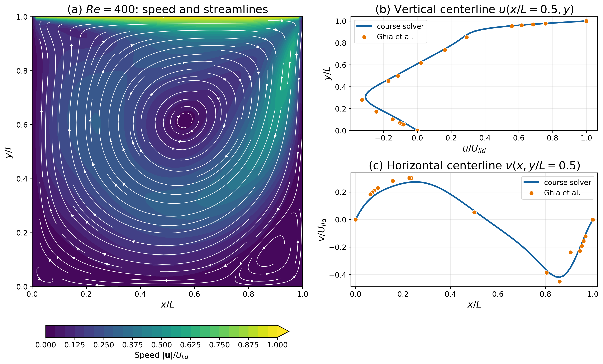

Start with a numerical solution and an independent benchmark: cavity fields,
centerlines and Ghia comparisons establish what a useful training label means.
[Figure contract](ARTICLE_FIGURE_MAP.md)

### Week 2 — Supervised learning and rarefaction

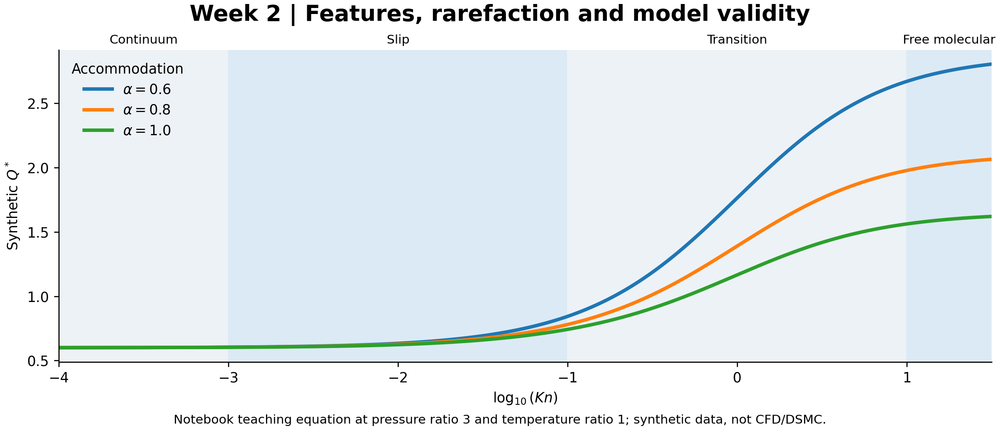

The Week-2 notebook's synthetic response illustrates how Knudsen number and
accommodation affect the learning problem. This is a teaching equation, not a
CFD/DSMC result. [Run the lab](notebooks/week02/AI_in_Fluids_Week2_Colab_Expanded.ipynb)

### Week 2.1 — Probabilistic uncertainty

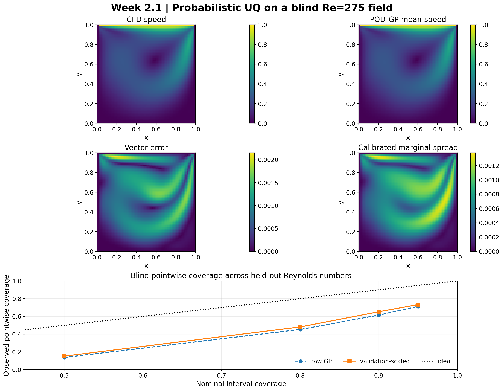

Bayesian and POD–Gaussian-process predictions are checked with proper scores
and blind coverage; the retained under-coverage is part of the lesson.
[UQ evidence](results/probabilistic_uq/README.md)

### Week 3 — Kinetic theory and DSMC

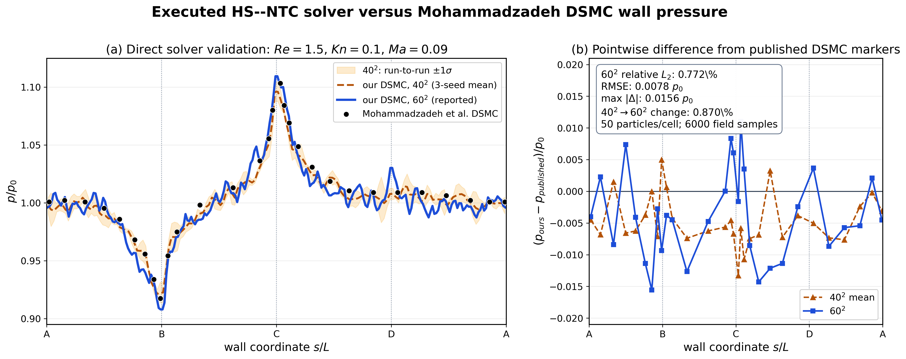

Connect molecular sampling to a macroscopic observable through the executed
HS–NTC wall-pressure validation.
[Validation contract](ARTICLE_FIGURE_MAP.md)

### Week 4 — Cavity surrogates and DeepONet

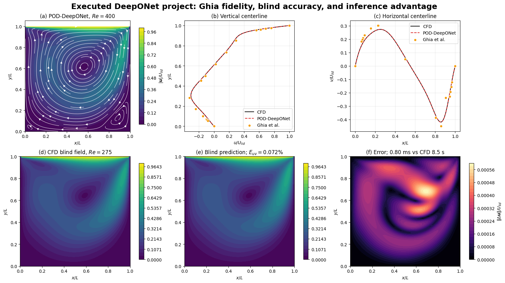

Complete-case testing combines field error, wall/divergence checks, reference
centerlines and measured inference cost.
[Model and validation evidence](results/pod_deeponet/README.md)

### Week 4.1 — Classical reduced-order models

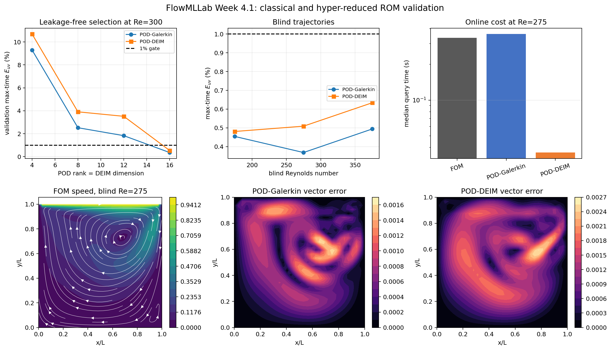

Compare reduced dynamics, hyper-reduction, blind trajectories and the offline/online
cost tradeoff. [Run the ROM lab](notebooks/week04/W4_1_Classical_ROM_Cavity.ipynb)

### Week 5 — Physics-guided projects

Use this retained cavity experiment as a project starting point: freeze a baseline,
change one modeling choice and evaluate complete unseen cases.
[Project pack](notebooks/week05_06/README.md) · [Interactive demo](demo/README.md)

### Week 6 — Physical validation and final evidence

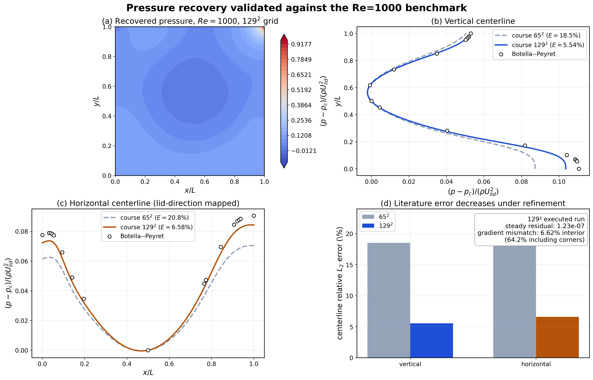

This existing pressure benchmark illustrates the independent physical checks
expected in a final evidence bundle; it is not a learned Fokker–Planck result.
Week 6 completes the selected Week-5 track, including optional closure testing.
[Project completion guide](notebooks/week05_06/README.md)

### Week 7 — Unsteady cylinder wakes

Four initial fields seed **277 autonomous future frames** at unseen **Re = 95**,
with **4.281% global vorticity error** against educational LBM labels.
The grid study passes practical fine-pair limits but fails the formal
asymptotic/GCI gate; these labels are not high-fidelity DNS.
[Video](results/cylinder_phase/re095_phase_stable_lbm_vs_decoder.mp4)
· [Model evidence](results/cylinder_phase/README.md)
· [Grid study](results/cylinder_grid_convergence/README.md)

[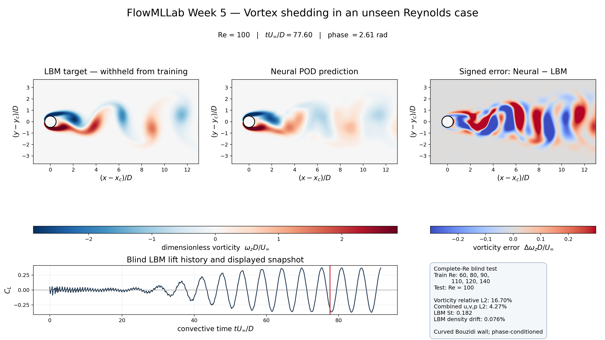](results/cylinder_ml/blind_re100_lbm_vs_neural.mp4)

The earlier Re=100 POD comparison is retained as a failed baseline, separate
from the autonomous Re=95 result. [Failure analysis](results/cylinder_ml/README.md)

### Week 7.1 — Rarefied hypersonic cylinder

The original **400 × 400 Mach-8.5** fields are rendered with continuous contours.
Error panels compare against Mach-8/Mach-9 interpolation; gray marks the masked
solid/sentinel region.
[Figure provenance](results/hypersonic_cylinder_week7_1/cylinder_homepage_provenance.json)

Across the five held-out cases in the **compact teaching dataset**, interpolation
errors are **0.398% / 0.609% / 0.779%** for local Mach, temperature and pressure.
The trained **3×96 tanh MLP** gives **1.53% / 2.70% / 2.50%**, with training
errors **1.26% / 2.21% / 1.82%**. Interpolation still wins; the earlier
underfit random-feature ridge is no longer the default classroom comparison.
These are new teaching runs, not the published model's accuracy.
[Data and paper](data/hypersonic_cylinder/README.md) · [MLP metrics](results/hypersonic_cylinder_week7_1/mlp_metrics.json)

### Week 8 — Gas dynamics and SciML

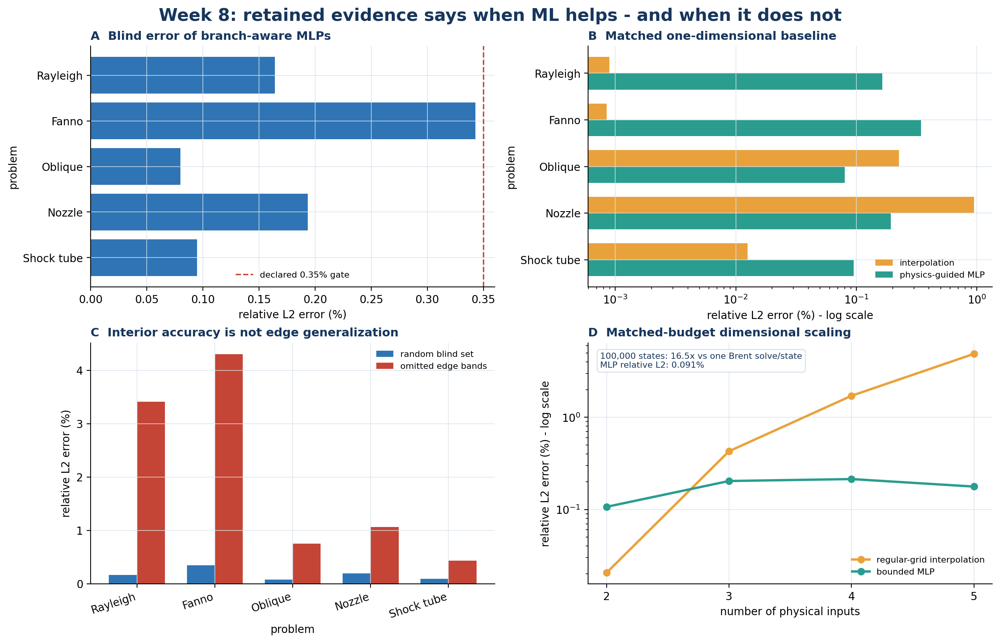

Preserve physical branches while comparing exact solvers, interpolation and
learned inverse maps under matched budgets.
[Benchmarks and validity limits](results/gas_dynamics_week8/README.md)

### Week 9 — Rarefied micro-step and micro-nozzle

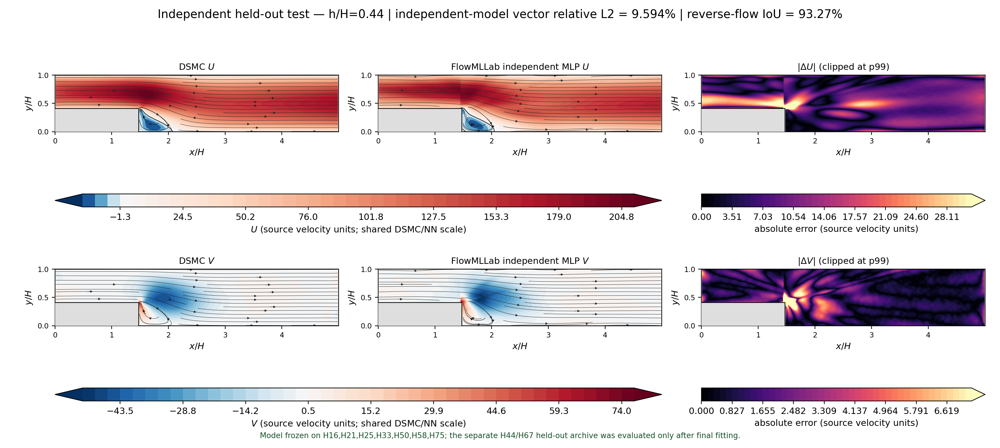

The independent H44 teaching model uses geometry and coordinates only.
[Step evidence and provenance](results/mahdavi_deeponet/README.md)

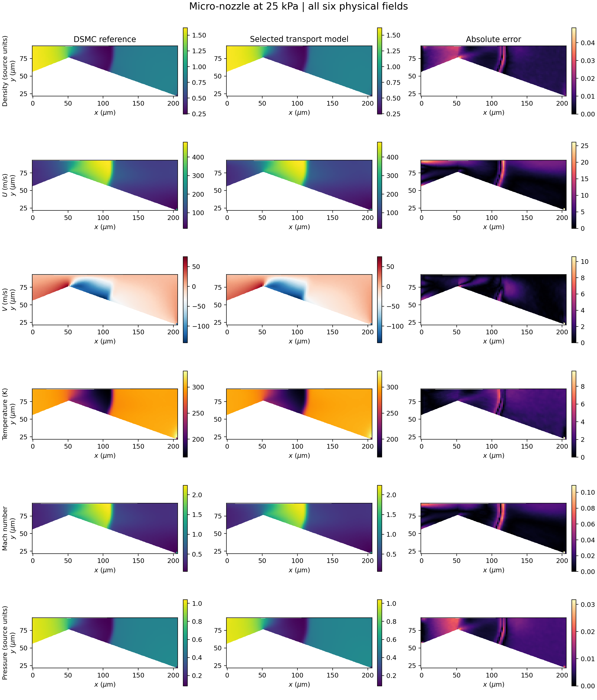

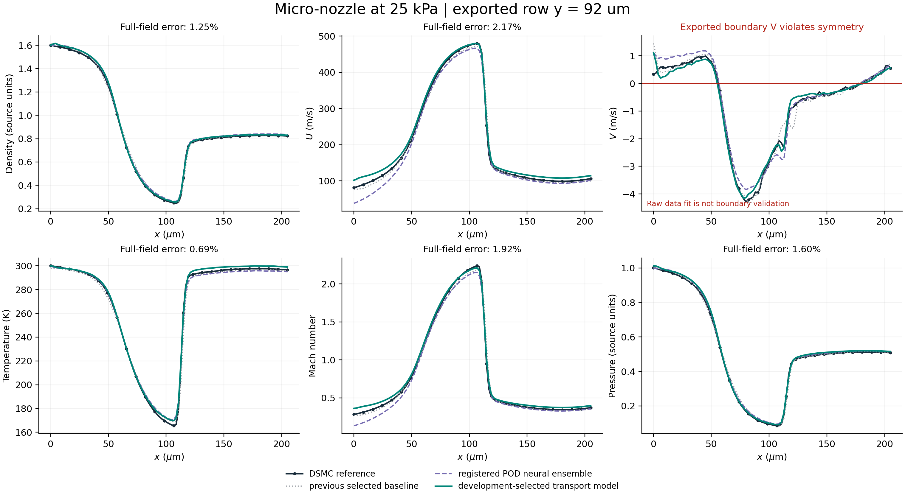

The selected registered-POD polynomial model and trained neural branches are
compared with the original interpolation baseline. The displayed transverse
velocity on the symmetry plane is the prescribed **V = 0** boundary condition,
not a learned accuracy result. Raw exports have a documented symmetry defect;
these are historical-holdout regression results, not fresh blind validation.
[Nozzle report](results/nozzle_transport/README.md)
· [Raw boundary audit](results/nozzle_transport/symmetry_boundary_audit.png)

### Week 10 — DSMC cavity and molecular shocks

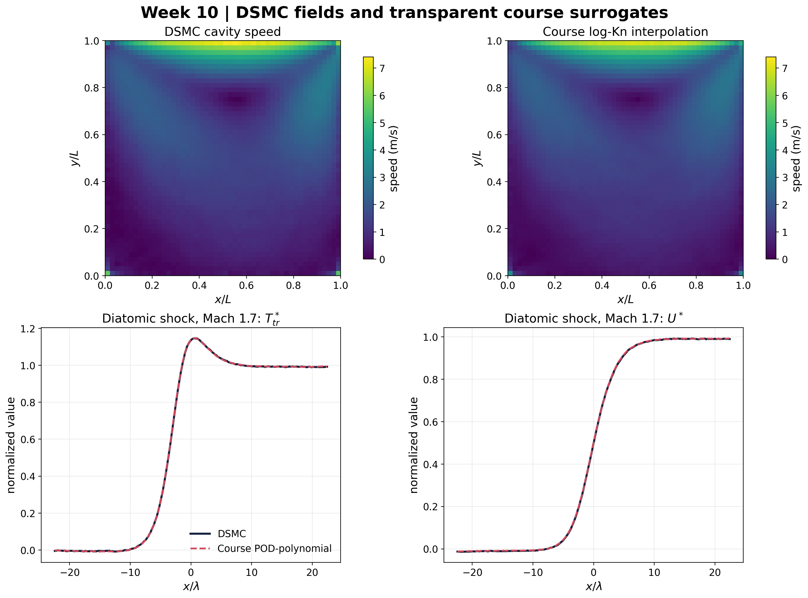

The article-data experiment retains **1.281% maximum primary cavity NRMSE**
and **1.018% maximum shock-profile relative L2 error**, with the data contract
and regeneration workflow available for inspection.
[Reproduction evidence](results/aescte_dsmc/README.md)
· [Data contract](data/aescte_dsmc/README.md)

## Reuse and contribute

The installable Python package, numerical solvers, notebooks, and teaching
materials are open source. See [contribution guidelines](CONTRIBUTING.md), the
[roadmap](ROADMAP.md), and [source/attribution policy](THEORY_SOURCE_POLICY.md).
Student submissions are not included.

[Read the software manuscript](manuscript/FlowMLLab_v1.1.0_Original_Software_Article.pdf)
· [Citation metadata](CITATION.cff)
· [Workshop, support, and consulting details](docs/RESULTS_GUIDE.md#workshops-support-and-consulting)

Current release: **v1.4.0** · [GitHub release](https://github.com/Ehsan-Roohi/FlowMLLab/releases/tag/v1.4.0)
· [Release notes](RELEASE_NOTES_v1.4.0.md).
Version-specific DOI: **[10.5281/zenodo.22315623](https://doi.org/10.5281/zenodo.22315623)**.
The [all-versions DOI](https://doi.org/10.5281/zenodo.22074169) resolves to the latest published archive.

**Ehsan Roohi** · University of Massachusetts Amherst · [roohie@umass.edu](mailto:roohie@umass.edu)

Copyright © 2026 Ehsan Roohi. [MIT License](LICENSE).
