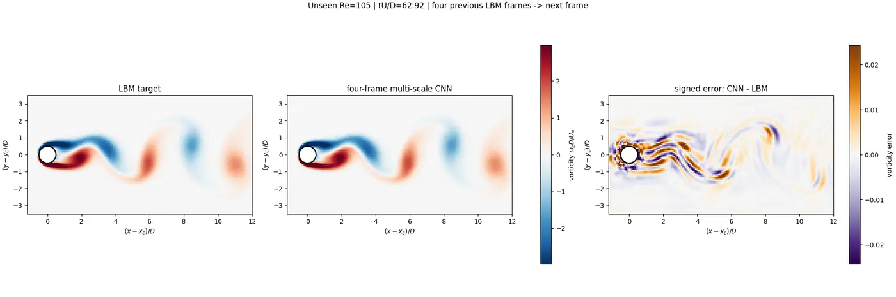

# FlowMLLab

[](https://github.com/Ehsan-Roohi/FlowMLLab/actions/workflows/ci.yml)
[](LICENSE)
[](https://doi.org/10.5281/zenodo.22126785)

## Validated CFD to scientific ML—from first Colab to reproducible benchmark

Start with a validated circular-cylinder wake, compare LBM with a blind neural
prediction, and verify the evidence chain. Continue through the 20-minute cavity
exercise to physics-checked POD--DeepONet benchmarks when ready.

<p align="center">
  <a href="https://colab.research.google.com/github/Ehsan-Roohi/FlowMLLab/blob/main/notebooks/P0_Project_Setup.ipynb"></a>
  <a href="demo/README.md"></a>
  <a href="notebooks/README.md"></a>
</p>

## Featured: circular-cylinder vortex shedding

The optional Week 7 extension advances from the steady cavity to an unsteady circular-cylinder
wake. A D2Q9 lattice-Boltzmann solver generates the reference fields, and a
four-frame multi-scale CNN predicts the completely unseen `Re=105` case without
the downstream vortex diffusion observed in the archived POD baseline.

<p align="center">
  
</p>

<p align="center"><em>The comparison plays automatically and loops. Blind vorticity relative L2 error: 0.815%; mean downstream profile error at 2D, 4D, 6D, and 8D: 0.804%.</em><br><a href="results/cylinder_cnn/re105_lbm_vs_multiscale_cnn.mp4">Open the full-resolution MP4</a></p>

### Cavity benchmark

<p align="center">
  <a href="demo/README.md">
    
  </a>
</p>

<p align="center"><em>Three retained test cases from the versioned evidence. Velocity and zero-mean pressure are direct outputs of separate POD--DeepONet heads.</em></p>

| Verified result | Retained evidence |
| --- | ---: |
| Blind `Re=105` cylinder vorticity error | **0.815%** relative $L_2$ |
| Mean cylinder-wake profile error at `2D,4D,6D,8D` | **0.804%** relative $L_2$ |
| Three-seed velocity error on retained cavity cases | **0.0727%–0.4455%** relative $L_2$ |
| Direct zero-mean pressure prediction | **0.1073%–0.2506%** relative $L_2$ |
| Repeated three-field evaluation versus a fresh recorded CPU CFD solve | **approximately $5.3\times10^3\times$ faster** |
| Reproducible learning and research entry points | **18 Colab notebooks + 6 lecture PDFs** |

### Choose a starting point

| Your goal | Start here |
| --- | --- |
| See the featured result immediately | [Play the blind `Re=105` cylinder video](results/cylinder_cnn/re105_lbm_vs_multiscale_cnn.mp4) |
| Complete the first evidence chain | [Run the 20-minute Colab](https://colab.research.google.com/github/Ehsan-Roohi/FlowMLLab/blob/main/notebooks/P0_Project_Setup.ipynb) |
| Reproduce the software release | Follow [START_HERE.md](START_HERE.md), then run `flowmllab qa --root .` |
| Adopt material in a course or workshop | Use [COURSE_MAP.md](COURSE_MAP.md) and the [notebook launcher](notebooks/README.md) |
| Contribute a bounded improvement | Review [ROADMAP.md](ROADMAP.md) and [CONTRIBUTING.md](CONTRIBUTING.md) |

**FlowMLLab** is an open-source framework for reproducible CFD-to-scientific-machine-learning experiments. It integrates transparent continuum and particle solvers, case-wise data partitions, non-neural baselines, coordinate networks, POD-DeepONet models, physical diagnostics, machine-readable evidence, and release checks.

The repository also contains the complete tutorial and lecture layer developed for the six-week graduate course **MIE 690A: AI in Fluid Mechanics**, University of Massachusetts Amherst, Summer 2026. The reusable modules, datasets, validators, and figure builders are the software core; the notebooks are documented examples of that framework.

The course treats scientific machine learning as a controlled computational-physics experiment:

1. generate or audit numerical data;
2. define a physically meaningful learning problem;
3. separate development, validation, and blind physical cases;
4. compare with a transparent non-neural baseline;
5. evaluate both statistical and physical fidelity; and
6. retain failure modes, configuration, and machine-readable evidence.

Start with [START_HERE.md](START_HERE.md). It gives the installation check, recommended order, expected runtimes, and a first 20-minute validation exercise.

## What is included

| Resource | Contents |
| --- | --- |
| `flowmllab/` | Installable Python package, scientific asset checks, repository QA, and figure-generation CLI |
| `demo/` | Read-only Streamlit explorer for the retained POD--DeepONet blind cases |
| `pyproject.toml` | Versioned package metadata, locked core dependencies, optional ML/test environments, and `flowmllab` entry point |
| `lectures/` | Five lecture/guide PDFs covering the original Weeks 1–6, plus a separate Week-7 cylinder lecture and editable sources |
| `notebooks/week01`–`week04`, `notebooks/week07` | Eleven guided laboratories: the original six-week course sequence plus a Week-7 cylinder-wake LBM extension |
| `notebooks/P0`–`P6` | Seven expanded research-project notebooks with conceptual notes, frozen decision gates, physical diagnostics, troubleshooting, deliverables, and further reading |
| `common/` | Shared CFD, surrogate, POD, kinetic, and QA utilities |
| `data/` | Fixed 11-case cavity reference dataset and numerical-quality table |
| `results/article_validation/` | Re=1000 pressure-recovery solutions and independent Botella--Peyret reference data |
| `results/dsmc_validation/` | Four HS--NTC wall-pressure solutions and Mohammadzadeh Fig. 3 DSMC markers |
| `results/article_figures/` | Paper-ready PNG/PDF validation figures and machine-readable error summaries |
| `results/pod_deeponet/` | Model-selection, blind-case, Ghia-centerline, timing, and full-field POD-DeepONet evidence |
| `results/cavity_rom/` | FOM reproduction and refinement, leakage-free POD/DEIM selection, blind trajectories, portable model, timing, break-even count, and summary figure |
| `results/cylinder_ml/` | archived Re=100 phase/POD failure baseline and its diagnostics |
| `results/cylinder_cnn/` | four-frame multi-scale CNN validation/blind video, downstream metrics, frozen weights, and regeneration script |
| `advanced/fp_closure/` | Bounded educational workflow for exact and learned Fokker–Planck closure testing |
| `references/` | Annotated reading guide and BibTeX database |
| `qa/` | Release validator for notebook syntax, required assets, and reproducibility anchors |

## Tutorial and example sequence

The recommended path is cumulative:

- **Week 1 — Numerical foundations:** Python/NumPy/TensorFlow fundamentals, finite differences, residuals, and validation of lid-driven-cavity centerlines against Ghia et al.
- **Week 2 — Supervised learning and model validity:** features, targets, scaling, losses, optimization, case-wise splits, interpolation versus extrapolation, and rarefied-flow nondimensionalization.
- **Week 3 — Particle and kinetic descriptions:** Maxwellian sampling, macroscopic moments, sampling-error scaling, DSMC algorithmic structure, noisy labels, and averaging.
- **Week 4 — Surrogates and operator learning:** audited CFD fields, scalar baselines, coordinate DNNs, and a restricted POD-DeepONet with complete-case selection, three-seed blind tests, Ghia validation, physical diagnostics, and measured inference cost.
- **Week 4.1 — Classical and hyper-reduced ROM:** an additive notebook for the same cavity, with dynamic centered POD-Galerkin, nonlinear-cost diagnosis, POD-DEIM, convergence checks, frozen blind tests, and offline/online break-even accounting.
- **Weeks 5–6 — Controlled research project:** select one track—including POD, physics-guided learning, uncertainty, rarefied flow, or learned closure—freeze the protocol, open blind cases once, document a failure/tradeoff, and produce a reproducible research summary.
- **Week 7 — Cylinder wakes with LBM and neural prediction:** derive D2Q9 BGK/TRT, distinguish attached, steady-recirculating, and vortex-shedding regimes, validate forces and Strouhal number, diagnose downstream diffusion in a POD baseline, then test a four-frame multi-scale CNN on a complete unseen Reynolds case.

The full module-to-evidence mapping is in [COURSE_MAP.md](COURSE_MAP.md).
The exact manuscript-figure ownership and reproduction commands are in [ARTICLE_FIGURE_MAP.md](ARTICLE_FIGURE_MAP.md).

## Quick start

```bash
python -m venv .venv
source .venv/bin/activate  # Windows PowerShell: .venv\Scripts\Activate.ps1
python -m pip install --upgrade pip
python -m pip install -e ".[test]"       # core framework and QA
flowmllab smoke --root .
flowmllab qa --root .
flowmllab figures all --root .
flowmllab rom --root .               # optional Week-4.1 full regeneration
flowmllab cylinder --root .          # verify retained Week-7 LBM evidence
```

Install the neural-network stack with `python -m pip install -e ".[ml,test]"`.
The exact core and ML dependency versions are recorded in `pyproject.toml` and
`requirements.txt`. The `flowmllab` commands are the supported programmatic
entry points; notebooks are tutorials that call the same shared modules.

Every public notebook now has an **Open in Colab** badge and a first-code-cell
bootstrap that clones this repository and installs the tested package automatically.
Use the [one-click notebook launcher](notebooks/README.md); no manual upload of
`common/`, `data/`, or package files is required.

TensorFlow is needed for the neural-network training cells. The numerical audit, interpolation, POD, data checks, and notebook syntax validation can be run without a GPU. Track 6 requires a CUDA-capable runtime for its final closed-loop run; its fast-mode configuration is only a smoke test, not research-resolution evidence.

## Common benchmark and data contract

The shared dataset contains full `u`, `v`, `p`, `psi`, and `omega` fields on a fixed grid for

`Re = 100, 150, 175, 200, 225, 250, 275, 300, 350, 375, 400`.

The streamfunction–vorticity solver is an educational reference. Re = 100 and 400 include Ghia centerline checks; all cases retain numerical residuals and a zero-mean pressure gauge. A smoother surrogate is not automatically more physically accurate than the CFD labels.

The reference dataset SHA-256 is recorded in `common/reproducibility.txt` and checked by the release validator.

The Week-1 cavity notebook opens with both velocity and pressure validation. The Week-3 DSMC notebook opens with a direct comparison of the package solver against Mohammadzadeh *et al.* at the same $Re=1.5$, $Kn=0.1$, $Ma=0.09$ condition. Both notebooks generate the paper-facing figures through `common/article_validation.py`; optional switches expose full numerical generation.

## Classical cavity-ROM validation result

Open `notebooks/week04/W4_1_Classical_ROM_Cavity.ipynb` for the additive
post-Week-4 lab, or run `flowmllab rom --root .` to regenerate
its frozen evidence.  The snapshot-enabled FOM reproduces the accepted
`Re=100` and `400` archive fields to below `8e-16` relative error and retains
the existing Ghia checks.  Independent grid and time-step refinements decrease
monotonically.

A development-only rule at `Re=300` selects POD rank 16 and DEIM dimension 16.
Across untouched `Re=175,275,375` trajectories, maximum-in-time velocity error
is **0.4941%** for POD--Galerkin and **0.6338%** for POD--DEIM; final vorticity
error remains below **0.56%**, wall error is exactly zero, and discrete
divergence is near round-off.  In the recorded CPU run, standard POD--Galerkin
does not materially accelerate this efficient small-grid FOM because it still
evaluates the full nonlinear field, whereas POD--DEIM is about **9.2x** faster.
Including offline snapshot and basis cost gives a recorded break-even near
**8 queries**.
Exact values and environment metadata are in `results/cavity_rom/`.

## Cylinder LBM teaching module

Week 7 adds an installable D2Q9 cylinder solver with transparent BGK theory and
a more robust TRT default, Zou--He inflow, a convective outlet, periodic
transverse boundaries, Bouzidi interpolated bounce-back on an analytical
circular wall, momentum-exchange forces, gauge
pressure, vorticity, recirculation length, and Strouhal diagnostics.  The
retained quick sweep covers `Re = 5, 20, 40, 100, 180`, so students see attached
flow, a steady symmetric wake, and periodic vortex shedding before using ML.

Open `notebooks/week07/W7_Lattice_Boltzmann_Cylinder_Student.ipynb` for the full
lesson. It keeps complete Reynolds cases together. The original phase/POD
surrogate is retained as a failure baseline because its downstream vortices
diffuse. The corrected path uses four consecutive LBM fields, a three-scale
fully convolutional residual predictor, and field/gradient/vorticity/divergence
losses. The design follows the predictive structure of Lee & You (JFM 2019)
without claiming a reproduction of their research-scale study.

The archived POD comparison used `Re=60,80,90,110,120,140` and withheld
`Re=100` from fitting. Once its diffuse wake was inspected to redesign the
method, `Re=100` correctly became validation rather than blind. Its 16.70%
vorticity error is retained rather than hidden.

[](results/cylinder_ml/blind_re100_lbm_vs_neural.mp4)

The corrected CNN is selected only with complete-case `Re=100` validation and
then tested once on untouched `Re=105`. With dimensionless frame spacing
`dt*=0.1042`, its blind vorticity error is **0.815%**, versus **11.01%** for
matched persistence. Mean downstream vorticity-profile error at
`2D,4D,6D,8D` is **0.804%**, and station enstrophy ratios remain within
`0.9993–1.0037`.

[Play the full blind `Re=105` LBM-versus-CNN video](results/cylinder_cnn/re105_lbm_vs_multiscale_cnn.mp4).

This is a teacher-forced one-step prediction from four previous true LBM
frames, not an autonomous rollout.

The committed `quick` evidence is a classroom regime check, not a
grid-converged external-cylinder DNS result.  Its finite circle resolution and
periodic transverse domain intentionally expose numerical error; quantitative
reference bands and an expensive refinement profile are supplied so students
can qualify a result rather than judging contours by appearance.  Run
`python qa/run_cylinder_lbm_validation.py --regenerate --workers 5` to regenerate
the teaching evidence, or `flowmllab cylinder --root .` to verify it.

## POD-DeepONet validation result

Run `python common/run_pod_deeponet_validation.py` to reproduce the CPU study. The multi-output model uses separately scaled POD trunks so pressure cannot distort the divergence-free velocity basis. The development-only rule selects a rank-3 velocity trunk with a `(32,32)` tanh branch and a rank-3 pressure trunk with an 8-neuron branch acting on `log(Re)`. At `Re = 175, 275, 375`, three-seed ensemble velocity errors are **0.4455%**, **0.0727%**, and **0.0947%**, while direct zero-mean pressure errors are **0.2506%**, **0.1245%**, and **0.1073%**. Wall error is exactly zero and discrete divergence remains at round-off.

This result does **not** claim that the network improves the Ghia benchmark or independently validates the pressure-recovery method used to create the labels. At `Re = 100` and `400`, POD-DeepONet preserves the centerline fidelity of the educational CFD solver. Its demonstrated advantage is amortized three-field evaluation after training: approximately 1.0 ms for the three-seed ensemble versus approximately 5.3 s for a fresh CPU CFD solve in the recorded run. Exact machine-readable values, protocol, seeds, fields, and the comparison figure are in `results/pod_deeponet/`.

<p align="center">
  <a href="results/pod_deeponet/pod_deeponet_ghia_validation.png">
    
  </a>
</p>

<p align="center"><em>Complete scientific validation figure: Ghia centerlines, blind fields, physical diagnostics, and measured cost.</em></p>

## Rules that apply to every project

- Split complete physical cases when the claim concerns a new Reynolds number, Knudsen number, wall speed, seed, or operating condition.
- Fit scalers and select models using development data only.
- Freeze architecture, rank, loss weights, stopping rules, and rejection thresholds before blind testing.
- Compare neural models with a transparent baseline using the same allowed information.
- Report local physics diagnostics alongside aggregate error norms.
- Treat a negative result as valid when the comparison is controlled and reproducible.
- Do not describe reduced teaching budgets as production convergence evidence.

## Student work and permissions

This repository contains instructor-developed teaching materials, common numerical assets, and starter notebooks. Student submissions are not included. Any student result reproduced in the associated manuscript remains subject to explicit student permission and attribution.

## Associated manuscript

**FlowMLLab: An open-source framework for reproducible computational-fluid-dynamics and scientific-machine-learning experiments**

The manuscript prepared for *AI Thermal Fluids* documents the software architecture,
numerical and ML workflow, validation contract, representative continuum and kinetic
applications, classical reduced-order-model baselines, limitations, and reuse pathway.

[Read the public FlowMLLab v1.1.0 original-software manuscript (PDF)](manuscript/FlowMLLab_v1.1.0_Original_Software_Article.pdf).
This is an author manuscript and is not a journal version of record. Cite the software
using the version-specific Zenodo DOI below.

## Workshops, support, and consulting

FlowMLLab remains free and open source. Optional professional services are available for universities, research laboratories, instructors, and engineering teams:

- **Live workshops:** a two-hour introduction, a one-day intensive, or a multi-session program covering validated CFD, scientific machine learning, POD--DeepONet, and DSMC.
- **Technical onboarding and support:** environment setup, benchmark reproduction, dataset qualification, notebook adaptation, and troubleshooting.
- **Research consulting:** design and review of CFD-to-SciML workflows, physical validation strategies, neural-operator studies, and rarefied-flow applications.
- **Custom extensions:** integration of new physical cases, institutional datasets, validation targets, or research-lab workflows.

For workshop, support, or consulting inquiries, contact [Ehsan Roohi](mailto:roohie@umass.edu?subject=FlowMLLab%20workshop%2C%20support%2C%20or%20consulting). These services are optional and do not affect access to the MIT-licensed software or educational materials.

If FlowMLLab supports your teaching or research, you can also support its continued open-source maintenance through the **Sponsor** button at the top of this repository.

## Citation and contact

Use [CITATION.cff](CITATION.cff) when citing the release.

Version 1.2.0 is the current source release. The latest archived release remains
v1.1.0 until a new Zenodo record is minted; its version-specific DOI is
[10.5281/zenodo.22126785](https://doi.org/10.5281/zenodo.22126785) and is also
recorded in [CITATION.cff](CITATION.cff). The GitHub release and archival record
contain only FlowMLLab. They do not include materials from any separate research
repository.

Ehsan Roohi  
Department of Mechanical and Industrial Engineering  
University of Massachusetts Amherst  
roohie@umass.edu

Copyright © 2026 Ehsan Roohi. Released under the MIT License; see [LICENSE](LICENSE).
