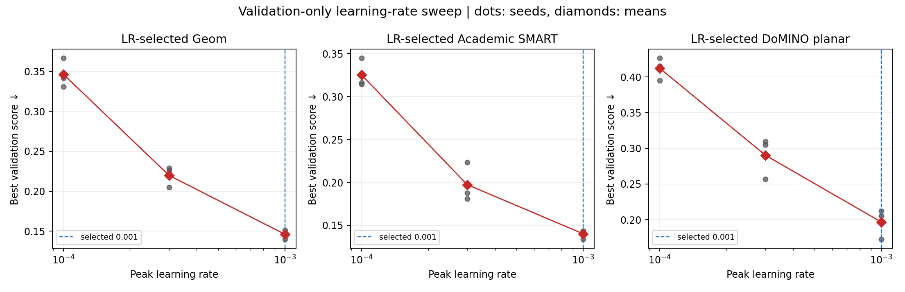
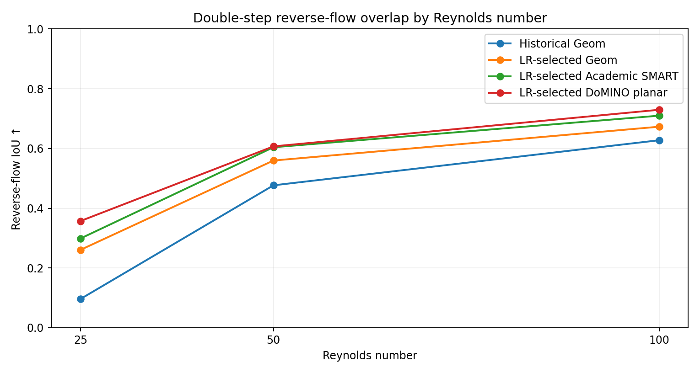
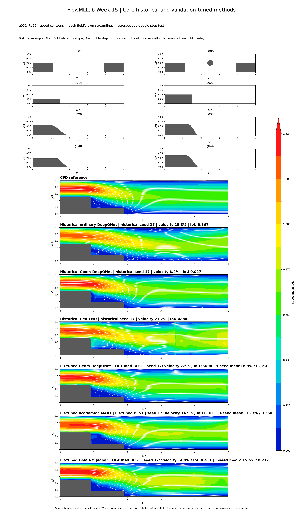
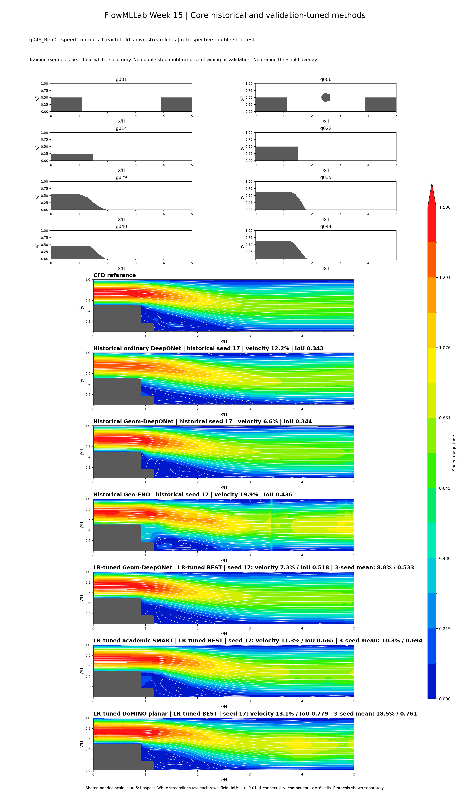
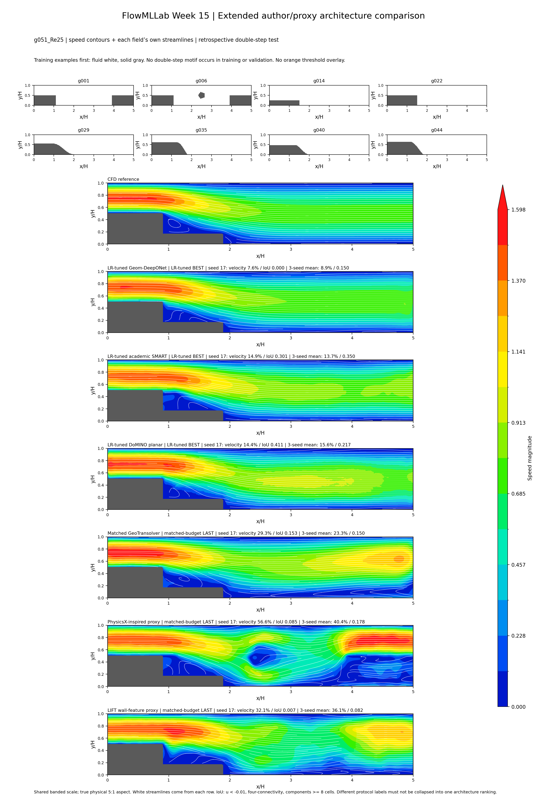
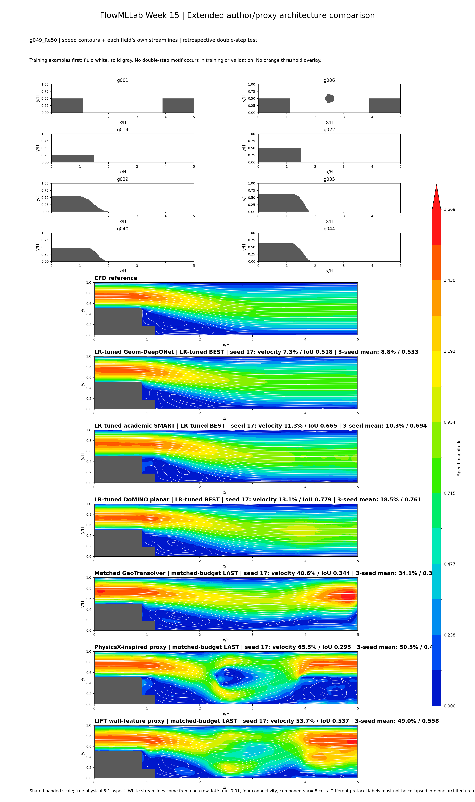
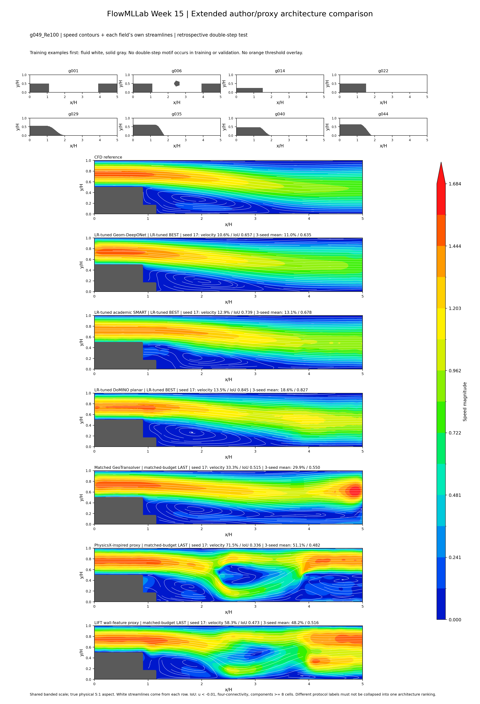
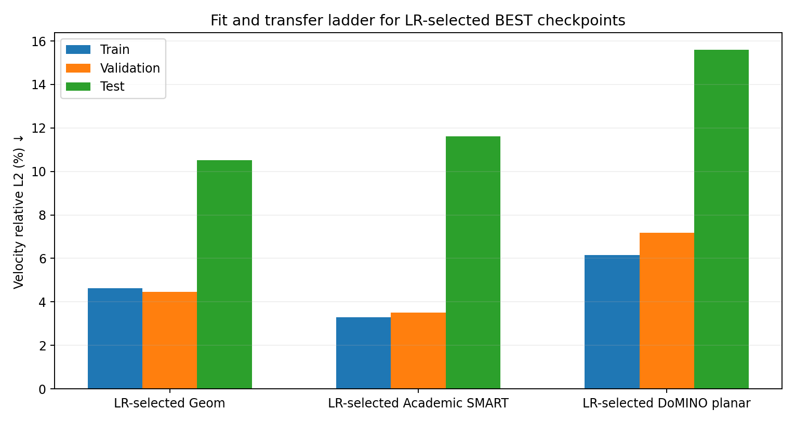

# FlowMLLab Week 15 - Neural Operators Under Geometry and Topology Change

**A long-form, evidence-first lecture for Ehsan Roohi's FlowMLLab**

**Release date:** 19 September 2026

**Scope:** ordinary DeepONet, Geom-DeepONet, Geo-FNO, SMART, GeoTransolver, DoMINO, a PhysicsX-inspired proxy, and a UniversalAGI/LIFT-inspired proxy
**Evidence rule:** no new CFD, no double-step geometry in training or validation, and no claim that the historically inspected double-step set is prospectively blind

---

## 0. How to use this lecture

This lecture is deliberately longer than a conventional slide deck. It is intended to serve four roles at once:

1. a conceptual introduction to neural operators for students who know basic neural networks but have not yet studied operator learning;
2. a reproducible record of the exact Week 15 geometry-generalization experiment;
3. an honest comparison of historical baselines, public author implementations, and transparent company-inspired proxies;
4. a failure-analysis case study showing why a plausible velocity contour is not sufficient evidence of a correct separated flow.

The accompanying notebook is the executable companion. The lecture explains what each calculation means; the notebook rechecks the split, hashes, stored arrays, metrics, learning-rate decisions, Reynolds-number trends, and figure provenance. Neither document runs new CFD.

The most important reading discipline is to keep four different questions separate:

- Can the model interpolate Reynolds number on a geometry it has already seen?
- Can the model predict a new member of a familiar geometry family?
- Can the model compose familiar wall features in a new arrangement?
- Can the model reproduce the topology, location, and strength of a recirculation region?

A model may succeed at the first question and fail at the other three.

---

## 1. The scientific question

We seek an approximation to a geometry- and parameter-dependent flow operator

$$
\mathcal{G}:(\Gamma,\mathrm{Re})\mapsto \mathbf{q}_{\Gamma,\mathrm{Re}}(x,y),
\qquad
\mathbf{q}=(u,v,p_s),
$$

where $\Gamma$ denotes the channel geometry, $\mathrm{Re}$ is the Reynolds number, and $p_s$ denotes the stored third output channel. The original OpenFOAM setup required to prove its exact nondimensional pressure convention is not present, so this lecture does **not** label it $\mathrm{Re}\,p$. For metrics, pressure is independently mean-centered over the fluid cells of each case.

The target experiment is unusually demanding. The model is trained on diverse geometries that do not contain a double-step motif and is evaluated on a family with two consecutive downward steps. This tests compositional geometry transfer: can knowledge acquired from single steps, ramps, obstacles, expansions, and contractions be recombined to represent interacting separation regions?

The answer is not a single number. The current evidence supports the following nuanced conclusion:

- the historical Geom-DeepONet checkpoint remains strongest in global velocity error;
- the newly tuned Geom-DeepONet is the strongest member of the newly comparable three-model suite for global field reconstruction;
- DoMINO gives the highest mean reverse-flow IoU in that tuned suite;
- the largest unresolved failure occurs at $\mathrm{Re}=25$, where the training data omit the required low-step/Reynolds-number combination;
- better detection of a reverse-flow footprint can coexist with a large error in reverse-flow magnitude.

---

## 2. Dataset and immutable evidence

The canonical dataset contains 130 accepted sampled CFD fields on a common $60\times300$ grid. Physical coordinates span $0\le x/H\le5$ and $0\le y/H\le1$. Every case stores:

- horizontal velocity $u$;
- vertical velocity $v$;
- the stored pressure-like third channel $p_s$;
- coordinates;
- a fluid/solid mask;
- geometry information derived from the mask, including a signed-distance representation where required.

The retained Reynolds numbers are 25, 50, and 100. All Reynolds-number variants of one geometry remain in the same split. This prevents a geometry from appearing in training at one Reynolds number and in validation or test at another.

The canonical dataset SHA-256 is:

`28d4d4c440cdc4c1ac1d13749ce00b0690d99f29cf20fd56c65fc00b6a8058fd`

The final split contains:

| Partition | Cases | Geometry IDs | Role |
|---|---:|---:|---|
| Training | 100 | 39 | parameter and geometry learning |
| Validation | 8 | 3 | checkpoint and learning-rate selection |
| Retrospective double-step test | 19 | 8 | historically inspected topology-transfer evidence |
| Quarantine | 3 | g005 | excluded because it contains a partial two-drop motif |

The double-step family consists of g012 and g045-g051. No member of this family enters training or validation. The test is historically inspected because it has been examined repeatedly during Week 15 development. The correct claim is therefore **retrospective held-out evaluation**, not prospective blindness.

---

## 3. What geometries are actually available during training?

The training pool is diverse, but diversity is not the same as coverage of every relevant interaction.

### 3.1 Single backward-facing steps

The single-step family g014-g028 contains one downward discontinuity. Step heights range approximately from $0.17H$ to $0.75H$. The critical coverage defect is that $\mathrm{Re}=25$ exists only for steps of approximately $0.5H$ and higher. Low single steps below $0.5H$ occur only at Reynolds numbers 50 and 100.

### 3.2 Sloped and curved ramps

The ramp family g029-g044 supplies gradual geometry changes and several weak-recirculation cases. Some $\mathrm{Re}=25$ ramps contain small separation regions, while several contain no retained reverse component at the chosen threshold.

### 3.3 Expansion, contraction, and obstacle cases

The g001/g004/g006-g011 family includes expansion and contraction features. Several variants add a small obstacle. Geometry g002 contains separated downward changes with an intervening upward change; it is not the consecutive two-drop terrace motif used by the test family.

### 3.4 Why g005 is quarantined

Geometry g005 contains two descending changes before a downstream contraction. Even though it is not identical to the held-out double-step test family, it exposes part of the target motif. It is therefore excluded rather than used as a convenient training example.

### 3.5 The actual extrapolation at Re=25

The test requests weak recirculation behind a $0.17H$ or $0.33H$ first step at $\mathrm{Re}=25$. That joint condition is absent from training. The model is not merely asked to rearrange known geometry; it is also asked to extrapolate across a confounded Reynolds-number/step-height gap.

This point explains why reporting only an overall 19-case average is misleading.

---

## 4. Before architectures: what is an operator learner?

A conventional supervised network approximates a finite-dimensional mapping

$$
f_\theta:\mathbb{R}^m\rightarrow\mathbb{R}^n.
$$

An operator learner instead approximates a mapping between functions or fields:

$$
\mathcal{G}_\theta:\mathcal{A}\rightarrow\mathcal{U}.
$$

For CFD, the input function may describe geometry, boundary conditions, material coefficients, forcing, or an initial field. The output is another function, such as velocity and pressure over a spatial domain.

In practice, every implementation discretizes the functions. The distinction remains useful because the architecture is designed to query the output at coordinates, grids, meshes, or point sets rather than merely predicting a fixed label vector.

An operator architecture does **not** automatically provide:

- geometry equivariance;
- topology extrapolation;
- conservation;
- correct boundary conditions;
- mesh independence;
- uncertainty calibration;
- reliable vortex topology.

Those properties require evidence.

---

## 5. Ordinary DeepONet

### 5.1 Core equation

DeepONet represents an output function through a branch-trunk contraction:

$$
\widehat{q}(\xi)=\sum_{k=1}^{r}b_k(a)\,t_k(\xi)+c.
$$

The branch network embeds the input function or parameter vector $a$. The trunk network embeds the query coordinate $\xi=(x,y)$. Their inner product produces the field value.

### 5.2 Why it is attractive

- output can be queried at many coordinates;
- branch and trunk have a clear functional interpretation;
- the architecture follows the universal-operator-approximation framework;
- inference can reuse a branch encoding for many query points.

### 5.3 Geometry limitation in this experiment

The historical ordinary DeepONet baseline does not receive the mask or SDF needed to distinguish arbitrary geometries completely. If two cases share the same operating parameter but have different walls, a parameter-only branch cannot infer which wall arrangement generated the solution.

This does not make ordinary DeepONet a poor method. It makes it a deliberately informative baseline: it shows what happens when the geometry is hidden or represented inadequately.

### 5.4 Week 15 evidence

Historical ordinary DeepONet gives:

- velocity error: 14.45%;
- centered-pressure error: 44.00%;
- vorticity error: 29.67%;
- reverse-flow IoU: 0.376;
- reverse-region velocity error: 165.5%.

It also produces a persistent distant/top-wall reverse pocket in the historical audit. This is an important visual failure even when the global contour looks smooth.

### 5.5 Primary references

- Paper: [Learning nonlinear operators via DeepONet](https://doi.org/10.1038/s42256-021-00302-5)
- Author repository: [lululxvi/deeponet](https://github.com/lululxvi/deeponet)

---

## 6. Geom-DeepONet

### 6.1 Architectural idea

Geom-DeepONet makes geometry part of the learned operator. In the pinned implementation used here, a global geometry representation and local query information are processed through geometry and output networks before a final contraction. The Week 15 adapter retains the author class structure and uses the full raster SDF together with Reynolds-number conditioning and field queries.

The key conceptual change is:

$$
\widehat{\mathbf{q}}(x,y)
=\mathcal{G}_\theta(\text{geometry representation},\mathrm{Re};x,y).
$$

### 6.2 What signed distance contributes

A signed-distance field makes proximity to a boundary explicit and varies smoothly away from the wall. It can help a network distinguish points that share the same coordinate role but lie in different geometries.

Signed distance is useful, but it is not a theorem of topology transfer. A network can still learn correlations such as “vertical step face implies a strong reverse pocket” without learning the correct interaction between two separated steps.

### 6.3 Author fidelity

The Week 15 adapter was checked against the pinned author source. The widths, nonlinearities, SIREN frequency, geometry/output sequence, and contraction structure match the relevant example. The stress-specific output sigmoid is removed for linear $(u,v,p_s)$ regression, and the bias is registered as a tracked Keras weight.

Pinned source:

- [ncsa/GeomDeepONet at commit 0a65f3d](https://github.com/ncsa/GeomDeepONet/tree/0a65f3d5b133fb6f248b0b11caa970d0cd724fb5)
- [Exact pinned baseline file](https://github.com/ncsa/GeomDeepONet/blob/0a65f3d5b133fb6f248b0b11caa970d0cd724fb5/Example2/Code/Baseline_GDON_DistanceSplit.py)

### 6.4 Historical versus freshly trained Geom

The historical and fresh models use the same retained objective. The important differences are optimizer history, learning-rate schedule, and checkpoint selection:

- historical stage 1: peak $10^{-3}$, cosine decay toward $10^{-4}$, 400 epochs;
- historical continuation: $10^{-4}$ toward $10^{-5}$, 200 epochs;
- original matched suite: one stage at $3\times10^{-4}$ toward $3\times10^{-5}$;
- new validation sweep: $10^{-3}$, $3\times10^{-4}$, and $10^{-4}$, each with the same 19,200-update ceiling.

Therefore 9.86% historical versus 13.42% fresh-at-$3\times10^{-4}$ did not isolate architecture quality. After validation-only tuning, fresh Geom improves to 10.53%.

### 6.5 The central Re=25 result

Historical Geom has excellent relative performance at $\mathrm{Re}=100$ but an IoU near 0.096 at $\mathrm{Re}=25$. The LR-tuned Geom raises the Re=25 mean IoU to 0.261. This is meaningful improvement, but it is not a complete vortex solution: reverse-flow magnitude and local velocity errors remain large.

---

## 7. Fourier Neural Operator and Geo-FNO

### 7.1 Fourier layer

A basic Fourier neural operator layer can be written as

$$
v_{\ell+1}(x)=\sigma\left(W_\ell v_\ell(x)
+\mathcal{F}^{-1}\left(R_\ell\,\mathcal{F}(v_\ell)\right)(x)\right).
$$

The learned spectral multiplier $R_\ell$ acts on retained Fourier modes. FFT-based computation is efficient on a common rectangular grid and provides a large receptive field.

### 7.2 Geometry difficulty

Sharp masks and irregular walls are awkward for a global periodic spectral representation. Geometry-aware FNO variants introduce masks, coordinate deformations, learned mappings, or domain-aware kernels.

Geo-FNO uses a learned deformation so that computations can be performed in a latent regular domain while representing nonuniform or irregular physical geometries.

### 7.3 Week 15 historical result

The historical Geo-FNO result gives:

- velocity error: 15.85%;
- centered-pressure error: 62.02%;
- vorticity error: 29.41%;
- reverse-flow IoU: 0.369;
- reverse-region velocity error: 299.2%.

The model sometimes captures a broad spatial trend but can introduce oscillatory or block-like field artifacts. A Fourier receptive field is not sufficient protection against topology shift.

### 7.4 Primary references

- FNO paper: [Fourier Neural Operator for Parametric Partial Differential Equations](https://arxiv.org/abs/2010.08895)
- Maintained neural-operator library: [neuraloperator/neuraloperator](https://github.com/neuraloperator/neuraloperator)
- Geo-FNO paper: [Fourier Neural Operator with Learned Deformations for PDEs on General Geometries](https://arxiv.org/abs/2207.05209)
- Geo-FNO repository: [neuraloperator/Geo-FNO](https://github.com/neuraloperator/Geo-FNO)

---

## 8. SMART

### 8.1 Main idea

SMART separates geometry encoding from field decoding. Boundary or geometry samples are compressed into a latent representation. Cross-attention updates latent geometry information, and a query decoder predicts the field at requested coordinates while conditioning on simulation parameters.

This design addresses two practical needs:

- a potentially large geometry point set can be compressed;
- many field queries can reuse a geometry representation.

### 8.2 Week 15 adapter

The public academic implementation is configured with its native two-dimensional option. Reynolds number is supplied as a parameter. The wrapper calls the author `encode` and `decode` paths rather than replacing the architecture with a look-alike implementation.

Geometry subsampling remains stochastic. Consequently, repeated inference with different geometry samples can vary. The fixed evaluation seed makes the stored comparison reproducible, but it does not measure full inference uncertainty.

### 8.3 Important distinction

The tested model is the public academic SMART implementation, not Luminary's proprietary clean-room implementation or a commercial pretrained system. Company benchmark claims are not treated as reproduced Week 15 evidence.

### 8.4 Week 15 result

After validation-only LR tuning:

- velocity error: 11.61%;
- centered-pressure error: 53.11%;
- vorticity error: 21.53%;
- reverse-flow IoU: 0.503;
- Re=25 IoU: 0.299.

SMART improves reverse-flow overlap relative to tuned Geom but overshoots reverse-flow magnitude more strongly on average.

### 8.5 Sources

- Pinned author code: [jhagnberger/smart at commit 9e9b30e](https://github.com/jhagnberger/smart/tree/9e9b30e6bd8b76b993643542300d9ee7a1e0beb5)
- Paper: [SMART: Scalable Mesh-free Aerodynamic Simulations from Raw Geometries using a Transformer-based Surrogate Model](https://arxiv.org/abs/2601.18707)
- Commercial-context article, not the tested code: [Luminary SMART](https://luminary.ai/resources/luminary-smart-the-new-state-of-the-art-model-architecture-for-large-physics-models/)

---

## 9. Transolver and GeoTransolver

### 9.1 Physical-state attention

Transolver introduced learned physical-state slices. Instead of performing full attention directly over all spatial points, points are softly assigned to a smaller set of latent physical states. Attention operates among those states before information is projected back to the points.

The design is motivated by the observation that many spatial points share related physical behavior even when they are distant in the input ordering.

### 9.2 Geometry-aware extension

GeoTransolver adds geometry-aware local and global mechanisms. In the pinned PhysicsNeMo implementation, GALE blocks incorporate geometry and operating-condition context, while multiscale neighborhoods provide local geometric information.

### 9.3 A subtle query-set issue

Accepting an irregular point set is not equivalent to query-set invariance. If physical-state aggregation is constructed from the current query set, the predicted value at one point may change when companion query points change. Week 15 preserves and measures this behavior rather than rewriting the model to force independence.

### 9.4 Week 15 result

At the matched 19,200-update budget and common $3\times10^{-4}$ peak LR:

- velocity error: 24.98%;
- centered-pressure error: 111.81%;
- vorticity error: 31.52%;
- reverse-flow IoU: 0.300.

These numbers do not prove that GeoTransolver is intrinsically inferior. The compact configuration, geometry sampling, and untuned learning rate are part of the experiment.

### 9.5 Sources

- Transolver paper: [Transolver: A Fast Transformer Solver for PDEs on General Geometries](https://arxiv.org/abs/2402.02366)
- Transolver repository: [thuml/Transolver](https://github.com/thuml/Transolver)
- Pinned PhysicsNeMo GeoTransolver source: [NVIDIA/physicsnemo at commit 94dbdf8](https://github.com/NVIDIA/physicsnemo/tree/94dbdf829d1a4e93e3f31ecb77713392c471388e/physicsnemo/models/geotransolver)
- GeoTransolver paper: [Geometry-Aware Transformer for PDE Surrogates](https://arxiv.org/abs/2512.20399)

---

## 10. DoMINO

### 10.1 Global and local geometry processing

DoMINO combines a global geometry representation with local pointwise features. Boundary points and signed-distance information are processed on auxiliary grids. Multiscale geometry features then feed basis and aggregation networks that predict the requested fields.

This is attractive for aerodynamic surrogate modeling because global body shape and local surface/query relationships can be represented separately.

### 10.2 Planar adaptation

The author implementation uses three-dimensional operations. Week 15 therefore replicates the two-dimensional geometry representation along an auxiliary $z$ direction and supervises only the center plane. This preserves the source model contract but does not create three-dimensional CFD evidence.

The compact $32\times16\times8$ geometry grid and small neighbor count are substantial capacity constraints. The result is a compact planar experiment, not a reproduction of the paper's large three-dimensional aerodynamic training regime.

### 10.3 Week 15 result

After validation-only LR tuning:

- velocity error: 15.59%;
- centered-pressure error: 71.85%;
- vorticity error: 22.73%;
- reverse-flow IoU: **0.534**, the highest among the tuned three-model suite;
- Re=25 IoU: **0.357**, also the highest among that suite.

DoMINO detects reverse-flow footprints well, but its global field and pressure errors are higher than tuned Geom and SMART. For g051/Re25, seed 17 detects a reverse region more clearly than several competitors, while the three-seed mean remains substantially weaker than its Re=50 and Re=100 behavior.

### 10.4 Sources

- Pinned PhysicsNeMo source: [NVIDIA/physicsnemo DoMINO at commit 94dbdf8](https://github.com/NVIDIA/physicsnemo/tree/94dbdf829d1a4e93e3f31ecb77713392c471388e/physicsnemo/models/domino)
- Paper: [DoMINO: Decomposable Multiscale Iterative Neural Operator](https://arxiv.org/abs/2501.13350)
- PhysicsNeMo repository: [NVIDIA/physicsnemo](https://github.com/NVIDIA/physicsnemo)

---

## 11. PhysicsX-inspired geometry-context proxy

### 11.1 Why it is called a proxy

PhysicsX publicly describes geometry-conditioned large physics models and weighted aggregation ideas, but the complete proprietary architecture, training corpus, pretrained weights, and optimization recipe are not public. Week 15 therefore implements a transparent research proxy instead of claiming reconstruction.

### 11.2 Implemented idea

The proxy encodes sampled boundary geometry into a latent context and decodes field queries independently. Positive boundary weights enter attention through

$$
\operatorname{Attn}(q,K,V)=\sum_j
\frac{w_j\exp(q^\top k_j/\sqrt d)}
{\sum_\ell w_\ell\exp(q^\top k_\ell/\sqrt d)}v_j.
$$

Adding $\log w_j$ to the attention logits makes the aggregation consistent with weighted samples. A structural test verifies invariance when one sample is split into identical half-weight samples.

On the present raster boundary, however, face lengths are uniform. Weighted aggregation is therefore effectively vacuous in this dataset. This limitation must appear beside the result.

### 11.3 Result

- velocity error: 40.63%;
- centered-pressure error: 263.69%;
- vorticity error: 65.70%;
- reverse-flow IoU: 0.324.

The proxy fits training data much better than it transfers. Its high-frequency query features produce visibly oscillatory or nonphysical patterns. This negative result is educational: a plausible company-inspired mechanism is not sufficient without the full architecture, training distribution, and validation protocol.

### 11.4 Source of inspiration

- [PhysicsX: PX-Car-Aero-v1 technical description](https://www.physicsx.ai/newsroom/scaling-physics-ai-for-automotive-aerodynamics-part-ii-meet-px-car-aero-v1)

---

## 12. UniversalAGI/LIFT wall-feature proxy

### 12.1 Publicly disclosed idea

UniversalAGI discusses wall-distance tokenization and geometry-aware pretrained simulation models. Week 15 tests one narrow disclosed idea: add a bounded nearest-wall-distance feature to the same transparent context-proxy backbone.

The implemented feature is

$$
h_w=\frac{d_w}{d_w+H},
\qquad
q_0\leftarrow q_0+\psi(h_w),
$$

where $d_w$ is physical distance to a wall-face midpoint. Inlet and outlet faces are excluded. A fixed scale $H$ replaces the percentile-derived scale discussed by the company.

### 12.2 Why this is not LIFT

- no proprietary source code is available;
- no proprietary pretrained weights are used;
- the backbone is our controlled proxy backbone;
- the wall feature is only one published design cue;
- the full data mixture and training curriculum are unknown.

The correct label is **LIFT wall-feature proxy**, not “the LIFT model.”

### 12.3 Result

- velocity error: 41.78%;
- centered-pressure error: 283.90%;
- vorticity error: 52.17%;
- reverse-flow IoU: 0.332.

The wall-distance feature does not rescue transfer. Since Geom-DeepONet already receives local signed distance, “providing distance” is not a novel advantage relative to all baselines.

### 12.4 Sources of inspiration

- [UniversalAGI wall-distance tokenization](https://www.universalagi.com/research/wall-distance-tokenization)
- [UniversalAGI SUV-PT](https://www.universalagi.com/research/suv-pt)

---

## 13. Architecture comparison at a glance

| Method | Geometry representation | Query mechanism | Source status | Main Week 15 caution |
|---|---|---|---|---|
| Ordinary DeepONet | inadequate/implicit for arbitrary masks | branch-trunk contraction | historical baseline | cannot distinguish arbitrary walls reliably |
| Geom-DeepONet | full raster SDF plus local query geometry | geometry/output networks + contraction | pinned author code/adapted outputs | SDF visibility does not guarantee topology composition |
| Geo-FNO | grid field with learned deformation | spectral operator | historical result | pressure and reverse magnitude remain weak |
| SMART | sampled geometry + latent context | cross-attentive decoder | pinned academic author code | stochastic geometry sampling; compact configuration |
| GeoTransolver | sampled geometry + multiscale neighborhoods | physical-state slices/GALE | pinned PhysicsNeMo code | query-set dependence; LR not tuned here |
| DoMINO | boundary/SDF + auxiliary 3-D grid | multiscale basis and aggregation | pinned PhysicsNeMo code | planar replication and coarse geometry grid |
| PhysicsX-inspired | sampled boundary + weighted latent context | independent query decoder | transparent proxy | not proprietary PhysicsX; weights uniform here |
| LIFT-inspired | same proxy + wall-distance embedding | independent query decoder | transparent proxy | not proprietary LIFT; isolated feature test |

---

## 14. Fairness: what equal training means and does not mean

The original fresh suite used only 3,840 updates and was severely undertrained. The matched-budget suite increased every fresh model to 19,200 updates. This makes update count equal, but it does not equalize:

- floating-point operation count;
- parameter count;
- wall-clock time;
- geometry resolution;
- neighborhood sample count;
- stochastic-inference variance;
- suitability of one common learning rate.

The new experiment addresses the last item for Geom, SMART, and DoMINO by testing peak learning rates $10^{-3}$, $3\times10^{-4}$, and $10^{-4}$ with three seeds and the same update ceiling.

Learning-rate selection uses only the frozen non-double-step validation set. Test arrays are not read during selection. This is proper procedural separation even though the research program has historically inspected the test family.

---

## 15. Learning-rate sweep

| Model | $10^{-3}$ | $3\times10^{-4}$ | $10^{-4}$ | Selected |
|---|---:|---:|---:|---:|
| Geom-DeepONet | **0.1462** | 0.2199 | 0.3464 | $10^{-3}$ |
| SMART | **0.1402** | 0.1974 | 0.3253 | $10^{-3}$ |
| DoMINO | **0.1967** | 0.2903 | 0.4123 | $10^{-3}$ |

The score combines geometry-balanced validation velocity, pressure, vorticity, reverse IoU, and reverse-region velocity error. Lower is better.

Three conclusions follow:

1. the common $3\times10^{-4}$ rate was not neutral;
2. all three author-code models preferred $10^{-3}$ on the frozen validation set,
   but that value is the upper edge of this three-point grid rather than a
   demonstrated interior optimum;
3. optimization settings materially affect the apparent architecture ranking.

---

## 16. The common reverse-scale ablation

The retained loss scales velocity channels by their training RMS values. Because the vertical velocity RMS is much smaller than the horizontal velocity RMS, a physically equal error in $v$ receives much more normalized weight in the reverse-zone term.

A pre-registered ablation replaced the reverse-zone $u,v$ scales with one shared physical velocity scale while leaving the main regression and curl terms unchanged.

| Arm | Validation score | Velocity % | Pressure % | Reverse IoU |
|---|---:|---:|---:|---:|
| Retained scaling | **0.1462** | 4.45 | 10.16 | **0.7603** |
| Common physical scale | 0.1501 | **4.12** | **9.60** | 0.7349 |

The candidate improves validation velocity and pressure but worsens the declared score and IoU. It fails the gate and is not evaluated on the double-step test. This is preserved as a negative result.

---

## 17. Main retrospective double-step table

| Model | Protocol | Velocity % | Pressure % | Vorticity % | Reverse IoU | Reverse-region velocity % |
|---|---|---:|---:|---:|---:|---:|
| Historical ordinary DeepONet | historical seed 17 | 14.45 | 44.00 | 29.67 | 0.376 | 165.5 |
| Historical Geom-DeepONet | historical seed 17 | **9.86** | 36.22 | **15.71** | 0.356 | 147.5 |
| Historical Geo-FNO | historical seed 17 | 15.85 | 62.02 | 29.41 | 0.369 | 299.2 |
| LR-tuned Geom-DeepONet | BEST, 3 seeds | 10.53 | **32.71** | 17.40 | 0.464 | **127.6** |
| LR-tuned SMART | BEST, 3 seeds | 11.61 | 53.11 | 21.53 | 0.503 | 200.7 |
| LR-tuned DoMINO | BEST, 3 seeds | 15.59 | 71.85 | 22.73 | **0.534** | 166.0 |
| Matched GeoTransolver | LAST, 3 seeds | 24.98 | 111.81 | 31.52 | 0.300 | 160.6 |
| PhysicsX-inspired proxy | LAST, 3 seeds | 40.63 | 263.69 | 65.70 | 0.324 | 265.8 |
| LIFT wall-feature proxy | LAST, 3 seeds | 41.78 | 283.90 | 52.17 | 0.332 | 197.6 |

This table must not be read as one clean architecture leaderboard. Historical and tuned/matched protocols differ. The safest claims are metric- and protocol-specific.

---

## 18. What changed after fresh single-stage training and LR selection?

Relative to the original equal-budget $3\times10^{-4}$ runs:

- Geom velocity improves from 13.42% to 10.53%;
- SMART velocity improves from 14.21% to 11.61%;
- DoMINO velocity worsens from 14.31% to 15.59%, while reverse IoU improves from approximately 0.465 to 0.534;
- validation selection therefore does not imply improvement in every test metric;
- Geom becomes much closer to the historical global-field baseline, though it does not surpass it in velocity or vorticity.

This is precisely why multiple metrics must remain visible.

The Re=25 footprint gain over the historical warm-start continuation is already
present in the fresh $3\times10^{-4}$ runs. It should therefore be attributed to
fresh single-stage training at either tested effective rate, not to learning-rate
tuning alone. The historical 9.86% Geom value is one seed, whereas tuned values
are reported as three-seed means.

---

## 19. Reynolds-number stratification

| Model | Re=25 IoU | Re=50 IoU | Re=100 IoU |
|---|---:|---:|---:|
| Historical Geom | 0.096 | 0.477 | 0.628 |
| LR-tuned Geom | 0.261 | 0.560 | 0.673 |
| LR-tuned SMART | 0.299 | 0.604 | 0.710 |
| LR-tuned DoMINO | **0.357** | **0.607** | **0.730** |

For tuned Geom at Re=25, the selected seed-17/29/43 overlaps are approximately
0.19/0.24/0.36. Thus the seed-17 contour is visibly poorer than the 0.261
three-seed mean and must not be presented as a representative mean field.

The monotonic trend is not a minor reporting detail. It reveals that the dominant failure is tied to a missing training regime. Global velocity error changes much less with Reynolds number than reverse IoU, so a case-averaged velocity score hides the mechanism.

---

## 20. How the Re=25 vortex is missed

Three failure modes appear repeatedly.

### 20.1 Wrong strength

The model can predict reverse velocity three or more times stronger than the CFD reference even when the reverse area is similar. A binary overlap score cannot see this amplitude error.

### 20.2 Wrong location

For low-step Re=25 cases, the CFD bubble often lies broadly over the terrace. Some predictions instead place a compact strong pocket against the vertical step face.

### 20.3 Wrong component topology

CFD may contain two separated recirculation components. A prediction may merge them, fragment one into several pockets, or create a distant outlet/top-wall pocket.

Therefore a vortex assessment should include at least:

- filtered reverse IoU;
- reverse-region velocity error;
- reverse area ratio;
- reverse-speed magnitude ratio;
- component count;
- component bounds or centroids;
- near-wall reattachment intervals;
- distant-pocket rate.

---

## 21. Metric definitions

### 21.1 Velocity relative error

$$
E_{uv}=100\frac{\|\widehat{\mathbf{u}}-\mathbf{u}\|_{2,\Omega_f}}
{\|\mathbf{u}\|_{2,\Omega_f}}.
$$

### 21.2 Gauge-invariant pressure error

$$
E_p=100\frac{\|(\widehat p_s-\overline{\widehat p_s})-(p_s-\overline{p_s})\|_{2,\Omega_f}}
{\|p_s-\overline{p_s}\|_{2,\Omega_f}}.
$$

### 21.3 Interior vorticity error

$$
\omega=\frac{\partial v}{\partial x}-\frac{\partial u}{\partial y},
\qquad
\Delta x/H=\frac{5}{300},\quad \Delta y/H=\frac{1}{60}.
$$

Central differences are evaluated only where the center and four stencil neighbors are fluid.

### 21.4 Reverse-flow IoU

Define $R=\{(x,y)\in\Omega_f:u<-0.01\}$. Retain four-connected components containing at least eight cells. Then

$$
\operatorname{IoU}=\frac{|R_{CFD}\cap R_{pred}|}{|R_{CFD}\cup R_{pred}|}.
$$

Absolute IoU depends on threshold and component filtering. Rankings were stable under the audited alternatives, but the convention must accompany every quoted number.

---

## 22. Core seven-row contours

These figures answer the original teaching question with seven flow rows: CFD, the three historical operator baselines, and the three learning-rate-tuned author-code models. Every row uses its own predicted $(u,v)$ field to draw streamlines. There is no orange threshold overlay.

### Re=25: the hardest missing-coverage regime

### Re=50

### Re=100

---

## 23. Extended seven-row contours

These pages keep CFD and the three tuned models, then add GeoTransolver and the two transparent company-inspired proxies. They should be used to discuss architecture ideas, not to imply that proprietary company systems were tested.

### Re=25

### Re=50

### Re=100

---

## 24. How to read the contours

Start at the geometry strip, not at the model result. Ask whether the relevant step height, step position, Reynolds number, and feature interaction occur in training.

Then read the CFD row:

- Where does separation begin?
- Does reverse flow touch the first fluid row above the wall?
- Is the terrace bubble closed?
- Does the second step produce a separate component?
- Where does reattachment occur?

Only then inspect model rows. Avoid judging a vortex by a single streamline. Streamplot seeding and interpolation affect the visual lines. Use the underlying $u<-0.01$ components and velocity values as quantitative evidence.

The banded blue-red map is applied to speed magnitude, not signed $u$. A dark-blue region is low speed, not automatically reverse flow.

---

## 25. Pressure: what can be claimed

The stored pressure-like channel decreases in amplitude with Reynolds number in a way inconsistent with the earlier label $p^*=\mathrm{Re}p$. The exact nondimensionalization cannot be recovered without the original OpenFOAM case setup.

Safe statements are:

- the stored third channel is predicted;
- its arbitrary additive gauge is removed independently per case;
- relative centered-field errors are reproducible;
- physical interpretation of its normalization remains provisional.

Unsafe statements are:

- calling it $\mathrm{Re}p$ without the solver setup;
- interpreting absolute pressure offsets;
- treating low centered-pressure error as proof of force accuracy without boundary integration and normalization evidence.

---

## 26. Training, validation, and test ladder

At 3,840 updates, validation velocity error was negatively rank-correlated with test velocity error. That behavior was a symptom of severe undertraining. At 19,200 updates the independently recomputed Spearman correlation is positive:

- all 18 matched runs: $\rho=0.5645$, $p=0.0147$;
- 12 author-code runs: $\rho=0.8462$, $p=0.000521$.

The two high-frequency proxies remain exceptions: they can fit training fields well while transferring poorly.

---

## 27. Reproducibility and authenticity checklist

The evidence bundle verifies:

- canonical dataset hash;
- geometry-level split and quarantine;
- absence of the double-step motif from training and validation;
- pinned author commits for Geom-DeepONet, SMART, and PhysicsNeMo;
- byte-level source comparisons recorded in the audit;
- checkpoint hashes and selection epochs;
- selection freeze before the new retrospective prediction pass;
- 342 saved tuned prediction fields;
- independent float64 recomputation of the stored metrics;
- figure/input hashes;
- fixed plotting conventions and physical aspect ratio.

The evidence bundle does not prove:

- convergence of the original CFD solver;
- grid independence of the OpenFOAM fields;
- the exact pressure nondimensionalization;
- full-scale reproduction of company systems;
- universal geometry transfer beyond the available masks;
- prospective blindness of the double-step set.

---

## 28. What the company-inspired study taught us

The practical value of studying industry systems is not to copy brand names. It is to extract testable architectural hypotheses:

- separate geometry encoding from field querying;
- compress large geometry point clouds into latent context;
- combine global shape information with local wall neighborhoods;
- add physically meaningful wall-distance features;
- aggregate irregular samples with quadrature-aware weights;
- use multiscale geometry grids;
- pretrain across diverse geometries and operating conditions.

Week 15 shows that testing one isolated idea in a small proxy can fail even when the full company system may be successful. Architecture, data scale, pretraining, optimization, and representation resolution are inseparable.

---

## 29. Recommended next scientific experiment

Do not choose another loss or architecture by repeatedly inspecting the double-step score. Use non-double-step family-holdout validation.

A defensible validation design includes:

1. an obstacle-family holdout;
2. a weak-recirculation Re=25 ramp holdout;
3. a low-single-step holdout;
4. equal weighting by Reynolds number;
5. velocity and pressure guardrails;
6. vortex detection, component, magnitude, and spurious-pocket metrics;
7. three independent initialization seeds;
8. one frozen retrospective double-step pass after selection.

The previously attempted combined location/amplitude family-holdout candidate failed all three folds and all nine paired score comparisons. It remains a negative result and is not promoted here.

The fundamental data gap cannot be optimized away: no low-step Re=25 training CFD exists. Filling that gap would require new CFD, which is outside this lecture and was not performed.

---

## 30. Suggested classroom sequence

### Part A - concepts

1. derive the DeepONet branch-trunk contraction;
2. derive one FNO spectral layer;
3. compare raster, point-cloud, latent-token, and auxiliary-grid geometry representations;
4. explain why geometry awareness differs from topology generalization.

### Part B - split audit

1. reconstruct geometry IDs from masks;
2. identify the quarantined motif;
3. verify all Reynolds variants stay together;
4. identify the Re/height coverage gap.

### Part C - evidence

1. reproduce the nine-model table;
2. plot learning-rate validation scores by seed;
3. stratify IoU by Reynolds number;
4. inspect g051/Re25, g049/Re50, and g049/Re100.

### Part D - critical discussion

1. choose the best model for global velocity prediction;
2. choose the best model for detecting reverse-flow footprint;
3. explain why those answers differ;
4. identify which claims remain unsupported.

---

## 31. In-class diagnostic questions

1. Why can an ordinary parameter-only DeepONet predict different fields at different coordinates yet still fail to distinguish two wall masks?
2. What information does signed distance add that a binary mask may not express smoothly?
3. Why does signed distance still fail to guarantee correct composition of two steps?
4. Under what conditions can FFT-based operators struggle with sharp irregular walls?
5. How do SMART and DoMINO differ in the way geometry context reaches a query point?
6. Why can GeoTransolver's prediction at one query depend on companion queries?
7. Why is the DoMINO experiment called planar rather than two-dimensional author DoMINO?
8. Why are PhysicsX and LIFT results labeled proxies?
9. How can IoU improve while global velocity error worsens?
10. What does a reverse-speed magnitude ratio greater than one mean physically?
11. Why is Re=25 simultaneously a geometry and parameter-coverage extrapolation?
12. Which additional CFD cases would remove the height/Re confound?
13. Why must the double-step set be described as historically inspected?
14. Why are equal updates not equal compute?
15. Which metric would matter most for reattachment control, surface force, or qualitative flow visualization?

---

## 32. Required student submission

Students should submit:

- the exact train/validation/test/quarantine geometry lists;
- a diagram of each model's geometry representation and query pathway;
- a source-status table distinguishing author code, historical result, and proxy;
- the learning-rate selection table with all seeds;
- the global nine-model table;
- Re-stratified IoU;
- one core and one extended contour page;
- a component-level analysis of one Re=25 case;
- a paragraph explaining what improves and what worsens;
- a limitations section stating that no new CFD was generated and the test is retrospective.

---

## 33. Final take-home messages

1. **Geometry as input is necessary but not sufficient.**
2. **A new topology is not merely another coordinate sample.**
3. **Optimization can change an apparent architecture ranking.**
4. **Global velocity error and vortex topology answer different questions.**
5. **Reynolds stratification exposed a failure hidden by global averages.**
6. **The strongest historical field model is not the strongest Re=25 vortex detector.**
7. **Company-inspired proxies must not be presented as proprietary systems.**
8. **Negative ablations and unsuccessful vortices belong in the scientific record.**
9. **The present data cannot teach a missing low-step/Re=25 combination directly.**
10. **A reproducible notebook must connect every figure and number to stored arrays and hashes.**

---

## 34. References and source links

### Operator learning foundations

1. Lu, L. et al. “Learning nonlinear operators via DeepONet based on the universal approximation theorem of operators.” *Nature Machine Intelligence* 3, 218-229 (2021). [DOI](https://doi.org/10.1038/s42256-021-00302-5) - [GitHub](https://github.com/lululxvi/deeponet)
2. Li, Z. et al. “Fourier Neural Operator for Parametric Partial Differential Equations.” ICLR (2021). [arXiv](https://arxiv.org/abs/2010.08895) - [GitHub](https://github.com/neuraloperator/neuraloperator)
3. Li, Z. et al. “Fourier Neural Operator with Learned Deformations for PDEs on General Geometries.” (2022). [arXiv](https://arxiv.org/abs/2207.05209) - [GitHub](https://github.com/neuraloperator/Geo-FNO)

### Geometry-aware models tested with public author code

4. Geom-DeepONet. [Pinned repository](https://github.com/ncsa/GeomDeepONet/tree/0a65f3d5b133fb6f248b0b11caa970d0cd724fb5)
5. SMART. [Paper](https://arxiv.org/abs/2601.18707) - [Pinned repository](https://github.com/jhagnberger/smart/tree/9e9b30e6bd8b76b993643542300d9ee7a1e0beb5)
6. Transolver. [Paper](https://arxiv.org/abs/2402.02366) - [GitHub](https://github.com/thuml/Transolver)
7. GeoTransolver. [Paper](https://arxiv.org/abs/2512.20399) - [Pinned PhysicsNeMo module](https://github.com/NVIDIA/physicsnemo/tree/94dbdf829d1a4e93e3f31ecb77713392c471388e/physicsnemo/models/geotransolver)
8. DoMINO. [Paper](https://arxiv.org/abs/2501.13350) - [Pinned PhysicsNeMo module](https://github.com/NVIDIA/physicsnemo/tree/94dbdf829d1a4e93e3f31ecb77713392c471388e/physicsnemo/models/domino)

### Industry descriptions used only as idea sources

9. PhysicsX. [PX-Car-Aero-v1 technical description](https://www.physicsx.ai/newsroom/scaling-physics-ai-for-automotive-aerodynamics-part-ii-meet-px-car-aero-v1)
10. UniversalAGI. [Wall-distance tokenization](https://www.universalagi.com/research/wall-distance-tokenization)
11. UniversalAGI. [SUV-PT](https://www.universalagi.com/research/suv-pt)
12. Luminary. [Commercial SMART description](https://luminary.ai/resources/luminary-smart-the-new-state-of-the-art-model-architecture-for-large-physics-models/)

---

## 35. Reproducibility files

- `consolidated_results.csv`: nine-model global table;
- `consolidated_results.json`: machine-readable equivalent;
- `assets/figure_provenance.json`: hashes and inputs for the six seven-row contour figures;
- `W15_Complete_Geometry_Generalization.ipynb`: executable teaching and audit notebook;
- `W15_NOTEBOOK_EXECUTION.json`: execution record;
- post-audit LR-sweep package: weights, histories, 342 tuned fields, and independent metrics;
- matched-budget package: six-model comparison at 19,200 updates;
- family-holdout package: preserved unsuccessful transfer-selection experiment.

The lecture and notebook are new versioned artifacts. Original Week 15 files and runs remain unchanged.
