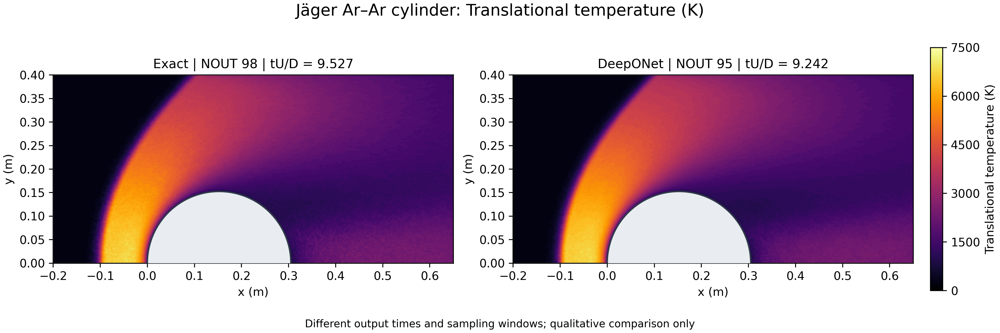
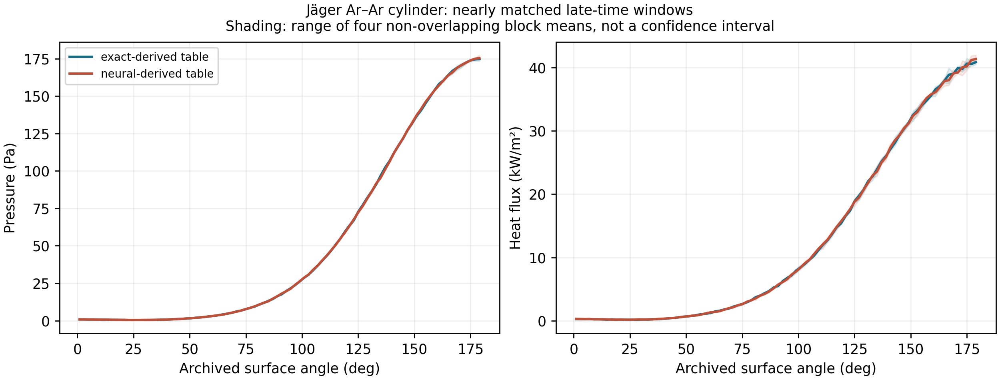

# Week 10.1 — Ab initio collision DeepONet

Supplemental reading after Week 10; no new executable training notebook.
[Retained colored fields and surface profiles](../results/abinitio_deeponet_cylinder/README.md).

## Research source

Ehsan Roohi, Ahmad Shoja-sani and Stefan Stefanov,
*Physics constrained neural collision operators for hard sphere surrogates
and ab initio angle prediction in direct simulation Monte Carlo*,
**Physics of Fluids 38, 057123 (2026)**,
[10.1063/5.0328463](https://doi.org/10.1063/5.0328463).

The paper describes an MLP scattering surrogate. The author-supplied July
research package uses DeepONet; these fields are from that later package,
not a reproduction of the original checkpoint. The original research data
predate their import into FlowMLLab. The course adds AI-assisted auditing
and visualization, not new simulations or article authorship.

## Learning goals

- Distinguish a molecular collision map from a whole-field surrogate.
- Separate angular fitting error, solver fidelity and sampling uncertainty.
- Interpret shared-color contours without claiming synchronized accuracy.

## The learned map

For relative velocity $\mathbf g=\mathbf v_1-\mathbf v_2$, the pair energy is
$E=\mu\lVert\mathbf g\rVert^2/2$, with reduced mass $\mu=m/2$ for equal masses.
The classical Jäger Ar–Ar potential determines the outer turning point:

$$
1-b^2/r_{\min}^2-V(r_{\min})/E=0.
$$

The scattering integral then determines the angle. The neural surrogate
learns $(E,b)\mapsto\cos\chi$, not the macroscopic flow field. The supplied
DeepONet uses standardized log-energy in its branch and scaled impact
parameter in its trunk, with latent products and smooth energy-band expert
weights. A two-component upper-semicircle output map bounds the cosine.

For a finite collision disk, $\sigma=\pi b_{\max}^2$ and equal-area sampling
uses $b=b_{\max}\sqrt U$, where $U$ is uniform on $[0,1]$. Rate construction,
pair selection, acceptance, random azimuth and the centre-of-mass update
remain separate physics operations. Validate them separately from the fit.

The retained DSMC runs use **exact-derived or DeepONet-derived angle tables**.
DeepONet does not directly predict the displayed temperature or pressure.
This differs from the parameter-to-field problem in Week 7.1 and belongs
with Week 10's molecular-model and DSMC validation material.

## Read the evidence

The archive describes argon at an upstream temperature of 200 K, number
density 4.247e20 m^-3 and streamwise velocity about 2634.1 m/s. The cylinder
radius is 0.1524 m and the stationary diffuse wall is at 500 K. Only the
computed upper-half domain is shown.

Each quantity uses a shared color scale. Density colors are logarithmic.
The solid disk is masked; no statistical smoothing or lower-half reflection
is applied. Linear plot interpolation does not increase simulation resolution.

**Exact: NOUT 98, tU/D=9.5265. DeepONet: NOUT 95, tU/D=9.2420.**
Times and sampling windows differ. These plots support qualitative inspection
of the bow shock and relaxation, not isolated pointwise model-error estimates.
Neither the output number nor visual agreement establishes convergence.

Mean angular error can hide localized failures. In the local audit of this
package, 21 grid points had cosine discrepancies above 0.1. Independent
quadrature agreed with the exact reference at those points to below 9e-10.
Their effect on flow depends on which collision states the solver visits.
Do not replace a collision-distribution-weighted assessment with a global mean.

## Surface pressure and heating

The previously prepared surface comparison uses reconstructed, non-overlapping
increments ending at NOUT 88–98 in both runs. The figure's neural-derived
table denotes DeepONet. The upstream stagnation region is near 180° in the
archive's angle convention. Read pressure in Pa and wall heat flux in kW/m².

The exact window spans tU/D=8.45938–9.52651 and the DeepONet window
8.46433–9.53072: close, not identical. Relative spatial L2 differences are
**0.4451% for pressure** and **1.0919% for heat flux** over 90 equal segments.
These are descriptive between-run differences, not isolated surrogate errors.
Shading represents four block means' range, not confidence bands; temporal
variations are comparable to the differences between runs.

See the [surface evidence and reconstruction method](../results/abinitio_deeponet_cylinder/README.md#surface-pressure-and-heat-flux)
for the sampling-reset treatment, source archives and vector figure.
Do not transfer these surface percentages to the asynchronous field contours.

## Discussion and assessment

1. Locate the shock and explain the different temperature, density and
   pressure patterns; distinguish hot gas from the imposed wall temperature.
2. Explain how a logarithmic density scale changes the visual emphasis.
3. Identify what matched physical windows and independent seeds would add.
4. Explain why table lookup in both modes on different hosts cannot reproduce
   a speed comparison against direct numerical scattering integration.
5. Specify mesh, time-step, particle-count and sampling checks needed before
   making stronger accuracy or convergence claims.

The previous surface-profile audit used other reconstructed windows and
removed overlapping cumulative samples. Its surface errors are not errors
of these two-dimensional fields. This companion reports no synchronized
error map, confidence interval, steady-state certification or speedup.
