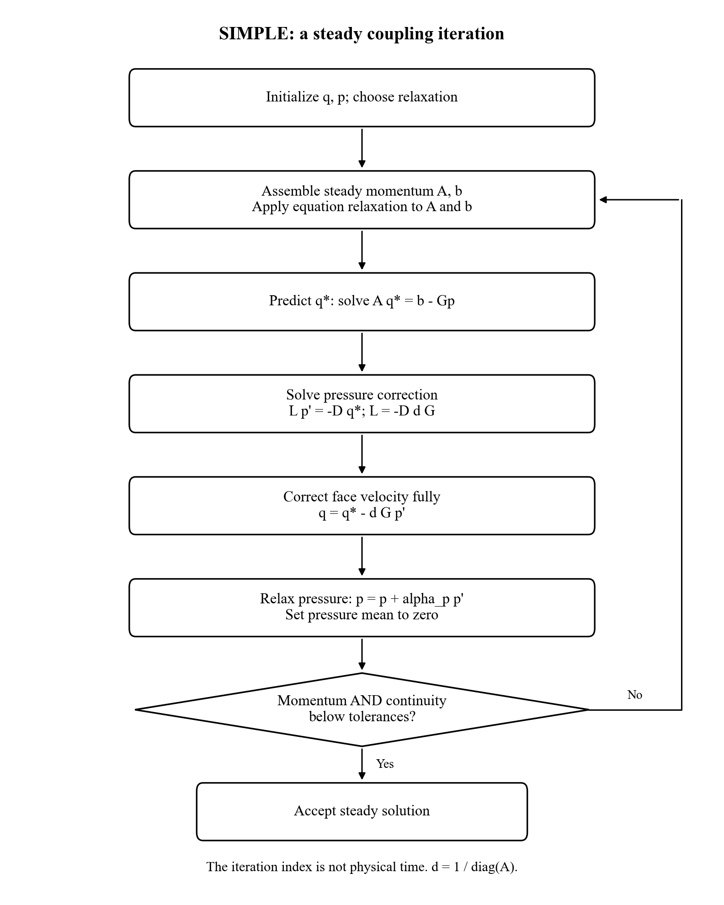
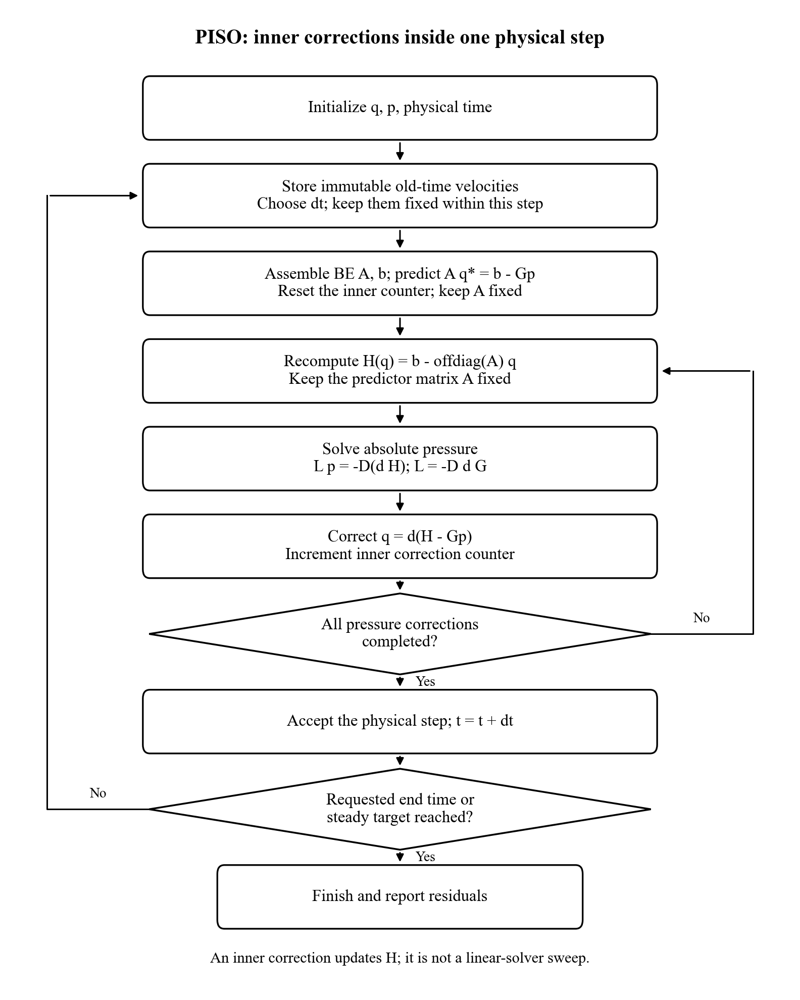
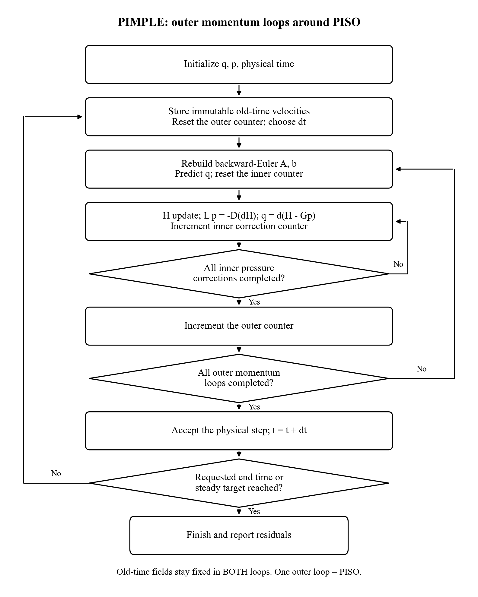
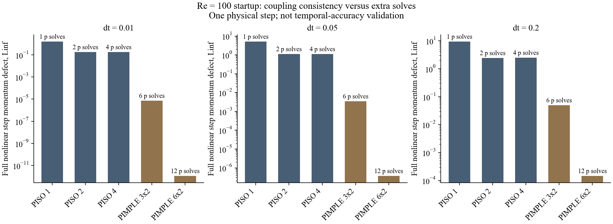

# Pressure-velocity coupling: evidence, flowcharts and teaching experiments

This supplement belongs to Week 1.2. All measured runs below are **Re=100**.
The higher-Re and time-dependent-lid studies are proposals, not completed
validation. The problem is a **lid-driven cavity**, not cavitation.

## What the comparative literature actually says

There is no defensible universal ranking of SIMPLE, PISO and PIMPLE. A study
must specify spatial discretization, grid placement, relaxation, time scheme,
correction counts, linear solver, stopping conditions and accuracy target.
The following sources answer different questions; they are not a single
controlled comparison of our three implementations.

| Source | Evidence relevant to this class | Boundary of the evidence |
| --- | --- | --- |
| [Issa (1986), JCP 62, 40-65](https://doi.org/10.1016/0021-9991(86)90099-9) and [Issa, Gosman and Watkins (1986), 66-82](https://doi.org/10.1016/0021-9991(86)90100-2) | PISO splits the implicit time-dependent equations into pressure/velocity correction stages. The companion study reports reduced effort for time-evolving flows when splitting error is small at the required time step. | Based on the publisher abstracts. This does not mean arbitrary large steps are accurate, or that PISO wins every steady problem. |
| [Pascau and Garcia (2010), Enhancement of PISO Scheme in Collocated Grids](https://congress2.cimne.com/eccomas/proceedings/cfd2010/papers/01330.pdf) | In their Re=1000 cavity, standard PISO performed best among the tested variants. At Re=5000, a SIMPLEC-based variant had faster convergence over a broader relaxation range. | Collocated grids and modified algorithms; not our MAC implementation, not a PIMPLE comparison, and not a general Reynolds-number cutoff. |
| [Brogi et al. (2024), FGCS 152, 1-16](https://doi.org/10.1016/j.future.2023.10.006) | This modern OpenFOAM precision study also discusses PISO/PIMPLE time-step choices in a compressible shock-tube test. Added outer coupling can make larger steps useful; increasing the step still affects accuracy. | Its main subject is floating-point precision. The compressible comparison cannot establish an incompressible-cavity speedup. The [2022 preprint](https://arxiv.org/abs/2209.06105) is an earlier version; settings differ from the final article. |
| [CFD Direct: transient solution](https://doc.cfd.direct/notes/cfd-general-principles/transient-solution), [PIMPLE](https://doc.cfd.direct/notes/cfd-general-principles/the-pimple-algorithm), and [steady convergence](https://doc.cfd.direct/notes/cfd-general-principles/steady-state-convergence) | Developer explanations separate inner pressure corrections, outer coefficient updates and relaxation. A physical-time accuracy requirement remains even when the coupling loop converges. | Primary technical documentation, not an independent three-way performance experiment. |
| [Albensoeder and Kuhlmann (2005), JCP 206, 536-558](https://doi.org/10.1016/j.jcp.2004.12.024) | High-Re cavity behavior can involve genuinely three-dimensional instabilities; corner discontinuities need careful treatment. | A 2D steady benchmark should not be presented as the general physical state of a high-Re laboratory cavity. |

**Our interpretation:** choose a method by cost at a specified accuracy and
robustness target. Compare steady algorithms at the same final equation defect;
compare transient algorithms at matched physical times and temporal errors.
An iteration of SIMPLE, a physical PISO step and a PIMPLE outer loop are not
equivalent units of work.

## 1. Shared algebra: what pressure corrects

The discrete momentum system is `A q = b - G p`, where q comprises interior
MAC face velocities. D is conservative cell divergence, G the pressure
gradient, `d=1/diag(A)` and `H(q)=b-offdiag(A) q`.

From `q=d(H-Gp)` and `Dq=0`, derive `L=-D d G` and
`L p=-D(dH)`. This is an approximation to the fully coupled momentum-pressure
problem because neighbor velocities in H are lagged during a correction.
Changing those neighbor velocities and rebuilding A are separate operations.

Pressure has a constant nullspace. The code pins one pressure unknown for the
linear solve, then reports zero-mean pressure. Normal wall face velocities are
zero. Never independently clip corrected face velocities: that can invalidate
the conservative flux balance.

## 2. SIMPLE: one steady iteration

[Scalable vector diagram](../../results/week01_2_pressure_velocity/flowcharts/simple.svg)

1. Assemble the steady momentum coefficients from current face velocities.
2. Apply equation relaxation to the diagonal and source, not merely to a
   plotted velocity. This release uses `alpha_u=0.7`.
3. Predict `q*` from the current pressure. It generally has a mass imbalance.
4. Solve `L p'=-D q*`; apply the **full** face correction
   `q=q*-dG p'`. The mass correction is not multiplied by `alpha_p`.
5. Update `p <- p+alpha_p p'` with `alpha_p=0.3`; remove its mean.
6. Recompute the unrelaxed steady momentum and continuity defects. Repeat
   until both pass; small changes between iterates are not the stopping test.

**Benefit to demonstrate:** a direct route to a steady solution, with only one
pressure solve per iteration. On our 32-cell grid, SIMPLE was cheaper than
PISO. **Cost to expose:** convergence depends on relaxation and grid; the
64-cell run needed 1870 iterations. Changing relaxation must not change the
target tolerance or justify accepting a different final solution.

## 3. PISO: repeated coupling with a fixed predictor matrix

[Scalable vector diagram](../../results/week01_2_pressure_velocity/flowcharts/piso.svg)

1. Copy the old-time fields once. Keep them immutable throughout this step.
2. Assemble backward-Euler momentum. The time derivative contributes `1/dt`
   to the normalized diagonal and `q_old/dt` to the source.
3. Predict velocity, keeping convection coefficients frozen for this step.
4. Recompute H from the current corrected velocity; solve for absolute
   pressure with `L p=-D(dH)`; set `q=d(H-Gp)`.
5. Repeat step 4 twice in the retained configuration. The second correction
   updates momentum coupling; repeating LU/Jacobi on one fixed RHS does not.
6. Accept the physical step. Store new old-time fields only when advancing
   to the next step. Check physical end time or the requested steady target.

**Benefit to demonstrate:** improved coupling without repeatedly rebuilding
and solving both momentum systems. On our 64-cell grid, it reached the common
steady target more cheaply than the selected SIMPLE/PIMPLE settings.
**Limitation:** more inner corrections cannot remove all error caused by
frozen nonlinear convection coefficients. Nor can they remove backward-Euler
time-discretization error.

## 4. PIMPLE: two nested coupling loops

[Scalable vector diagram](../../results/week01_2_pressure_velocity/flowcharts/pimple.svg)

1. Copy old-time fields once and choose dt.
2. At each **outer** loop, rebuild momentum coefficients from the current
   velocities, predict momentum and reset the inner correction counter.
3. Execute the **inner** PISO H/pressure/velocity corrections with that fixed
   predictor matrix. Retained settings: two inner corrections.
4. Repeat the outer loop three times. Updating the nonlinear convection
   coefficients is the additional work distinguishing PIMPLE from PISO.
5. Accept the physical time step only after both loops finish. Never overwrite
   `q_old` inside an outer or inner loop.

One outer loop reproduces this PISO implementation exactly. **Benefit to
demonstrate:** reduce the nonlinear momentum defect within a step. **Cost to
expose:** more matrix assembly, momentum solutions and pressure corrections.
In the retained steady case, both PISO and PIMPLE needed 540 physical steps;
the extra PIMPLE work did not buy a shorter march at the same dt.

The implementation uses fixed correction counts, not an adaptive inner/outer
residual loop. The flowcharts show this actual behavior rather than controls
available in a different solver.

## 5. A measured demonstration: why extra loops can matter

We executed **15 one-step configurations** on 32 MAC cells/side at Re=100,
starting from rest with a unit-speed lid. The time steps are 0.01, 0.05 and
0.2. Each configuration starts from the same zero old-time fields.

The reported defect substitutes the final velocity and pressure into the
**full nonlinear backward-Euler momentum equations**, including convection
coefficients rebuilt from that final velocity. It differs from the steady
residual in the original convergence figure. All configurations satisfy
continuity to pressure-solve precision.

At dt=0.05, two PISO corrections leave a nonlinear step defect of about
1.11; three PIMPLE outer loops with two inner corrections reduce it to
0.00343, at the cost of six rather than two pressure solves and six rather
than two scalar momentum-system solves. This is a visible PIMPLE advantage
in **within-step algebraic consistency**, not evidence of a more accurate
physical trajectory.

The PISO defect can plateau or slightly rise when increasing inner corrections
from two to four: the matrix's nonlinear coefficients remain frozen.
Inspect the separately recorded frozen-predictor defect before attributing
that plateau to a failed pressure solve. Outer loops address a different
source of error.

[All measurements and definitions](../../results/week01_2_pressure_velocity/coupling_step_study.json)
are retained. Reproduce with `python qa/week01_2_teaching.py`. Counts are
deterministic; very short single-run timings are illustrative, not rankings.

## 6. Does increasing Reynolds number make these algorithms fail?

There is no Reynolds number at which one of these pressure-coupling methods
universally ceases to work. Three distinct difficulties must be separated:

- **Spatial resolution and convection:** boundary layers and small vortices
  need a finer mesh. For the implemented central coefficients,
  `a_E=nu/h^2-u_E/(2h)`. A large local cell Peclet number
  `Pe_h=|u_E|h/nu` can make a neighbor coefficient negative; the sufficient
  positivity condition `Pe_h<=2` is then lost. Near unit advective speed,
  `Pe_h` is approximately `Re/N`: at Re=1000 and N=64 it is about 15.6.
  This is a boundedness diagnostic, not a universal failure threshold.
  More pressure corrections do not repair insufficient spatial resolution.
- **Nonlinear coupling:** convection depends more strongly on velocity as
  viscosity decreases. Relaxation, a smaller dt or more outer iterations can
  help solve the discrete equations. Their benefit must be measured.
- **Physical/model behavior:** a higher-Re real cavity may become unsteady or
  three-dimensional. A failure to reach a 2D steady state does not by itself
  identify an algorithm bug or establish the need for a turbulence model.

The current public solver deliberately remains qualified at Re=100 and rejects
other Reynolds numbers. A future higher-Re branch needs its own validation;
the table below does not silently expand the released claim.

## 7. Recommended classroom sequence and assessment

| Stage | Experiment | What students should learn | Current status |
| --- | --- | --- | --- |
| A | Re=100 steady cavity; 32 and 64 cells; three methods and independent FD reference | Same discrete steady solution; different costs; ranking changes with mesh | Executed; FV Ghia errors are nonmonotone on these two grids |
| B | Re=100 single-step inner/outer correction sweep | Mass conservation is distinct from momentum consistency; PIMPLE reduces nonlinear step defects at extra cost | 15 configurations executed; not temporal-accuracy validation |
| C | Re=100 SIMPLE relaxation sweep, e.g. `(alpha_u,alpha_p)=(0.5,0.5),(0.7,0.3),(0.9,0.1)` | Robustness versus speed; accept only the same unrelaxed final residual and fields | Proposed; these pairs are trials, not assured optimal/stable settings |
| D | Re=100 startup to matched final times, then a smooth ramped/oscillating lid; halve dt | PISO/PIMPLE cost at matched time error, and phase/amplitude errors; a large stable dt can be inaccurate | Proposed; variable-lid boundary API and temporal reference still required |
| E | Re=400, then 1000 on 64/128/256 cells with independently validated convection and benchmark tables | Separate mesh error, numerical boundedness and coupling failures; inspect secondary vortices and lid-wall stress | Proposed; public solver has not been extended or run at these Re values |

Keep spatial equations, grid, initial fields, physical final time and linear
solver settings fixed in a coupling comparison. For transient studies, SIMPLE
needs a proper backward-Euler outer iteration **inside each step**; its current
steady iteration must not be labelled a physical trajectory.

Assess: centerline error, kinetic energy, vortex position, phase/amplitude
where relevant, momentum defect, cell divergence, solve counts and repeated
wall-time measurements. Plot **cost versus error** and retain failed or
nonconverged configurations. Do not select settings merely to make a chosen
algorithm win. A matched-grid, dt-refined numerical reference also has error;
document its own refinement.

**Recommended next numerical extension:** stage D at Re=100, before a higher-Re
claim. It isolates the intended benefit of PIMPLE without changing viscosity,
mesh and convection simultaneously. Stage E can follow as a separate
verification/benchmark exercise. Week 1 remains unchanged.
