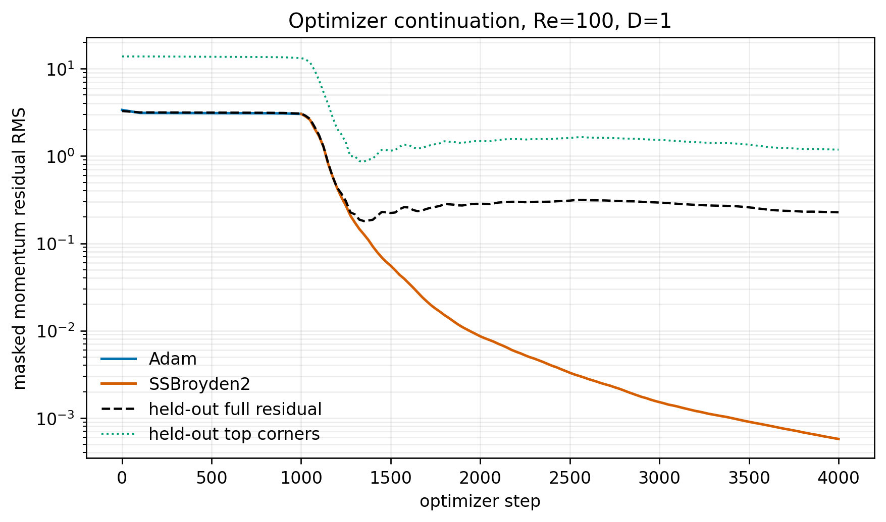
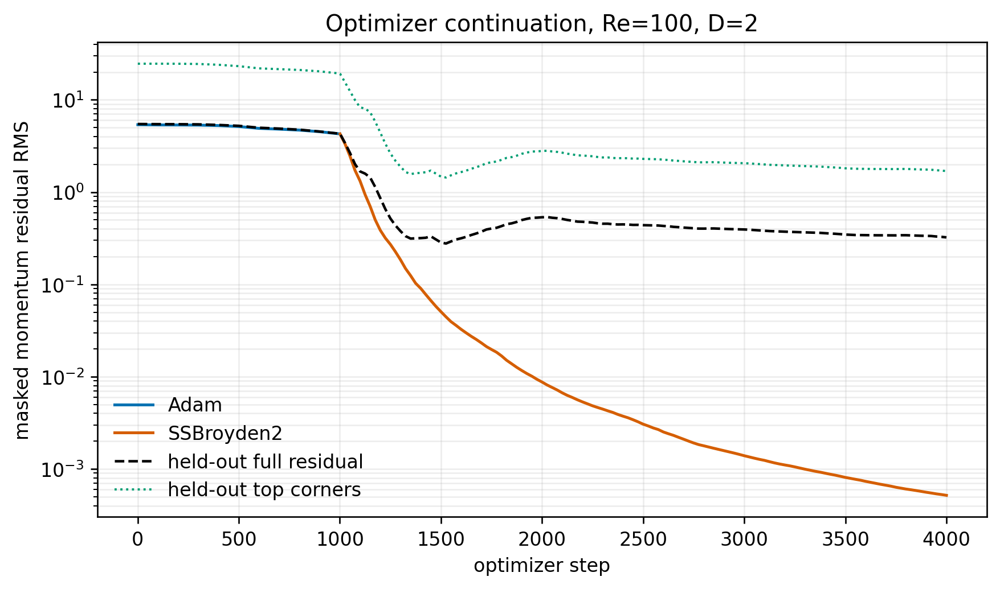
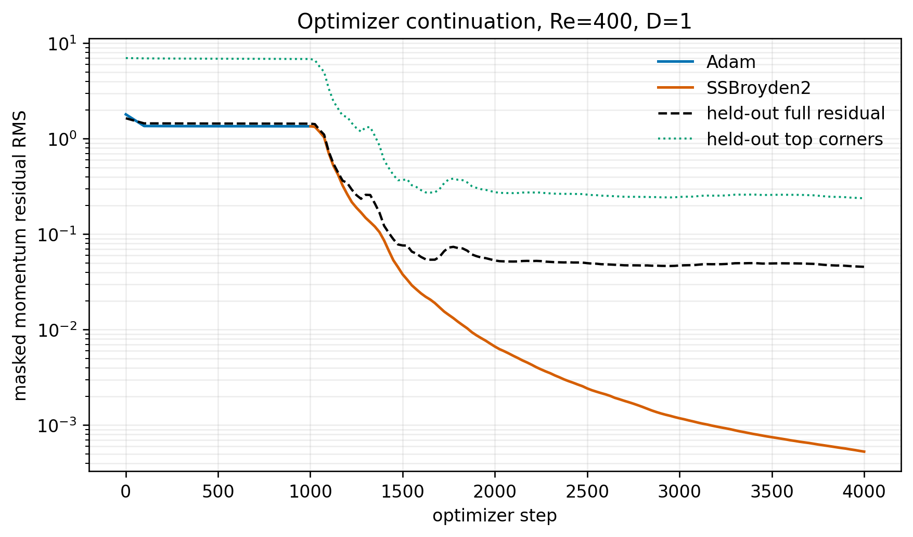
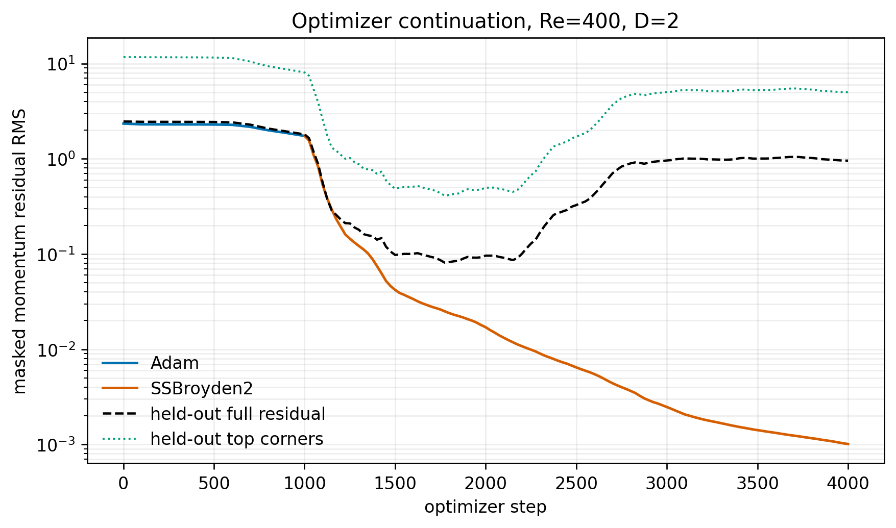

# Week 13 — research audit of rectangular-cavity PINNs

This independent final-course module develops the lid-driven-cavity PINN beyond
the Week 4.2 foundations. The notebook audits a retained four-case Unity A100
matrix rather than silently retraining it:

- Reynolds numbers 100 and 400;
- depth-to-width ratios 1 and 2;
- float64 Adam warm-up followed by SSBroyden2 continuation;
- exact streamfunction wall constraints;
- held-out full-domain and top-corner residuals; and
- frozen CFD field gates for the two square cases only.

[Open the audit notebook](W13_Rectangular_Cavity_PINN_Research.ipynb) after the
retained results have been generated. The notebook displays optimizer histories,
claim boundaries and geometry-faithful colored contours. It does not treat a
low training loss or an attractive contour as proof of accuracy.

The deep-cavity outputs are residual-audited hypotheses because the local archive
does not contain a raw, matched CFD field at the same geometry and smoothed lid.
The Cheng--Hung benchmark supports topology interpretation, not a reconstructed
pointwise error computed from a publication figure.

## Retained loss curves

Each case is shown separately at full width. The plotted loss is momentum
residual RMS, not squared loss or CFD solution error. Blue/orange distinguish
Adam and SSBroyden2; black dashed and green dotted curves track the held-out
full-domain and top-corner residuals. These are existing Unity training records,
not new runs. A low masked training residual does not certify the full domain.

### Re = 100, H/L = 1

### Re = 100, H/L = 2

### Re = 400, H/L = 1

### Re = 400, H/L = 2

## Reproduction

The exact training runner, restartable `gpu-preempt` batch file, harvest gate and
protocol are in `qa/`. Optimizer checkpoints stay on Unity and are intentionally
excluded from GitHub. The public evidence retains numerical histories, audits,
figures, the dependency lock, upstream commit/digest and SLURM job identifiers.

This four-case matrix is a feasibility pilot, not yet a publication comparison.
A paper must add matched multi-aspect-ratio CFD/FEM references, several fixed
seeds and a factorial comparison between primitive/FOSLS and streamfunction
representations at equal precision, capacity and residual-evaluation budget.
