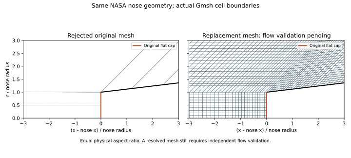

# Why the first NASA mesh family was rejected

A small residual is a convergence diagnostic, not proof that a computed flow is physically correct. The original coarse SEEB-ALR run reached a density residual below 1e-9, but its flat nose cap had pressure below the freestream pressure. At the axis stagnation node, p/p_infinity was 0.54035. At the interior cap node it was 0.46930. These are incompatible with the compression and stagnation expected ahead of this blunt cap. The failed medium mesh also developed a very large density near the upstream axis while its pressure remained positive. These fields cannot support a validated release.

This finding is separate from the off-body waveform comparison: a tolerable pressure curve at H=21.2 inches cannot repair an incorrect local flow. The original meshes had no upstream axis node within one nose radius of the cap. Two cap cells were fixed across refinement. The replacement preserves the same original sampled CAD geometry and physical conditions, while resolving the upstream shock region, the leading body and the cap locally.

The comparison is generated directly from exported mesh connectivity by `qa/week16/plot_nose_resolution.py`; its sidecar JSON records mesh hashes. It is a mesh inspection, not a flow-validation result.

## Independent physical checks

For a calorically perfect gas, steady adiabatic flow preserves total specific enthalpy:

\[
h_0=\frac{\gamma}{\gamma-1}\frac{p}{\rho}+\frac{u_x^2+u_r^2}{2}.
\]

The stagnation streamline crosses the detached shock normally. Compute its downstream Mach number and static pressure from the normal-shock equations, then decelerate isentropically to the wall:

\[
M_2^2=\frac{1+(\gamma-1)M_\infty^2/2}{\gamma M_\infty^2-(\gamma-1)/2},\qquad
\frac{p_2}{p_\infty}=1+\frac{2\gamma}{\gamma+1}(M_\infty^2-1),
\]

\[
\frac{p_{0,2}}{p_\infty}=\frac{p_2}{p_\infty}
\left[1+\frac{\gamma-1}{2}M_2^2\right]^{\gamma/(\gamma-1)}.
\]

For gamma=1.4 and Mach 1.6 the expected stagnation pressure ratio is approximately 3.805. This check uses analytical gas dynamics; it is not fitted to a CFD result or the off-body measurements. Shock entropy production also means that density cannot exceed the upstream isentropic stagnation bound under the assumed flow model.

Before computing the new family, the added numerical acceptance allowances are fixed at: stagnation pressure error below 10%; maximum total-enthalpy deviation below 10%; and maximum density no more than 1.1 times the isentropic stagnation bound. These conservative local checks supplement, and do not replace, residual convergence, positive finite fields, experimental waveform and peak errors, and mesh sensitivity. They are not claims of 10% accuracy everywhere.

The new mesh places the final upstream axial spacing and first body spacing near R/12, uses at least ten cap cells, and refines the cap together with the rest of the mesh. Actual exported node spacings are checked before solving. The proposed three-level family is 1, 1.5 and 2 relative to this new, more resolved base mesh. Experimental error limits remain 20% waveform, 10% peak and 5% last-two-mesh waveform change. No result from the rejected family is reused as an accepted grid in this family.

References: [NASA Glenn normal-shock equations](https://www.grc.nasa.gov/WWW/BGH/normal.html); [NACA Report 1135, Equations, Tables, and Charts for Compressible Flow](https://www.nasa.gov/wp-content/uploads/2023/03/equations-tables-charts-compressibleflow-report-1135.pdf). Original NASA geometry and measurement provenance remain in `cases/week16_lowboom/reference/source_manifest.json`.
