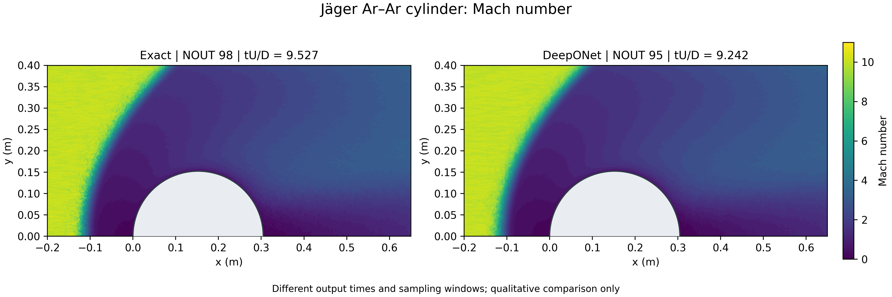
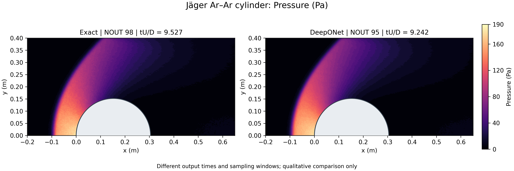
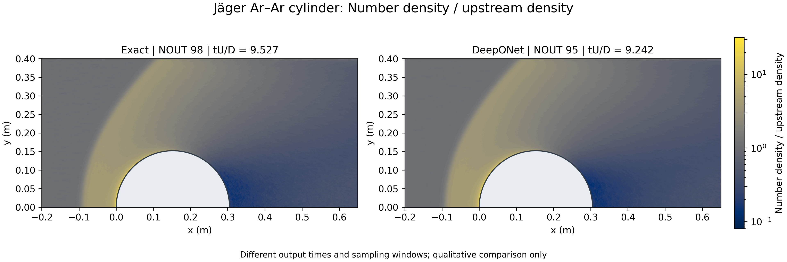

# Week 10.1 — Jäger Ar–Ar collision DeepONet: cylinder contours

[Week 10](../../notebooks/week10/README.md) ·
[Lecture companion](../../lectures/week10_1_abinitio_collision_deeponet.md)

## Research attribution

Ehsan Roohi, Ahmad Shoja-sani and Stefan Stefanov,
*Physics constrained neural collision operators for hard sphere surrogates
and ab initio angle prediction in direct simulation Monte Carlo*,
**Physics of Fluids 38, 057123 (2026)**,
[10.1063/5.0328463](https://doi.org/10.1063/5.0328463).

These pre-existing research fields were supplied by Ehsan Roohi from the
July 2026 Jäger/DSMC DeepONet package. The related article describes an MLP;
this later DeepONet package is **not a reproduction of that checkpoint or
the paper's speedup**. FlowMLLab adds AI-assisted verification and plotting,
not new simulations. This is separate from Week 7.1's Fusion-DeepONet paper.

## Colored fields








[Overview](contours_overview.png) · [Vector temperature figure](temperature_exact_deeponet.svg)
· [Provenance and rendering checks](contour_manifest.json)

PNG pairs are 3840 × 1280 pixels, 320 dpi. The script also generates SVG
versions of every pair; the temperature SVG is retained here. Each quantity
has common colors across both runs. Density is divided by the upstream
4.247e20 m^-3 and uses logarithmic colors.

## Interpretation limits

DeepONet learns a collision-angle map; DSMC produces the macroscopic flow.
Both runs use table lookup with different angular tables, not a direct
neural prediction of the plotted fields.

| Run | Output | tU/D | Cell-centre points |
| --- | --- | --- | --- |
| Exact-derived table | 98 | 9.526506 | 214,233 |
| DeepONet-derived table | 95 | 9.242032 | 214,233 |

**Different times and sampling windows: qualitative comparison only.**
No synchronized error map, convergence certificate, confidence interval or
speedup is claimed. Earlier surface-profile errors concern other reconstructed
windows and must not be used as accuracy measures of these fields.

## Verification and reproduction

Source: author-supplied `DEEPO_NET_CYLINDER_CONTOURS_308d9892.zip`, pinned by
SHA-256 in the manifest. ZIP CRC and all listed member hashes passed. Both
fields have identical coordinates, finite values, no duplicate centres and
no centres inside the cylinder.

Only the first Tecplot zone is used; subsequent boundary zones are excluded.
Linear interpolation onto an 851 × 401 display grid uses a triangulation
with solid-intersecting triangles masked. No extrapolation, statistical
smoothing, mirrored lower-half flow or synthetic samples are added. All
native values fall within the common color ranges. Display resolution is
not simulation resolution.

From the repository root, with the original ZIP available locally:

```bash
python qa/plot_deeponet_cylinder_contours.py /path/to/DEEPO_NET_CYLINDER_CONTOURS_308d9892.zip
```

Outputs default to ignored `tmp/abinitio_final/contours`, leaving retained
evidence untouched. The original archive and checkpoint are not redistributed.
Publication of these derived teaching figures was requested by Ehsan Roohi;
this does not grant a blanket license for the dataset, checkpoint or
third-party DS2V source. Cite the paper and FlowMLLab for this case.

This is a Week 10.1 supplemental reading case, not a new training notebook.
The archived v1.4.0 tag and DOI remain unchanged. This companion is included
in the separately requested v1.4.1 maintenance release.
