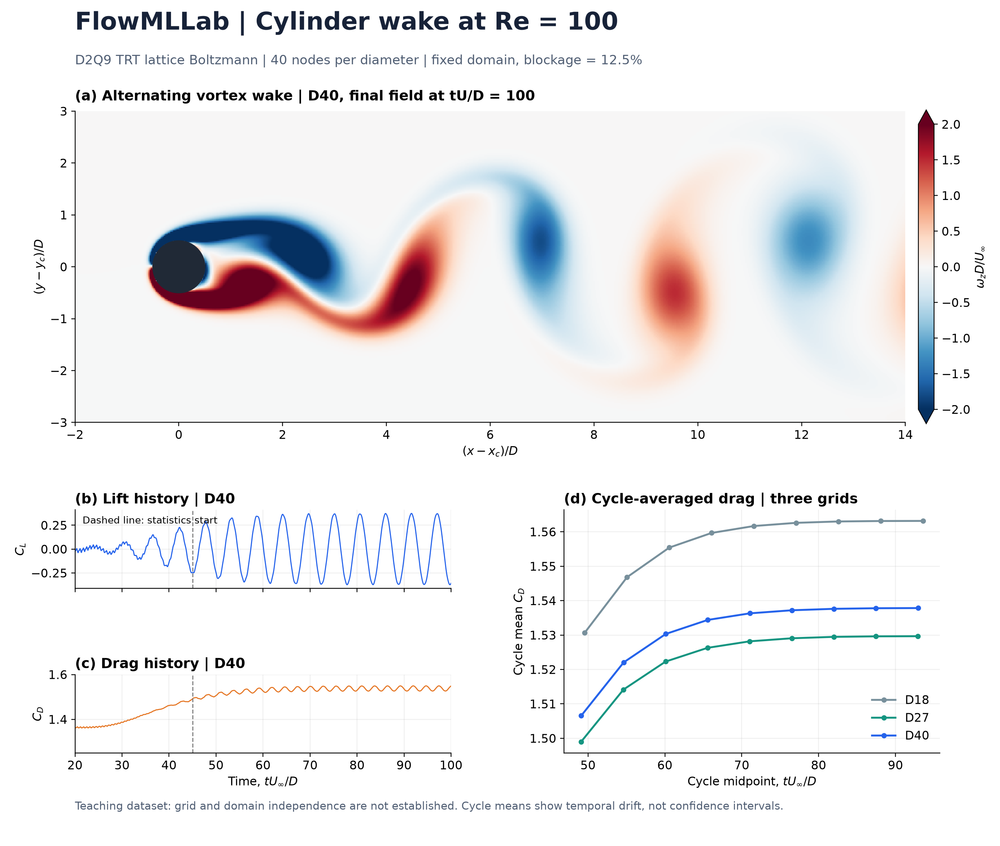

# Re100 cylinder: D40 teaching dataset

2D low-Mach TRT/Bouzidi LBM, Re=100, 40 nodes per diameter, 800 by 320 grid. Unity job 64026823 completed the simulation; exit 2 records the grid assessment.

Use for teaching force histories, shedding frequency, resolution comparisons and temporal averaging. Includes final and time-mean fields plus force histories, not time-resolved field movies or a new trained surrogate.

| Quantity | D40 |
|---|---:|
| Mean drag, tU/D about 45 to 100 | 1.53064 |
| Strouhal | 0.18288 |
| Recirculation length / diameter | 1.42230 |

Accuracy: D27-to-D40 changes are 0.52% in drag and 1.05% in recirculation length; these quantities have a nonmonotone three-grid sequence. Temporal drift remains. Educational results, not a certified grid-independent benchmark; original assessment flags are retained.

## Load from repository root

```python
import numpy as np
with np.load('results/cylinder_d40/re100_D040.npz', allow_pickle=False) as data:
    time = data['time']  # lattice timesteps
    lift = data['lift_coefficient']
    drag = data['drag_coefficient']
    velocity = data['u']
```

Recompute the temporal audit into a new directory:

```bash
python qa/audit_temporal_d40.py /tmp/flowml_temporal_audit_new
```

CSV and JSON retain metrics, configuration and temporal analysis. Nine complete lift cycles were available. Recirculation temporal uncertainty cannot be inferred from a single mean field.


## Overview figure



[PDF](cylinder_d40_overview.pdf). Reproduce from the repository root with `python qa/plot_cylinder_d40.py` (NumPy and Matplotlib). The final vorticity is shown at tU/D=100, clipped to +/-2; force histories are shown from tU/D=20. Cycle means describe temporal drift, not confidence intervals.
