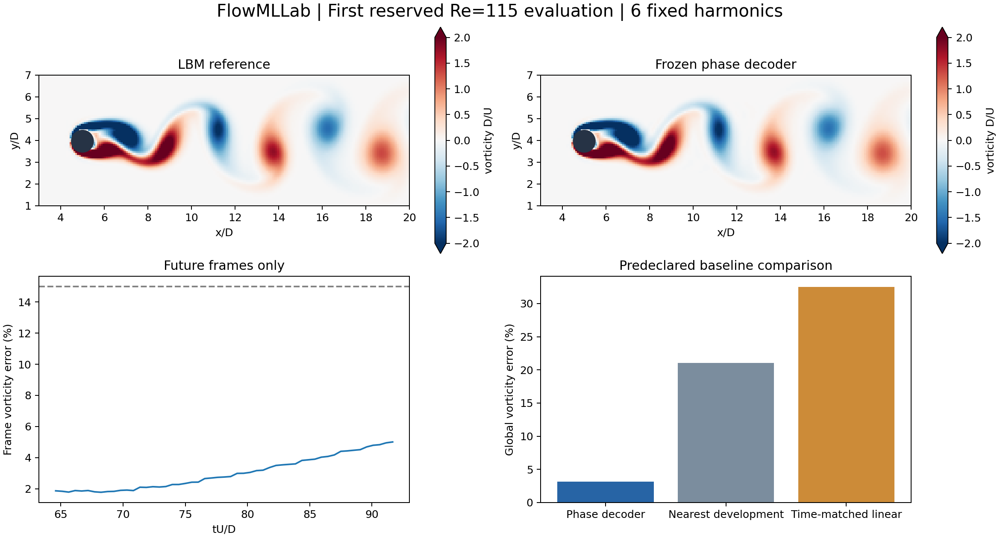

# First frozen-model evaluation: Re115

The protocol and model hashes were recorded before opening the target fields.
Six harmonics were selected using the existing Re100 validation result; development
cases were Re90, 110, 120, 140. No Re115 tuning was performed.

| Quantity | Fourier decoder | Nearest decoder | Time-matched linear fields |
|---|---:|---:|---:|
| Global vorticity relative L2 | 3.17% | 21.04% | 32.50% |
| Worst future-frame error | 5.01% | 33.61% | 41.79% |
| Strouhal relative error | 0.00445% | 0.901% | Not inferred |

The predefined vorticity and frequency gates pass. Pressure error is 10.09%,
versus 8.09% for linear interpolation: this is not superiority on every variable.
Four observed compact frames span t*=1.5625, versus 0.3125 for the dense original
validation. The 53-frame future test is therefore not an identical observation-window benchmark.
CFD force statistics are diagnostics, not surrogate force predictions. These are
educational LBM labels, without a claim of grid independence.

See `protocol.json`, `frozen_model.json`, `first_use.json`, `metrics.json`, and
`frame_errors.csv`. The case is no longer an untouched test after this report.
The scoring implementation is `qa/evaluate_reserved_cylinder.py`; it refuses to
overwrite an existing result directory. Development archive hashes are recorded
in the frozen model; inputs come from the public cylinder release.
