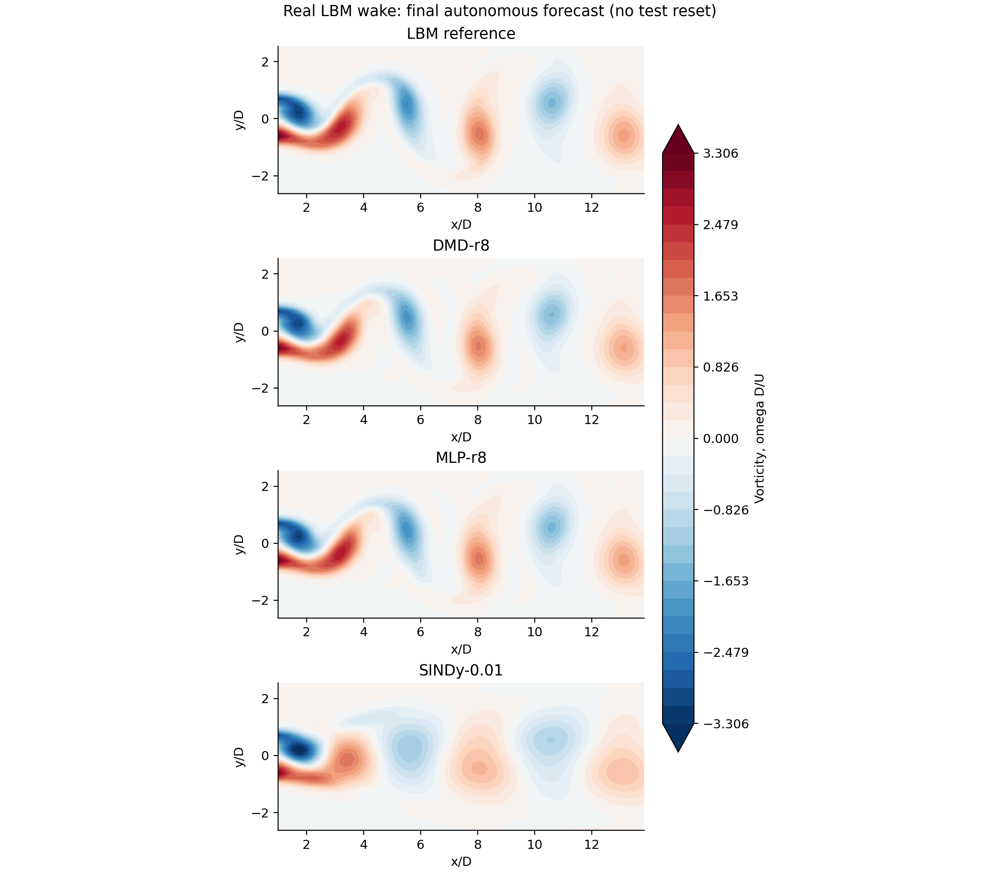
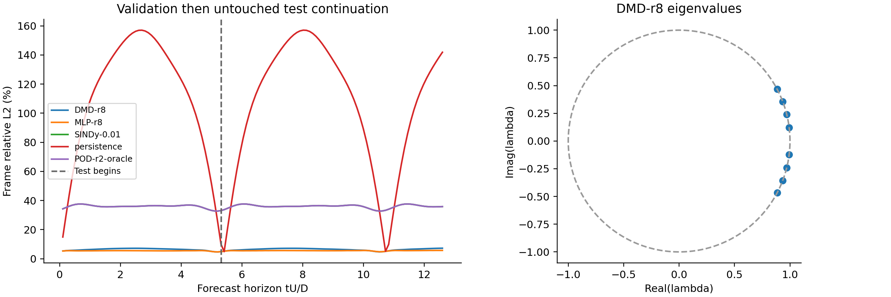
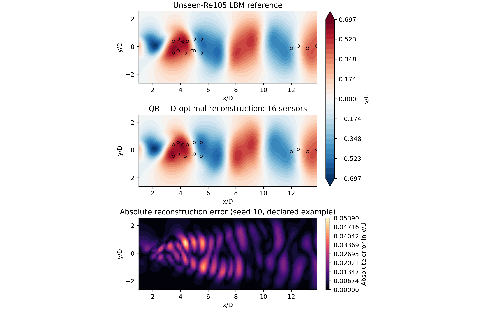
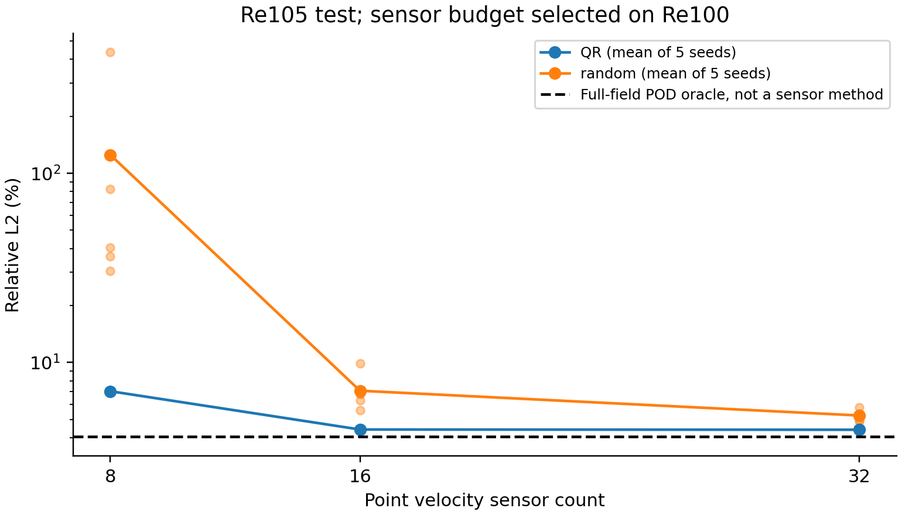

# Modal teaching experiments - development evidence

Two bounded additions to existing weeks, **not a new release/DOI or a newly blind
research benchmark**. Original implementations inspired by
[PyDMD](https://github.com/PyDMD/PyDMD),
[PySensors](https://github.com/dynamicslab/pysensors),
[PySINDy](https://github.com/dynamicslab/pysindy) and
[PDEBench](https://github.com/pdebench/PDEBench).
No external code, figures or package example data were copied. These are
transparent textbook exercises, not wrappers or package-equivalent implementations.

The underlying fields were generated earlier by the author FlowMLLab LBM solver
and published in [cylinder-cfd-v1](https://github.com/Ehsan-Roohi/FlowMLLab/releases/tag/cylinder-cfd-v1).
They are NOT the DSMC data from the hypersonic cylinder article and are not
presented as new results of that article. [Source/derivative provenance](../../data/modal_labs/README.md).

## Reproduce without modifying retained files

From the repository root, reproduce the retained dependency versions:

```bash
python -m pip install -e . -r qa/modal-requirements.txt nbformat nbclient nbconvert ipykernel
python qa/run_modal_labs.py --output tmp/modal-new-run
python -m unittest discover -s tests -p test_modal_tools.py -v
python qa/verify_modal_labs.py --output tmp/modal-new-verification
```

Use a fresh output path each time. The verification command additionally requires
nbformat, nbclient, nbconvert and ipykernel. It executes both notebooks and emits
executed HTML into scratch, verifies input/code hashes and compares **all**
reported candidate/seed metrics with retained values. Its declared portability
tolerance is 2% relative plus 1e-5 absolute for non-angular values; phase uses
a wrapped absolute tolerance of 0.001 rad (0.057 degrees), because relative error
is ill-conditioned near zero; identical local reruns were deterministic.
CI has been added for this check and HTML artifacts; remote CI is not claimed
until the branch is pushed and actually runs.

Recovery verification (2026-09-06): both notebooks executed and every retained
metric passed the existing tolerance with the pinned dependencies. All 470
retained files remained byte-identical. Fifteen modal unit tests passed; the
course gate parsed 30 notebooks / 312 code cells and 15 lecture PDFs.
Newer unpinned libraries exceeded tolerance for one MLP diagnostic, so CI now
uses the recorded versions rather than relaxing the gate. The local notebook
check used `--in-process` because kernel sockets are unavailable in that runtime;
CI uses Jupyter kernels. See [verification.json](verification.json).

`plan.json` is written before fitting; `metrics.json` retains the full protocol's
results, candidate failures, eigenvalues, ODE equations, spectral diagnostics,
sensor indices, library versions and source hashes. Full fields are recomputed
in seconds from the bundled CFD subset rather than stored redundantly.

## Week 7 - future time, not a new Reynolds number

Re110, vorticity ROI: train [0,160), validation [160,210), test [210,281).
POD and mean are training-only. DMD rank is selected on validation. The MLP is
freshly fitted with eight POD coordinates and a four-frame history, two 32-unit
tanh layers, seed17. Its initialization has more history than one-state DMD.
All predictions originate from the end of training and continue through test
without reset or teacher forcing.

| Method | Test relative L2 | Interpretation |
|---|---:|---|
| DMD rank8, validation-selected | 6.44% | Autonomous forecast |
| Fresh MLP rank8 | 5.54% | Autonomous four-history baseline |
| Full-field POD rank8 oracle | 5.45% | Representation floor, NOT a forecast |
| DMD rank2 | 36.09% | Lower-rank control |
| Integral SINDy rank2, threshold0.01 | 35.96% | 18 of 20 terms retained: weak sparsity |
| Full-field POD rank2 oracle | 35.96% | Large truncation floor |
| Persistence | 113.13% | Last training field |

The selected SINDy model is **not strongly sparse** (18/20 coefficients).
Threshold0.1 retains four terms but has 43.63% test field error. Threshold0.05
passes validation and then fails test integration; it remains a recorded failure.
Selection is frozen before attempting test rollouts: no replacement by a
test-successful candidate. A single periodic orbit does not identify unique
off-orbit cubic dynamics or discover Navier-Stokes.





The predeclared probe is near (x/D,y/D)=(4,0.5). Its test interval lasts only
7.40 D/U, with FFT-bin spacing about 0.135 U/D. This is not adequate for a
high-precision Strouhal estimate. Source force-history Strouhal is a diagnostic
only, never a fit/selection input. Relevant wake modes must be distinguished
from harmonics and possible box modes.

## Week 5 - sensing on a retained unseen-Re case

Train POD/locations on Re90+110, select budget on Re100, test on retained Re105.
Rank8; sensor budgets8/16/32; paired artificial observation noise = 1% training
v RMS; seeds10-14. The smallest optimized validation error <=5% selects16 sensors
(validation3.81%). Test mean errors at this same budget:

| Method | Mean test relative L2 |
|---|---:|
| QR + D-optimal, 16 sensors | 4.42% |
| Random, 16 sensors | 7.09% |

All five scores, condition numbers and all budgets are retained, not only the
winning mean. Seeds describe measurement-noise/layout variability in one case,
not independent CFD samples. Full-field POD oracle is a nondeployable floor.





## Metric and scientific limits

- Area-weighted relative L2/RMSE, maximum and worst-frame errors, ROI-edge error,
  scalar-integral error and mean-removed Hann-windowed temporal spectra are shared
  by these new labs; older archived experiments are not silently rescored.
- Undefined zero-reference relative errors are null. ROI edges are not physical
  walls. Vorticity/velocity scalar integrals are not mass or energy conservation.
- Fields retain the coarse educational LBM's discretization/domain limitations.
  The 32x78 ROI excludes the body. Filled contours interpolate level crossings
  for display only; no smoothing or synthetic resolution is used in metrics.
- This is original low-Mach LBM, not hypersonic DSMC, shock segmentation, robust
  noisy-DMD benchmarking or an independent validation of a Roohi article.
- Main remains the frozen course until reviewed; these are development companions.

CI portability correction: even the pinned environment on GitHub differed by
0.000304 rad in the MLP phase diagnostic (-0.009063 vs -0.009367 rad).
The original uniform relative check rejected this near-zero angle. Only angular
comparison now uses the absolute circular tolerance above; model selection,
field-error gates, source data and retained scores are unchanged.
