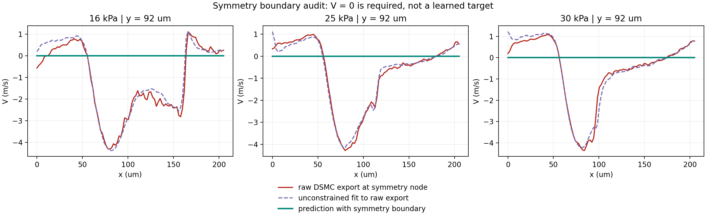

# Registered nozzle models and the symmetry defect

This experiment improves regression against the existing exported DSMC fields.
It does **not** pass physical validation: the source export has nonzero
transverse velocity at its stated horizontal symmetry boundary. Matching that
label cannot establish physical correctness.

## What was changed

The old alignment could select a large outlet gradient and translated entire
rows, including the fixed throat. The new positive interior compression sensor
excludes the expansion and outlet. A monotone coordinate map anchors inlet,
throat, compression and outlet. Training-only Huber quadratics locate the
compression from pressure. RMS-scaled registered fields define one joint POD.
Coefficients are predicted by a quadratic baseline or a trained tanh MLP.
The sensor smooths density only to locate compression; it does not replace labels.

All preprocessing is refitted inside ten complete-case development folds.
Pressures 15 and 33 kPa remain interpolation anchors. The candidate grid is
POD ranks 2/4/6 and neural widths 8/16, with seeds 690/691/692. Mean full-grid
relative L2 over the six fields selects the configuration. Exploratory work
also compared translated versus anchored registration and linear versus
quadratic pressure fits on development cases. This is a regression assessment
on **previously inspected** 16/25/30 kPa cases, not a new blind experiment.

The development winner is rank-6 POD with a quadratic branch (8.598% development
mean). The neural comparator uses rank 2 and width 8 (8.858% development mean).
Seven of its 30 development fits and one of three final fits emitted optimizer
convergence warnings; none were silently discarded. Neural spread is optimizer
variability, not a calibrated prediction interval.

| Raw-export regression metric | Previous interpolation | Selected polynomial | Neural ensemble |
|---|---:|---:|---:|
| Mean of 18 full-field errors (%) | 6.429 | 4.199 | 4.604 |
| Maximum full-field error (%) | 14.200 | 13.667 | 13.394 |

At 25 kPa, selected U/V errors are 2.173%/2.713%. At 30 kPa U/Mach remain
11.601%/13.667%, with 3.431 micrometres mean compression-station error.
No target-derived shift is used at inference. The paper checkpoint is absent
from the public source repository, and the paper's exact error contract has
not been independently reproduced. No claim of matching or beating the paper
as a whole is supported.

## Why the boundary plot was unphysical

The exported max-y row is at y = 92 micrometres. The required symmetry condition
is V = 0; the 16 kPa file instead contains V = -4.3103 m/s at x = 79.95 micrometres.
The next interior row has V = -8.4979 m/s at y = 91.164 micrometres.
This structured pattern is not evidence of random sampling noise alone.

The public [legacy Fortran archive](https://github.com/Ehsan-Roohi/roohi-nozzle-dsmc-fortran/tree/6e62458d31e99d9c63ca3079a28edba8376f5487)
contains an exporter that assigns adjacent cell attributes to top boundary
nodes without odd reflection of V. Inspect `artifacts/a5/a5cae3e0d196f14627b7952c2bf7ee1512fb709c37d2f9724f078b32a84c82fe.for`,
the `j.eq.(ncy+1)` branch before `WRITE (9,...)`. Its geometry variants and
variable lists do not establish the exact executable that produced the current
data. This is strong evidence of an export mechanism, not a verified rerun.

A correct symmetry reconstruction uses odd reflection for V, giving nodal
V = (Vc + (-Vc))/2 = 0, and even reflection for scalar quantities and tangential
velocity. The source cell statistics, exact run configuration and exporter
should be recovered before regenerating and validating all boundary values.

`predict_with_symmetry(model, pressures, symmetry_y_m=92e-6)` applies this known
boundary condition to predictions and rejects a coordinate that does not
identify an entire boundary row. Its result is saved separately as
`symmetry_constrained` in `predictions.npz`. All interior values are unchanged.
**These constrained values are not used to claim a lower raw-label error.**
The raw archives remain unchanged. Fixing the boundary alone does not establish
interior conservation, thermodynamic consistency, or the wall condition.



## Evidence and reproduction

```bash
python -m pip install -e .
OPENBLAS_NUM_THREADS=1 OMP_NUM_THREADS=1 python qa/run_nozzle_transport_validation.py --stage select
OPENBLAS_NUM_THREADS=1 OMP_NUM_THREADS=1 python qa/run_nozzle_transport_validation.py --stage evaluate
python -m unittest discover -s tests -p test_nozzle_transport.py -v
```

The retained run uses Python 3.12, NumPy 2.2.6, SciPy 1.15.3,
scikit-learn 1.6.1 and Matplotlib 3.10.9, within project dependency ranges.
`selection.json` is saved before evaluation. CSVs retain all development
folds, all three global/local metric variants, neural seeds and physical
diagnostics. NPZ checkpoints load without pickle. `report.json` records
hashes, timing and `physical_validation_passed: false`.

The common global metric is unweighted grid relative L2. Historical
shock-window and gradient-weighted definitions remain fixed across models;
they are not assumed identical to the paper's local metrics. Mass-flow
integration is a diagnostic over the exported nodal fields, not exact
conservation: the source itself has about 6% streamwise spread. Density and
pressure retain source units. Figures share reference/prediction color scales
and show the full absolute-error range; no clipping hides the 30 kPa failure.

The NPZ source is the CC BY 4.0 derivative described in
`../mahdavi_deeponet/provenance.json`. New model outputs and numerical figures
are FlowMLLab-generated. No restricted course text or solution was used.

## Required next evidence

Recover the exact cell-centered DSMC export and boundary metadata; regenerate
nodal output with correct parity; verify boundary and interior diagnostics;
obtain the article checkpoint and exact evaluation definitions. Then freeze
the model and generate additional unseen cases, especially around the current
high-pressure failure and a separate geometry. Select their size using pilot
cost and learning curves rather than an arbitrary 200–500-case commitment.
