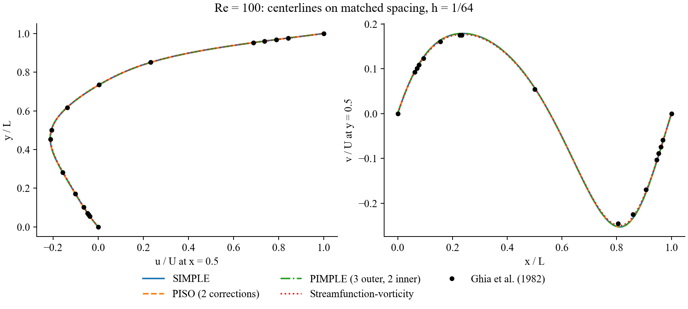
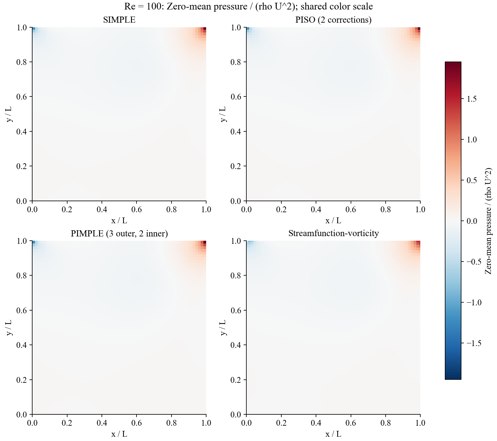
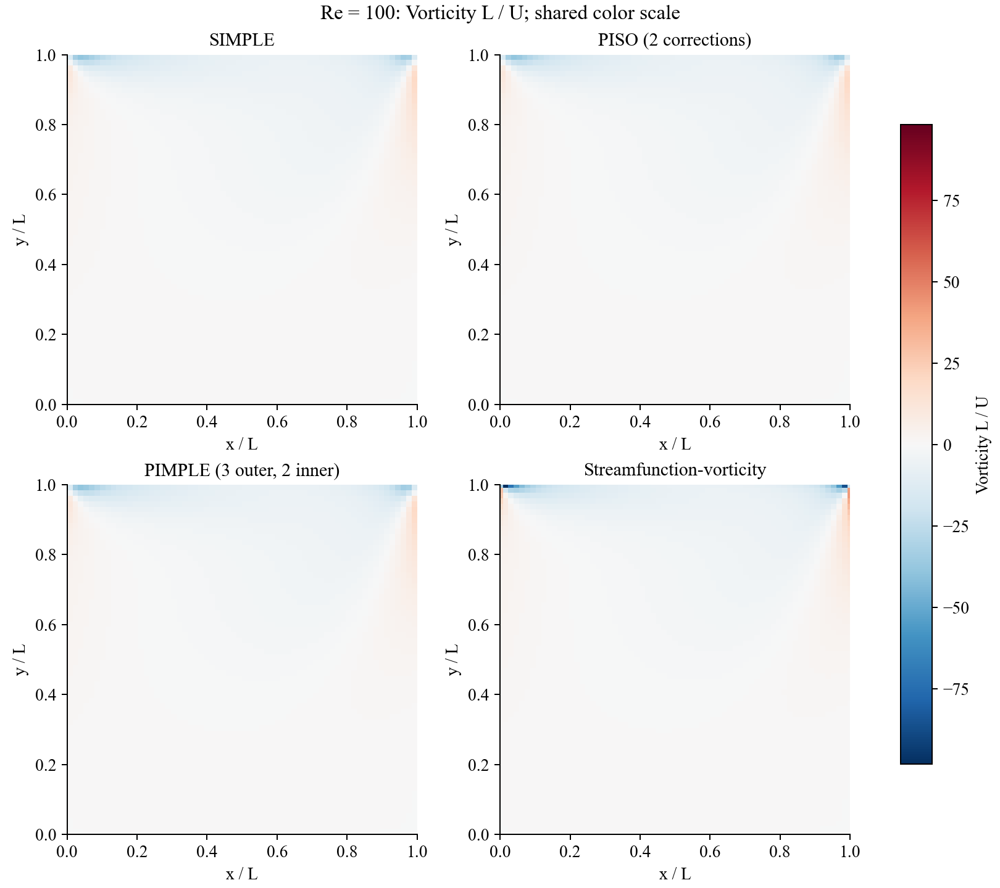
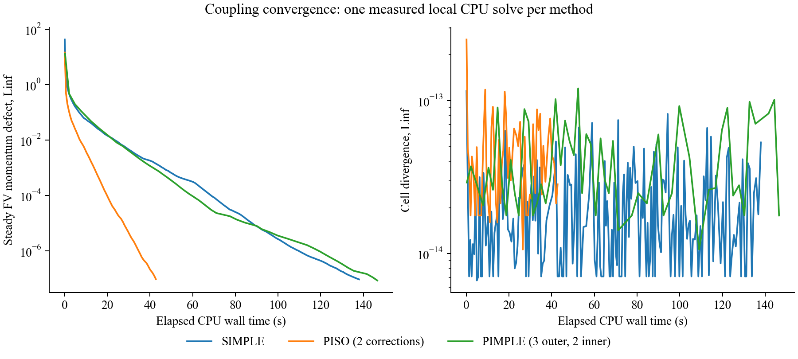
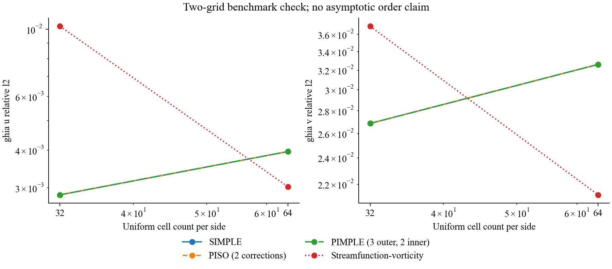

# Week 1.2: executed Re=100 cavity comparison

All three FV coupling algorithms solve the same steady discrete equations. PISO and PIMPLE approach that state using backward-Euler physical steps. The existing Week-1-family streamfunction-vorticity source is used unchanged as an independent reference.

| Method | Cells/side | Iterations or steps | CPU s | Ghia u relative L2 | Ghia v relative L2 | FV momentum Linf | FV divergence Linf |
| --- | ---: | ---: | ---: | ---: | ---: | ---: | ---: |
| SIMPLE | 32 | 480 | 5.074 | 0.00284714 | 0.0268666 | 8.538e-08 | 3.220e-15 |
| PISO (2 corrections) | 32 | 540 | 6.994 | 0.00284715 | 0.0268665 | 9.543e-08 | 1.933e-14 |
| PIMPLE (3 outer, 2 inner) | 32 | 540 | 19.604 | 0.00284714 | 0.0268666 | 8.635e-08 | 2.126e-14 |
| Streamfunction-vorticity | 32 | 19000 | 8.106 | 0.0102302 | 0.0369577 | not the same discrete norm | streamfunction construction |
| SIMPLE | 64 | 1870 | 137.987 | 0.00395384 | 0.0326072 | 9.284e-08 | 5.339e-14 |
| PISO (2 corrections) | 64 | 540 | 42.756 | 0.00395384 | 0.0326071 | 9.491e-08 | 2.842e-14 |
| PIMPLE (3 outer, 2 inner) | 64 | 540 | 146.522 | 0.00395385 | 0.0326072 | 8.489e-08 | 1.776e-14 |
| Streamfunction-vorticity | 64 | 19000 | 17.284 | 0.00302636 | 0.0212527 | not the same discrete norm | streamfunction construction |

## What this establishes

- All six new FV runs reach momentum Linf < 1e-7 and continuity Linf < 1e-9.
- The three FV algorithms agree on each grid within 2e-6 in u, v and zero-mean p.
- The FD reference velocity errors decrease on refinement. The FV Ghia errors increase slightly from 32 to 64 cells: this nonmonotone trend is retained explicitly, not labelled an accuracy/refinement pass.
- Ghia values are benchmark data, not an exact solution. Pressure is not validated by Ghia velocity tables.
- The independent streamfunction discretization and pressure recovery need not match the FV pressure pointwise, especially at the singular lid corners.
- CPU values are single-run, local measurements. They do not establish a universal fastest algorithm.
- Two grids do not establish an asymptotic convergence order. Only Re=100 steady coupling, conservation and the stated benchmark-error bounds are qualified. Further refinement and another velocity reference are required before an asymptotic accuracy claim.
- Backward Euler is first order in time. Startup accuracy and larger-time-step PIMPLE benefits need a separate temporal-refinement study.

## Settings

Unit square, lid speed 1, density 1, nu=0.01, no-slip impermeable walls; pressure mean zero. Uniform MAC finite-volume grids, central convection and central diffusion. SIMPLE alpha_u=0.7, alpha_p=0.3. PISO: dt=0.05, 2 pressure corrections. PIMPLE: same dt, 3 outer loops and 2 pressure corrections per outer loop. Linear systems use sparse LU (SciPy); no multigrid or packaged CFD solver.

Normal wall velocities are exactly zero. Tangential wall velocities enter the momentum equations using half-cell distances; the lid corner discontinuity is not silently smoothed. All plotted curves are computed fields.

## Figures












## Reproduce

```bash
python qa/run_week01_2.py
python qa/build_week01_2.py
python -m unittest discover -s tests -p test_pressure_velocity.py -v
```

[Executed field/configuration manifest](manifest.json) records hashes, Python/NumPy/SciPy versions, stopping conditions and all measured quantities.

[Notebook](../../notebooks/week01_2/W1_2_Cavity_Pressure_Velocity.ipynb) | [Lecture](../../lectures/week01_2_pressure_velocity.pdf) | [Algorithm and source notes](../../notebooks/week01_2/README.md)
