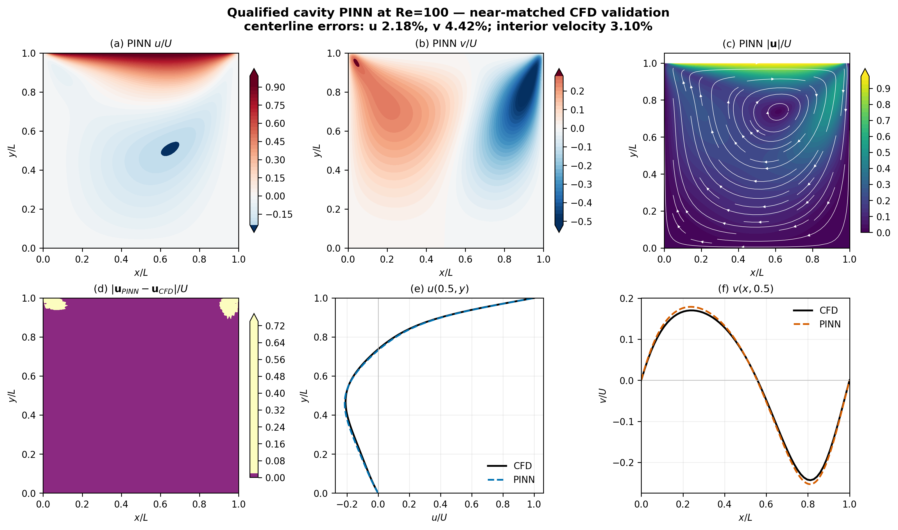
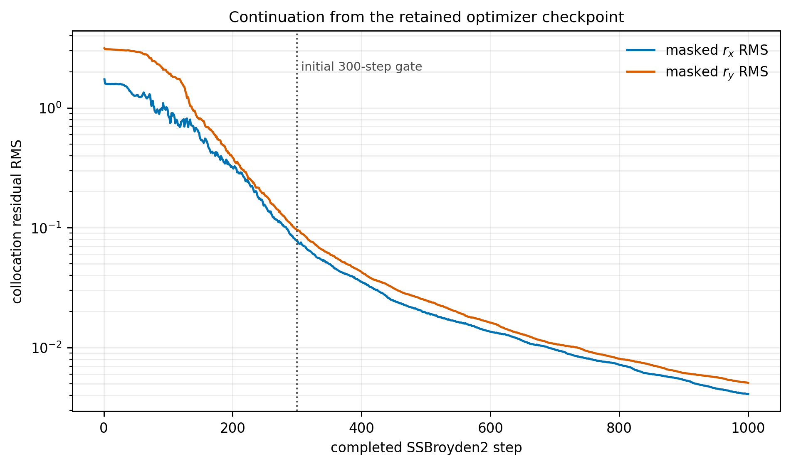

# Week 4.2: qualified cavity PINN evidence

This directory contains the selected, lightweight evidence from the Unity
qualification of Christopher J. McDevitt's DeepPlasma lid-driven-cavity PINN.
McDevitt gave Ehsan Roohi permission to use this case in the course. The
external implementation is not redistributed; the runner fetches and verifies
the upstream source identified in `audit.json`.

## Result and scope

The retained result is a float64, fixed-collocation PINN at Re=100 trained on an
NVIDIA A100 in Unity's `gpu-preempt` partition. It is **qualified against a
near-matched reference**, not claimed as a high-Reynolds-number research result.
The PINN uses a smooth lid near the corners, while the retained conventional-CFD
field uses the classical discontinuous lid.

| Quantity | Relative L2 error | Frozen gate | Decision |
|---|---:|---:|---|
| vertical-centerline `u(0.5,y)` | 2.18% | 10% | pass |
| horizontal-centerline `v(x,0.5)` | 4.42% | 15% | pass |
| interior velocity vector, 8,192 audit points | 3.10% | 15% | pass |

The independent, unmasked momentum-residual RMS values are 0.0378 and 0.0246.
The divergence RMS is 2.34e-15, and all four walls satisfy the hard velocity
conditions to machine precision. These residual values and field errors measure
different properties and must not be conflated.

## Predeclared continuation

The first 300-step run missed the frozen field-error gates at 11.27%, 19.24%
and 15.51%. It was retained as a failed qualification. The accepted run then
continued the *same* seed, collocation points, model, dense inverse-Hessian and
random-number states to 1,000 steps; no threshold was changed. The continuation
passed at 2.18%, 4.42% and 3.10%.

The Slurm script requests a checkpoint signal ten minutes before the two-hour
limit and requeues automatically. Atomic checkpoints include the model,
SSBroyden2 state, fixed collocation set, completed step and CPU/GPU/NumPy RNG
states. The 229 MB checkpoint remains on Unity and is deliberately excluded
from GitHub.

## Reproduction

See [`qa/WEEK42_UNITY_PROTOCOL.md`](../../qa/WEEK42_UNITY_PROTOCOL.md), the
restartable runner, pinned dependency file and environment gate. `audit.json`
is the machine-readable scientific record. The figure files are regenerated
from the accepted checkpoint with `FLOWML_PINN_RENDER_ONLY=1`, so rendering
cannot alter the training evidence.

`render-audit.json` records the successful render-only Slurm job and exact
SHA-256 digests and pixel dimensions of both publication figures. The render
job loaded the accepted checkpoint and did not perform an optimizer step.
