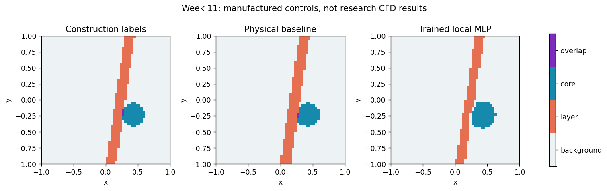
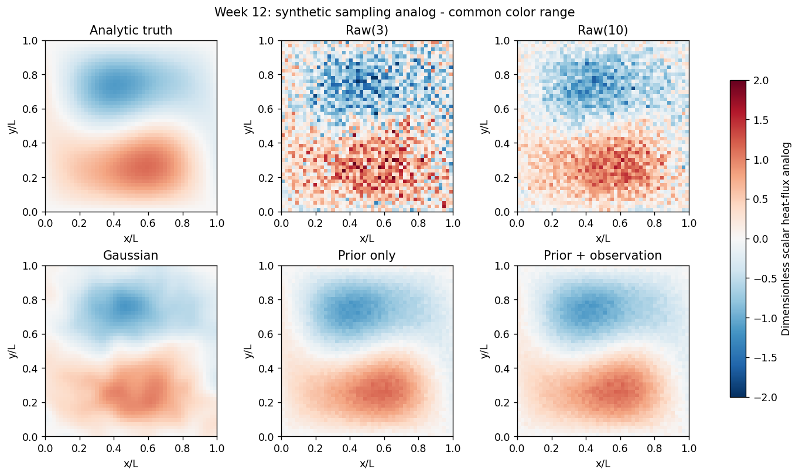

# Weeks 11 and 12 - executed teaching analogs

These original warm-up figures are preserved. The main course gallery now shows
[Week 11 real airfoil/cylinder inference](../week11_research/README.md) and
[Week 12 real DSMC heat-flux reconstruction](../week12_research/README.md).
Both notebooks and lectures distinguish the warm-up from those research sections.

These figures come from the two executed classroom notebooks, not the author's
research simulations. Source methods are attributed separately below. No original
CFD/DSMC archive or research checkpoint is redistributed. These additions postdate
v1.4.1 and are not retroactively included in its immutable Zenodo archive.

## Week 11: overlapping features

[Lab](../../notebooks/week11/W11_Shock_Vortex_Identification.ipynb) ·
[Lecture](../../lectures/week11_shock_vortex_identification.pdf).
Analytic compression layer, vortex and shear; **not a physical shock solution**.
Known construction labels are compared with a validation-thresholded physical
baseline and a trained local MLP. Full case-wise metrics remain in the notebook.
The MLP is not the research spatial dual-decoder model.

Retained result: the physical baseline wins both tasks on case 50, while the
MLP wins both on case 51. Do not describe this as uniform neural superiority.

Research source: Ehsan Roohi, *Physics-audited joint neural segmentation of shocks
and vortex cores: cross-solver transfer and controlled airfoil--cylinder studies*,
author-supplied manuscript (2026), [ShockVortexML](https://github.com/Ehsan-Roohi/ShockVortexML).

## Week 12: observation-conditioned reconstruction

[Lab](../../notebooks/week12/W12_DSMC_Moment_Reconstruction.ipynb) ·
[Lecture](../../lectures/week12_dsmc_moment_reconstruction.pdf).
Synthetic scalar pattern with independent Gaussian blocks; **not DSMC results**.
All methods share one independent noisy reference per case. Training, validation
and test seeds are disjoint. Mean preservation is not exact truth or a full
conservation certificate. The support score is a heuristic, not calibrated coverage.

Research source: Ehsan Roohi, *Geometry-native machine learning reconstruction of
DSMC moment fields with support monitoring*,
[arXiv:2609.01637](https://doi.org/10.48550/arXiv.2609.01637) (2026).
The scalar mean-prior/DCT exercise does not replace the paper's MambaIR prior,
nine-field reconstruction, geometry-native cylinder transfer or 27-zone monitor.

Retained limitations: prior-plus-observation improves mean reference NRMSE only
modestly over prior-only in this synthetic family, and its gradient error is
worse than prior-only. The simple support rule abstains on both the shifted
case and the displayed new in-condition draw: a visible false-alarm example,
not evidence that the heuristic reliably separates supported and unsupported
conditions. No thresholds were retuned after reading these test outcomes.

## Rebuild (maintainer operation)

Install notebook/PDF authoring dependencies in addition to FlowMLLab:
`python -m pip install nbformat nbclient ipykernel reportlab pillow`.
From a complete checkout run `python qa/build_week11_12_materials.py --execute`.
This explicit authoring command rewrites the two named notebooks and teaching
figures, stages PDFs under output/pdf and copies them into lectures/. Ordinary
student notebook execution performs no such retained-file writes.

Lecture sources are Markdown under lectures/source/. New educational wording,
code and manufactured data are original AI-assisted FlowMLLab work, not new
research CFD or particle-solver evidence. Seven numerical regression tests cover
the core controls and invariants in tests/test_feature_reconstruction.py.
