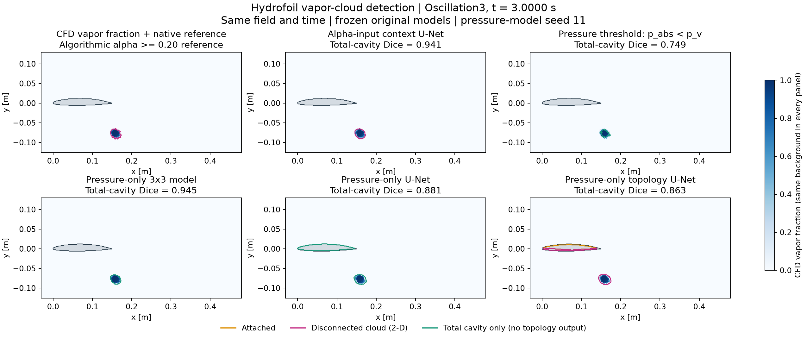
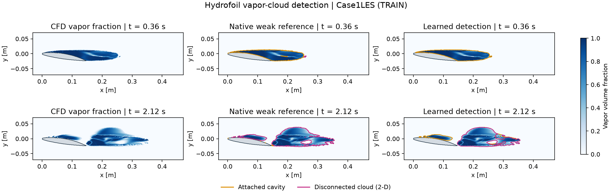
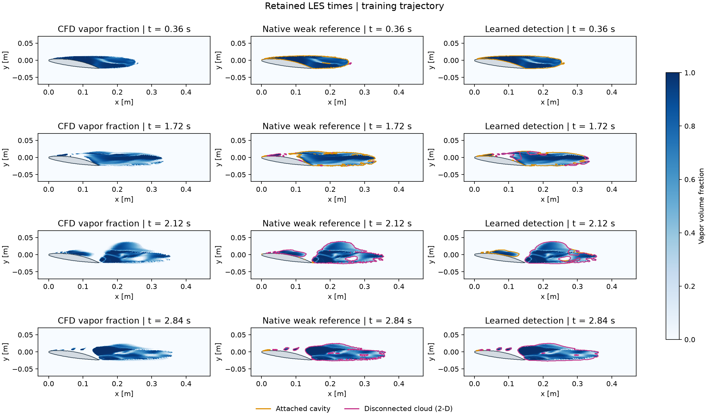
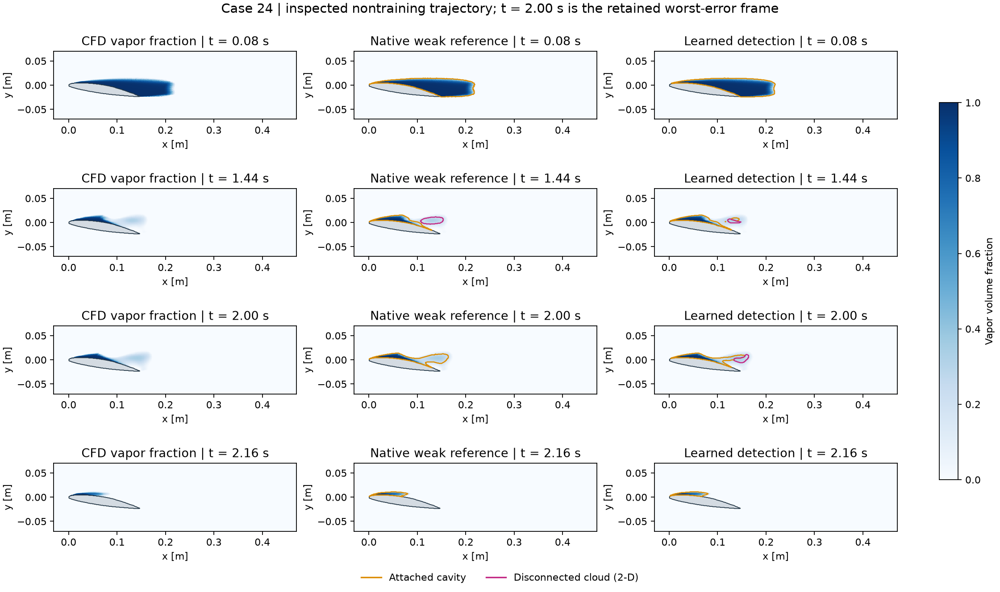
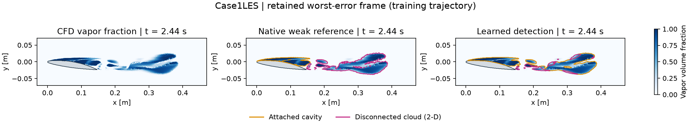

# Hydrofoil vapor-cloud detection: alpha and pressure methods

[Colab](https://colab.research.google.com/github/Ehsan-Roohi/FlowMLLab/blob/main/notebooks/week11/W11_Cavitation_Cloud_Detection.ipynb) ·
[Notebook](../../notebooks/week11/W11_Cavitation_Cloud_Detection.ipynb) ·
[Code](../../flowmllab/cavitation_detection.py) ·
[Lecture 11](../../lectures/week11_shock_vortex_identification.pdf) ·
[Data and model provenance](../../data/week11_cavitation/manifest.json)

## Compare the methods on identical fields and times




The comparison includes alpha-input context U-Net, fixed pressure threshold,
pressure-only 3×3 model, pressure U-Net and pressure topology U-Net. CFD alpha
provides the same background in every panel; it is never supplied to pressure
inference. Orange/magenta denote attached/disconnected classes. Green denotes
total cavity for methods without topology output. Raw wall mistakes are visible.

Each case's largest valid CFD cavity area determines the illustrated frame;
model score does not select it. Seed 11 is the first declared pressure seed.
The frame Dice printed in a panel differs from the whole-trajectory pooled
scores in [the complete table](methods_metrics.json), which retains all
16 frames and three seeds. Both cases lack valid attached-reference pixels.
They were excluded from training but previously inspected. Inputs and training
histories differ, so these are not blind or matched-input accuracy rankings.
The less successful U-Net variants remain visible as diagnostic comparisons.

[Comparison code](../../flowmllab/cavitation_methods.py) ·
[Data, weights and protocol](../../data/week11_cavitation_methods/README.md) ·
[Figure times and hashes](methods_figure_provenance.json).

## Original alpha-input detector and its retained cases

This extension packages Ehsan Roohi's existing hydrofoil machine-vision code and
results (`native_alpha20_v6`, 2026-09-12). The original 126,275-parameter context
U-Net is rerun on all 158 retained frames. The fresh argmax predictions and pooled
TP/FP/FN scores must match the stored original evidence. It is spatial detection
from CFD vapor fraction and geometry, not photographic segmentation or forecasting.

## Cavity field and learned detection



Orange: attached cavity. Magenta: disconnected vapor cloud in 2-D. Solid is grey;
grey support in the reference outside the solid marks uncertainty. Vapor color
range is [0,1] in every panel. The 0.36 and 2.12 s frames are **TRAIN examples**.
Predictions are unmodified neural argmax; wall mistakes are not silently removed.

## The complete retained LES review



The four original review times are 0.36, 1.72, 2.12 and 2.84 s. Their visual
sequence is not proof of object identity, a resolved detachment event or a
converged shedding cycle. This is the training trajectory.

## Nontraining transfer and retained failures



Case 24 was excluded from gradient training but inspected during development.
The original worst-error time is 2.00 s. Its cloud score remains substantially
weaker than its attached-cavity score; this limitation is part of the lesson.



## Pooled agreement with the native alpha20 weak references

| Case | Role | Frames | Attached Dice | Cloud Dice |
| --- | --- | ---: | ---: | ---: |
| Case 13 | TRAIN | 18 | 0.98971 | 0.97397 |
| Case 14 | TRAIN | 18 | 0.97880 | 0.95276 |
| Case 16 | TRAIN | 18 | 0.97668 | 0.88049 |
| Case1LES | TRAIN | 32 | 0.93323 | 0.88713 |
| Case 19 | Inspected validation | 27 | 0.96939 | 0.56808 |
| Case 24 | Inspected nontraining | 27 | 0.96270 | 0.49188 |
| Case 23 | Inspected nontraining | 18 | 0.97995 | 0.85525 |

Scores pool valid pixels over each case. The native teacher uses face connectivity
at alpha_v >= 0.20 and exact wall contact; solid/uncertain support is ignored.
These numbers are **weak-reference agreement**, not independent physical accuracy.
Class imbalance, tiny cloud supports and correlated snapshots matter. The
[machine-readable replay](replay_metrics.json) includes TP, FP, FN, wall errors and
zero-vapor controls. [Figure provenance](figure_provenance.json) records times,
indices, configuration and model/data/code hashes. A raster-connectivity baseline
and a seeded noise exercise are executed in the notebook without altering the model.

## Code and training provenance

v6 adapts a previously trained native_v4 parent for 1000 additional updates at
learning rate 0.0002 using the four TRAIN cases and the changed alpha20 references.
The parent had 2000 updates with alpha50 references. A failed from-scratch alpha20
development attempt preceded the retained adaptation; this is not a new blind
experiment or an equal-total-budget comparison. The fixed final step is retained.

The notebook includes the original architecture, preprocessing, weighted
cross-entropy plus foreground-Dice training objective, cloud-frame sampling,
reflection augmentation and clipping through the reusable Python module.
Optional final-stage adaptation starts from the supplied parent; it never
overwrites the original weights. Raw Fluent conversion and the earlier parent
training are outside the public subset. No new successful training claim is made.

To rebuild the retained figures and notebook from the public bundle:

```sh
python -m pip install -e '.[test,reconstruction]' nbclient ipykernel
python qa/build_week11_cavitation.py
python qa/build_week11_cavitation_methods.py
```

Student Run All computes in memory and preserves the retained files. The builder
above is an explicit authoring command that regenerates this gallery.

Related primary study: Hatzissawidis et al., *Deep learning semantic segmentation
for cloud cavitation image analysis*, Physics of Fluids 38, 093331 (2026),
[10.1063/5.0345365](https://doi.org/10.1063/5.0345365). That study uses camera-image
segmentation followed by heuristic sheet/cloud separation. This lab uses the
author's separate CFD-based multiclass experiment; it does not claim to reproduce
or outperform that study. Code adaptation and course text are AI-assisted.
