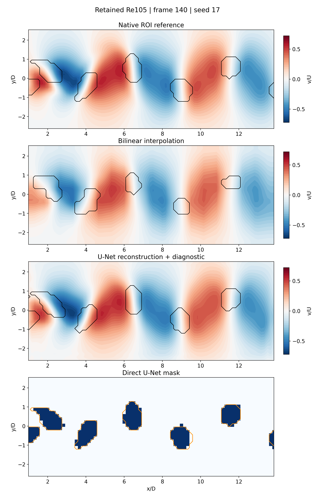
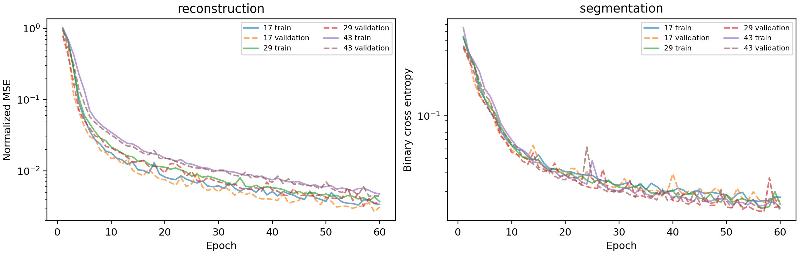

# Week 11: retained reconstruction / identification comparison

Three CPU training seeds, complete-case splitting, validation-selected checkpoints.
These are previously generated coarse author LBM wakes, not new CFD or a blind research benchmark.
The mask reference is native-ROI swirling strength, not human annotation. No shock accuracy is claimed.

| Method | Seed | Velocity L2 | Vorticity L2 | Dice | IoU |
|---|---:|---:|---:|---:|---:|
| Interpolation | - | 0.0789 | 0.3980 | 0.7730 | 0.6305 |
| reconstruction | 17 | 0.0177 | 0.1122 | 0.9477 | 0.9008 |
| segmentation | 17 | N/A | N/A | 0.9673 | 0.9368 |
| reconstruction | 29 | 0.0189 | 0.1261 | 0.9419 | 0.8904 |
| segmentation | 29 | N/A | N/A | 0.9727 | 0.9470 |
| reconstruction | 43 | 0.0209 | 0.1407 | 0.9409 | 0.8886 |
| segmentation | 43 | N/A | N/A | 0.9718 | 0.9454 |

L2 values are fractions, not percentages. Dice/IoU are frame-macro scores excluding a two-cell ROI margin.
No best-test model or best-looking frame is selected. Seeds quantify optimizer variability only.

Black contours: each velocity field's diagnostic mask. In the direct-mask panel, orange outlines are the native weak reference.
Color limits come from training v; all velocity panels share them. Physical aspect ratio is preserved.
Filled contours interpolate level crossings for display only; all scores use the original 32 x 78 arrays.

[Full protocol, provenance and limitations](../../notebooks/week11/RECONSTRUCTION_PROTOCOL.md) · 
[Executable companion](../../notebooks/week11/W11_Lab2_Reconstruction_and_Identification.ipynb)

Reproduce into a fresh directory: `python qa/run_week11_reconstruction.py --output output/new_w11_run`.
The supplied Ricardo-course code/checkpoint is not redistributed; this is an independent adaptation of the reconstruction-first idea.
