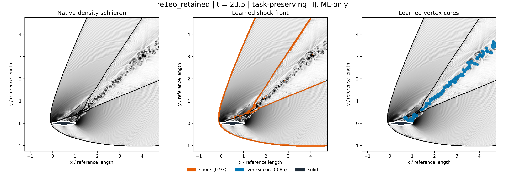
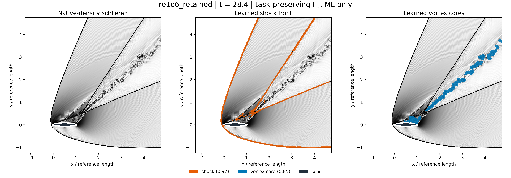
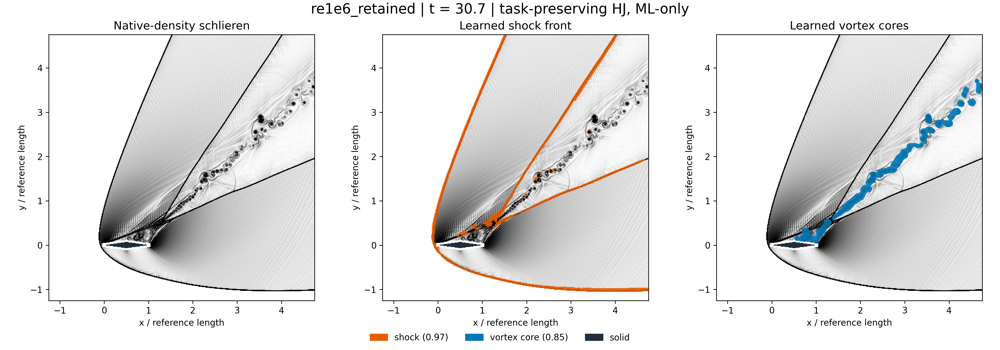
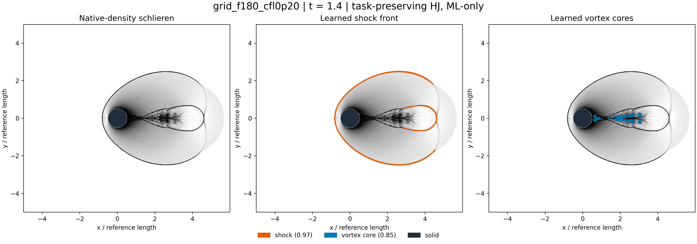
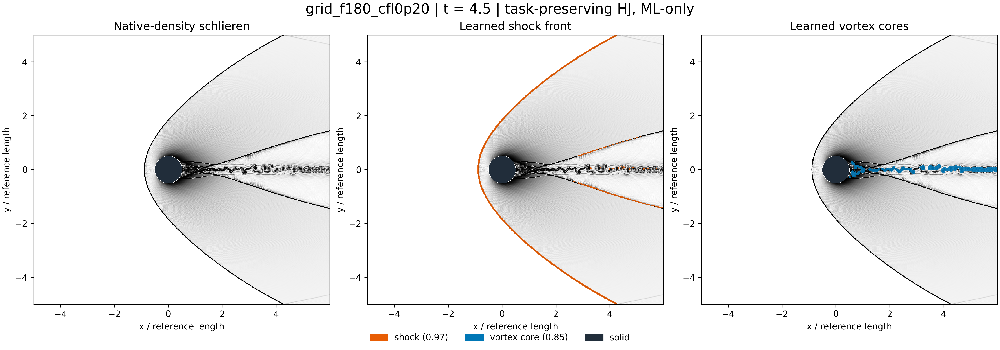
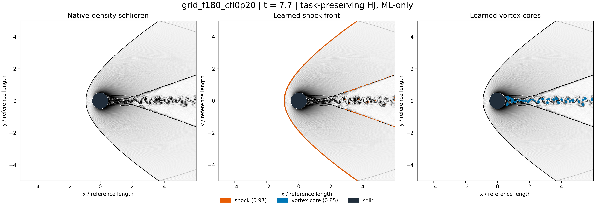

# Week 11 — real shock/vortex research fields

Existing research data from Ehsan Roohi, *Physics-audited joint neural segmentation
of shocks and vortex cores: cross-solver transfer and controlled airfoil--cylinder
studies*, author manuscript (2026), [ShockVortexML](https://github.com/Ehsan-Roohi/ShockVortexML).
The authors approved public preprint release on 2026-09-06; the repository will
record the public identifier when the deposit is complete. It is not currently
claimed as a published JCP article or deposited preprint. CFD fields and the
trained checkpoint predate this course addition; they were not generated by an
LLM.

Six fresh CPU inference runs use the frozen task-preserving Harmonized Joint
(HJ) `shock_repair_v2_native86_v1` kit. HJ is the custom shared-encoder,
multi-branch encoder-decoder used by the research workflow; the full workflow
has specialist shock, vortex-core, wake/shear and expansion paths. This gallery
renders only the shock and vortex outputs. U-Net is a capacity-matched baseline
and a separate reconstruction experiment, not the network used for these masks.
Primitive hashes, checkpoint files and seven-channel input contracts were checked.
Shock threshold 0.97; vortex threshold 0.85; minimum component 9 native pixels.
No new solver run, retraining, threshold tuning or physics-supported hybrid.
The [manifest](research_manifest.json) records selected IDs and checkpoint hash.

Selection was first/middle/last eligible time after t>1 for each of two
previously inspected development-test trajectories. All human-review frames were
excluded. These are not untouched external tests. Mask counts are not accuracy;
no independent human annotations were supplied for these figures.

Same-model qualitative movies on the author's YouTube channel:
[airfoil S2](https://www.youtube.com/watch?v=j9rO5j3sudA) and
[cylinder S8](https://www.youtube.com/watch?v=hh3K40KRBUQ). Both descriptions
identify the fixed shock-front model with preserved structure outputs and link
to the ShockVortexML release. They are visualization evidence, not accuracy data.

## Airfoil — all three times







## Cylinder — all three times







Each 4800-pixel-wide figure retains the full native domain, equal physical-axis
scales, raw-density schlieren and separate ML-only masks. Solid-crossing display
gradient stencils are excluded; missing features are not painted in. Inspect
thin missed branches and merged cores. Native grid artifacts remain visible.
Matching PDF figures are available in this directory; raster data remain native
resolution even in a PDF. No super-resolution or synthetic detail is introduced.

## Reproduction and reuse

From FlowMLLab with the author's research checkout and its runtime installed:

```bash
python qa/run_week11_research_figures.py --research-root /path/to/ShockVortexML --output tmp/new_week11_run
```

Requires the frozen replay kit, native primitives and review manifests. The
command refuses an existing output directory and does not alter the research
checkout. Bulk primitives/checkpoints are not duplicated here. Derived figures
are included for the author's course; no new blanket license for upstream
research assets is asserted. Original plotting and teaching integration are
AI-assisted, not new CFD data generation.

[Notebook and lecture](../../notebooks/week11/README.md) ·
[Preserved synthetic warm-up](../week11_12_teaching/README.md).
