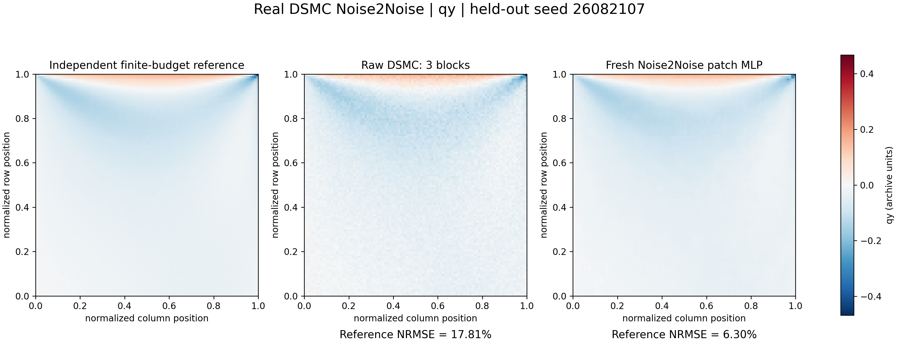
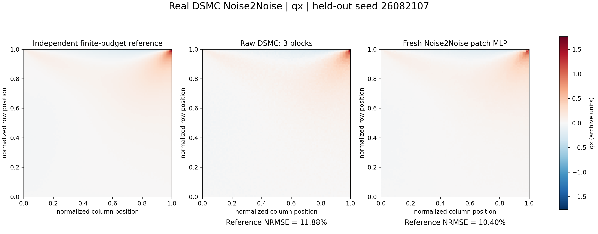
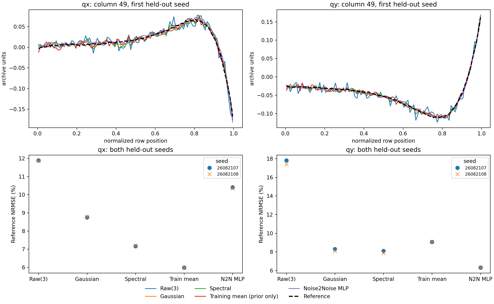

# Week 12 — freshly trained Noise2Noise-style DSMC lab

Development extension, not a release or new DOI. A complete Run All trains a
small model from real observations; it does not merely display checkpoint images.

Data: existing Roohi JCP2 cavity archive associated with
[arXiv:2609.01637](https://doi.org/10.48550/arXiv.2609.01637).
Method inspiration: Lehtinen et al., [Noise2Noise](https://arxiv.org/abs/1803.04189).
Original FlowMLLab implementation; no NVlabs code or research checkpoint reused.

## Protocol and limitations

Four training seeds, two validation seeds, two evaluation seeds. Each noisy
training input is paired with the average of the other three training seeds.
Input/target pairing therefore never includes the input seed in its own target.
Targets use nine blocks; training mean uses all 12 development blocks. This is
not a method trained with only the current three-block observation.

A 5x5 two-component patch feeds a 64x32 tanh MLP, without spatial coordinates.
Fixed initialization 12, 3,000 locations per training seed, at most 160 epochs.
Scales are training-only. Gaussian width is selected from 0.5/1/1.5/2 using
independent noisy validation targets, not the reference. The DCT filter uses
training-only spectral signal/noise estimates. Nothing is tuned on test error.

**The optimizer reached its 160-epoch budget without satisfying its convergence
criterion.** This limitation is retained in the notebook and manifest. The result
is a fixed-budget teaching baseline, not a fully optimized denoiser. qx is a
visible neural failure relative to simpler methods; it is not removed or retuned.

The archived reference was opened by the runner only after fitting/selection.
Nevertheless this is an already-inspected archive and not a new blind trial.
Only repeat observations at one condition are tested. Conditional noise bias,
correlation and new-condition generalization remain unqualified.

## Results: both held-out seeds, direct reference NRMSE (%)

| Method | qx mean | qy mean |
|---|---:|---:|
| Raw(3) | 11.87 | 17.60 |
| Gaussian, validation-selected | 8.76 | 8.20 |
| Development-fitted spectral filter | 7.17 | 7.98 |
| Training mean, prior only | 5.98 | 9.05 |
| Fresh Noise2Noise MLP | 10.37 | 6.31 |
| MLP + observed mean restoration | 10.24 | 6.27 |
| Raw(10), larger sampling budget | 6.56 | 9.87 |

The MLP reduces qy error here but does not beat the simple baselines for qx.
The strong training-mean result illustrates the limitation of a same-condition
experiment. Mean restoration preserves a noisy measurement, not exact truth.
Raw(10) is not a matched-budget comparator. No speedup or statistical significance
is claimed. The 260-block reference still contains sampling noise.







Also retained: [second-seed qy](qy_seed26082108.png),
[second-seed qx](qx_seed26082108.png), [all 28 scores](metrics.csv),
[test predictions](test_predictions.npz), [frozen teaching plan](plan.json),
[run record, warnings and hashes](run_manifest.json).
Contour scales cover every displayed value with no interpolation or clipping.

## Reproduce

Run the [Week 12 notebook](../../notebooks/week12/W12_DSMC_Moment_Reconstruction.ipynb)
from this local development checkout. It keeps all new outputs in memory and
does not rewrite retained evidence. The main-branch Colab launcher still opens
the published predecessor until this extension is merged.

For an explicit new evidence run:

```bash
python qa/run_week12_noise2noise.py --output tmp/new_noise2noise_run
```

The command refuses to reuse an existing output directory. It needs only the
course Python dependencies and retained compact data, not Unity, GPU, a ZIP
download or an archived neural checkpoint. Runtime measured locally was about
14 seconds for fitting, excluding plotting; this is not a performance guarantee.
