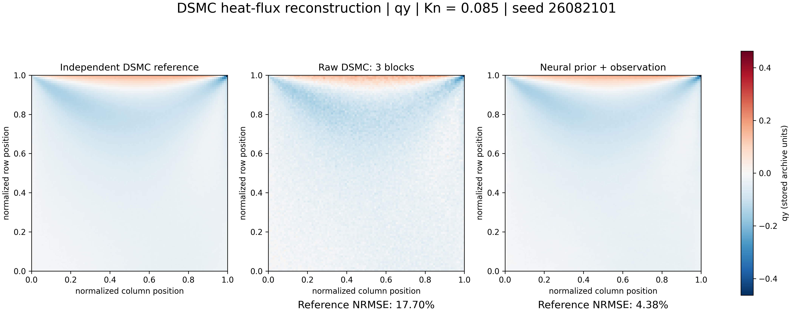
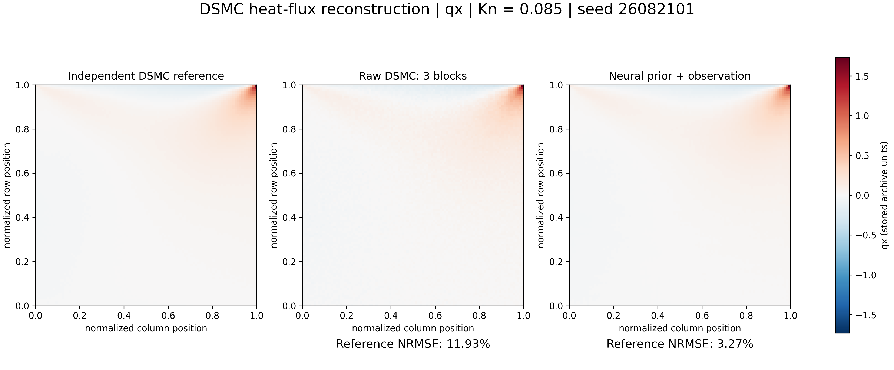
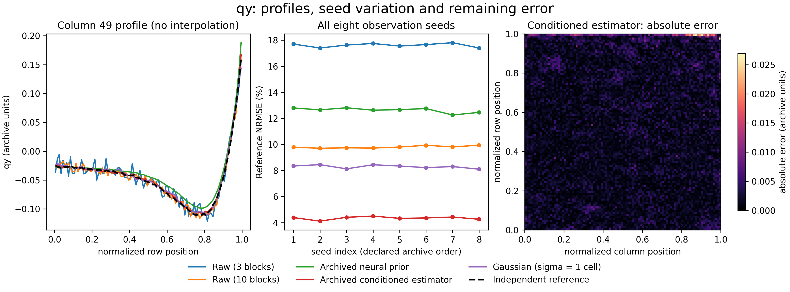
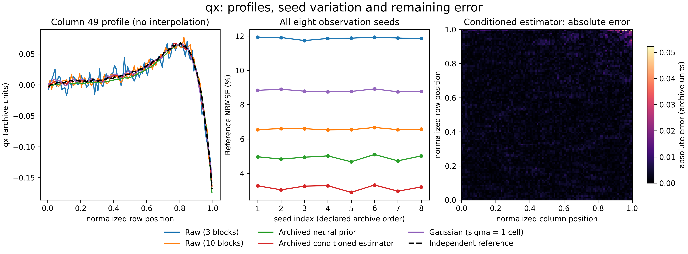

# Week 12 — real DSMC heat-flux reconstruction

Source: Ehsan Roohi, *Geometry-native machine learning reconstruction of DSMC
moment fields with support monitoring*, [arXiv:2609.01637](https://doi.org/10.48550/arXiv.2609.01637)
(2026); author-confirmed JCP submission, not claimed as a published JCP article.
The author-supplied `JCP2(1).zip` contains existing DSMC data and stored neural
predictions. These data predate FlowMLLab and were not generated by an LLM.

This is a re-evaluation of the historical prospective JCP2 archive, not new
neural training, new DSMC, or a new blind trial. We retain the archive's method
identifiers and do not claim every archived method equals the final paper
implementation. Only qx and qy are displayed; unsupported prior channels are
not filled or relabelled.

## Heat flux — shared colors, full range





Kn=0.085, lid speed 350 m/s. The first seed in the archive (26082101) is shown,
not the best-scoring seed. Native 100-by-100 values are displayed without
interpolation, clipping or invented spatial detail. Axes are normalized array
positions, not independently verified physical coordinates; color values retain
archive units. High-resolution rendering does not increase solver resolution.

## All eight seeds, profiles and remaining error





Mean direct reference NRMSE (%), equal-cell relative L2 norm:

| Method | qx | qy |
|---|---:|---:|
| Raw(3) | 11.87 | 17.61 |
| Raw(10) | 6.57 | 9.80 |
| Archived neural prior | 4.90 | 12.63 |
| Archived conditioned estimator | 3.15 | 4.34 |
| Gaussian, fixed sigma=1 cell | 8.81 | 8.29 |

The reference is an independent finite-budget DSMC average, not exact truth.
Raw(3) and Raw(10) are disjoint according to the archive, unlike the nested
synthetic warm-up. These scores are not reference-noise-deconvolved errors.
Noise reduction alone does not establish speedup, physical correctness or
generalization to other geometries/conditions.

[Full qy five-method display](cavity_qy.png) ·
[Full qx five-method display](cavity_qx.png) ·
[All 80 scores](metrics.csv) · [Provenance and hashes](research_manifest.json).
Each figure also has a matching PDF in this directory.

## Numerical verification and reproduction

The prediction bytes match the archive's frozen SHA-256 lock. We recomputed
64 stored-method scores; maximum discrepancy is 1.39e-9. Sixteen fresh
Gaussian-filter evaluations use a predeclared one-cell width, not test tuning.
The notebook verifies retained-file hashes and recomputes ten first-seed scores
from [the compact field subset](first_seed_fields.npz). This subset contains
first-seed fields and the shared reference, not all original research data.

```bash
python qa/build_week12_research_figures.py --archive /path/to/JCP2.zip --output tmp/new_week12_run
```

Use the six-member archive containing `predictions.npz` and `reference_stats.npz`.
The command refuses an existing output folder and never changes the input ZIP.
Bulk solver data and checkpoints are not redistributed. This author-approved
course subset does not assign a new blanket license to upstream research assets.
Plotting and course integration are AI-assisted; the DSMC evidence is from the
author's existing research.

[Notebook and lecture](../../notebooks/week12/README.md) ·
[Preserved synthetic warm-up](../week11_12_teaching/README.md).
