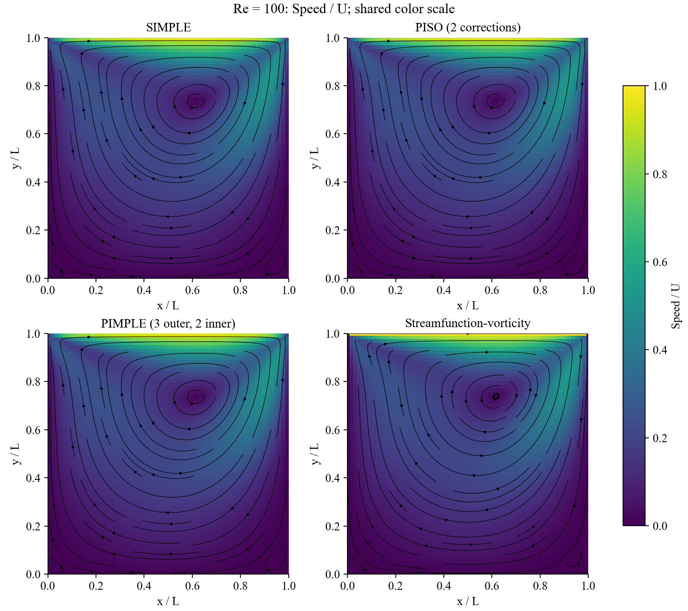

# Week 1.2 - Pressure-velocity coupling

An independent Re=100 extension after the original Week 1. The original
streamfunction-vorticity notebook remains unchanged.

[Open in Colab](https://colab.research.google.com/github/Ehsan-Roohi/FlowMLLab/blob/main/notebooks/week01_2/W1_2_Cavity_Pressure_Velocity.ipynb) | [Lecture](../../lectures/week01_2_pressure_velocity.pdf) | [Measured report](../../results/week01_2_pressure_velocity/README.md) | [Detailed guide](../../notebooks/week01_2/README.md)

## Class sequence

1. Inspect the four-formulation centerline and field comparisons.
2. Derive the pressure operator from MAC face continuity.
3. Trace SIMPLE, PISO and PIMPLE on the same momentum equations.
4. Check conservation, pressure gauge and algorithm limits.
5. Recompute one method and explain its measured cost and benchmark error.

## Student output

Velocity and pressure fields, Ghia centerlines, momentum and continuity
residuals, grid/refinement evidence and one scientifically bounded method choice.
Distinguish steady iteration from physical time. Only Re=100 steady behavior
is qualified; the next experiment is temporal refinement for a changing lid.

[Source](../../flowmllab/pressure_velocity.py) | [Tests](../../tests/test_pressure_velocity.py) | [Retained configurations and field hashes](../../results/week01_2_pressure_velocity/manifest.json)

[Return to course map](../../COURSE_MAP.md)
