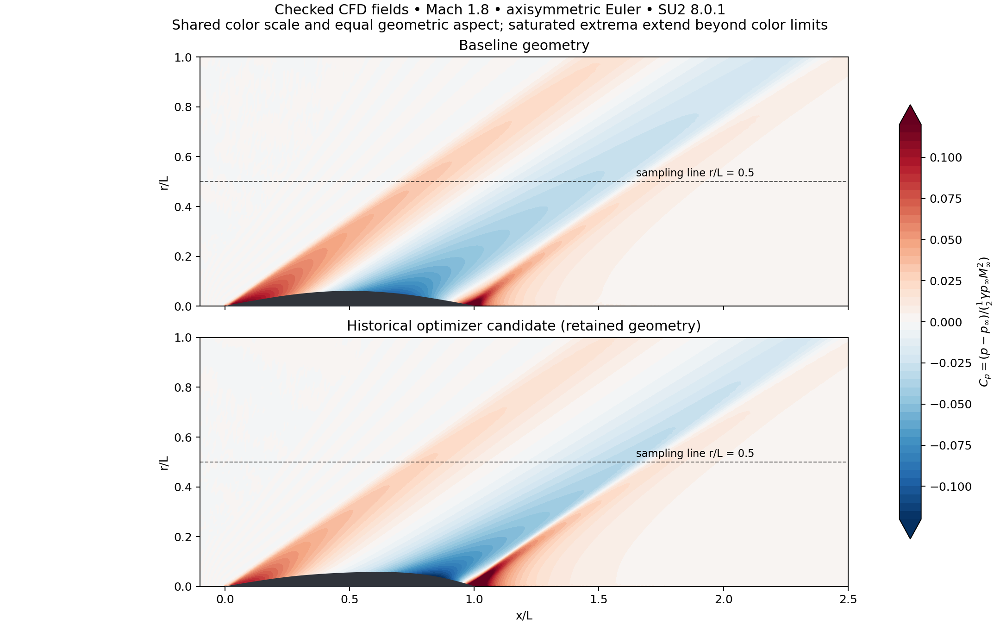

# Week 16 — Supersonic shape optimization

[Course home](../../README.md) · [All weeks](../README.md) · [← Week 15](../week15/README.md)

Supersonic shape optimization with verified Gmsh/SU2 CFD.

## Lecture and notebooks

**Lecture:** [Lecture 16](../../lectures/week16_supersonic_shape_optimization.pdf)

| Notebook | Read | Run / setup |
| --- | --- | --- |
| Supersonic shape optimization with Gmsh/SU2 evidence | [Open notebook](../../notebooks/week16/W16_Supersonic_Shape_Optimization.ipynb) | [Setup and reproduction guide](../../notebooks/week16/README.md) |

## What you will work on

- Supersonic shape optimization

## Suggested route

Read the lecture, then work through the notebooks in the listed order. Read each notebook’s setup instructions before running its cells; use the figures and evidence below to interpret the results. Follow the assignment guide to distinguish retained CFD evidence from computations reproduced in the notebook.

## Experiment and results

Build a CFD-to-learning design workflow for a fixed-volume supersonic body of revolution.
Use physically checked data to fit a pressure-signature surrogate, propose shapes, and assess retained designs with direct CFD.
The exercise distinguishes numerical verification, surrogate prediction error and the limits of near-field noise proxies.

**Problem:** Reduce near-field peak pressure at fixed body volume while constraining pressure drag. 
**CFD / data:** 44 Gmsh/SU2 **8.0.1** axisymmetric Euler cases at Mach 1.8, with 24 training, 6 validation, 8 test and 6 extrapolation cases. Eight finer-grid CFD references test the neural model; ten retained-design calculations and a three-grid Taylor–Maccoll study provide additional checks. 
**Learning method:** Compare POD-based ridge regression, MLP and Gaussian-process surrogates. The separately retained clean-data model is a fixed 32–32 tanh MLP with 12 POD coefficients and log pressure drag, fitted on the 24 training cases; its saved weights are audited without refitting.

**Results:** The retained model has 7.20% aggregate waveform error, 2.24% mean peak-pressure error and 2.27% mean drag error against the finer CFD references. Worst-case waveform error is 15.37%; extrapolation waveform error is 34.29%. Direct finer-grid CFD of the retained optimized geometry gives **20.66% peak-pressure reduction and 3.52% pressure-drag reduction**. These design gains belong to the directly checked retained geometry, not a newly verified optimum from the clean-data model. One alternative violates the drag constraint.

[Executed notebook and assignment](../../notebooks/week16/README.md) · [Lecture](../../lectures/week16_supersonic_shape_optimization.pdf) · [Numerical evidence](../../results/week16_lowboom/README.md)

The finest Taylor–Maccoll cone pressure error is 1.16%. Atmospheric propagation and ground-level PLdB are not computed. The NASA SEEB-ALR reproduction failed its numerical and physical checks and remains a clearly labeled deferred research appendix; no successful NASA validation is claimed.

---

[Course home](../../README.md) · [All weeks](../README.md) · [← Week 15](../week15/README.md)
