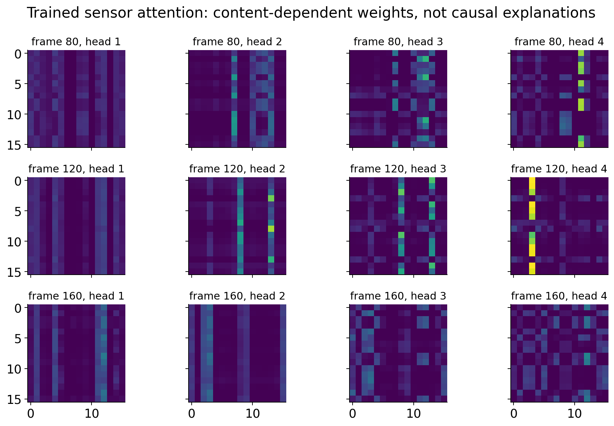

# Week 17 — Attention as a learned kernel

[Course home](../../README.md) · [All weeks](../README.md) · [← Week 16](../week16/README.md) · [Week 18 →](../week18/README.md)

Q/K/V algebra, permutation tests and attention interpretation.

## Lecture and notebooks

**Lecture:** [Lecture 17](../../lectures/week17_cfd_transformer.pdf)

| Notebook | Read | Run / setup |
| --- | --- | --- |
| Attention as a learned kernel | [Open notebook](../../notebooks/week17/W17_CFD_Transformer.ipynb) | [Setup and reproduction guide](../../notebooks/week17/README.md) |

## What you will work on

- Attention as a learned kernel on a wake

## Suggested route

Read the lecture, then work through the notebooks in the listed order. Read each notebook’s setup instructions before running its cells; use the figures and evidence below to interpret the results.

## Experiment and results

**Problem:** Which attention properties follow from the algebra, and which need physical evidence? 
**CFD / data:** Retained simulated wake observations; the figure inspects the saved SensorSet checkpoint on three Re110 frames. 
**Learning method:** Build Q, K and V, test permutation equivariance and vary temperature/key masks.

The four trained heads change with sensor content. Attention weights describe model computations; they do not establish causal physical influence.

[Student notebook](../../notebooks/week17/W17_CFD_Transformer.ipynb) · [Lecture](../../lectures/week17_cfd_transformer.pdf) · [Setup and assignment](../../notebooks/week17/README.md)

---

[Course home](../../README.md) · [All weeks](../README.md) · [← Week 16](../week16/README.md) · [Week 18 →](../week18/README.md)
