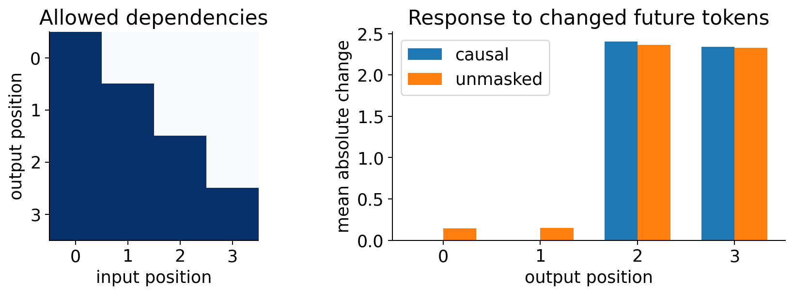

# Week 18 — Language modeling and causal decoding

[Course home](../../README.md) · [All weeks](../README.md) · [← Week 17](../week17/README.md) · [Week 19 →](../week19/README.md)

Next-character likelihood, perplexity and causal prefix invariance.

## Lecture and notebooks

**Lecture:** [Lecture 18](../../lectures/week18_cfd_transformer.pdf)

| Notebook | Read | Run / setup |
| --- | --- | --- |
| Language modeling and causal decoding | [Open notebook](../../notebooks/week18/W18_CFD_Transformer.ipynb) | [Setup and reproduction guide](../../notebooks/week18/README.md) |

## What you will work on

- From next-character likelihood to causal wake decoding

## Suggested route

Read the lecture, then work through the notebooks in the listed order. Read each notebook’s setup instructions before running its cells; use the figures and evidence below to interpret the results.

## Experiment and results

**Problem:** Train next-token predictors without revealing future inputs. 
**Data:** A small character model uses training-only vocabulary from course documents, with a separate validation document; wake coefficients provide the next-state example. 
**Learning method:** Shift targets, implement cross-entropy/perplexity and test every output position.

This mechanism experiment changes future inputs: masked earlier outputs stay invariant, while unmasked outputs change. The figure tests a decoder mechanism, rather than language-model quality; the required notebook trains a small instructional language model.

[Student notebook](../../notebooks/week18/W18_CFD_Transformer.ipynb) · [Lecture](../../lectures/week18_cfd_transformer.pdf) · [Setup and assignment](../../notebooks/week18/README.md)

---

[Course home](../../README.md) · [All weeks](../README.md) · [← Week 17](../week17/README.md) · [Week 19 →](../week19/README.md)
