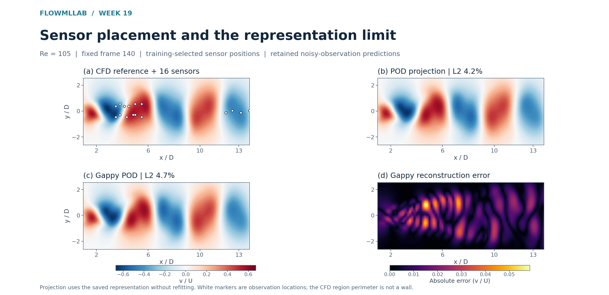

# Week 19 — Tokenization and sensor design

[Course home](../../README.md) · [All weeks](../README.md) · [← Week 18](../week18/README.md) · [Week 20 →](../week20/README.md)

Patch inversion, POD representation floors and noise-aware sensing.

## Lecture and notebooks

**Lecture:** [Lecture 19](../../lectures/week19_cfd_transformer.pdf)

| Notebook | Read | Run / setup |
| --- | --- | --- |
| Tokenization and sensor design | [Open notebook](../../notebooks/week19/W19_CFD_Transformer.ipynb) | [Setup and reproduction guide](../../notebooks/week19/README.md) |

## What you will work on

- Tokenization and noise-aware sensor design

## Suggested route

Read the lecture, then work through the notebooks in the listed order. Read each notebook’s setup instructions before running its cells; use the figures and evidence below to interpret the results.

## Experiment and results

**Problem:** How do observation design and tokenization constrain reconstruction? 
**CFD / data:** The retained 32 by 78 fluid-region wake fields and 16 sensors selected from the training representation. 
**Learning method:** Invert patches, compute the POD floor and solve noise-conditioned gappy reconstruction.

At Re105 frame 140, white markers locate the 16 sensors. Velocity contours compare the CFD reference, its projection into the saved training POD basis and noisy-observation gappy-POD reconstruction. The projection is a truth-dependent representation diagnostic. The notebook also compares point, patch and single-state token storage.

[Student notebook](../../notebooks/week19/W19_CFD_Transformer.ipynb) · [Lecture](../../lectures/week19_cfd_transformer.pdf) · [Setup and assignment](../../notebooks/week19/README.md)

---

[Course home](../../README.md) · [All weeks](../README.md) · [← Week 18](../week18/README.md) · [Week 20 →](../week20/README.md)
