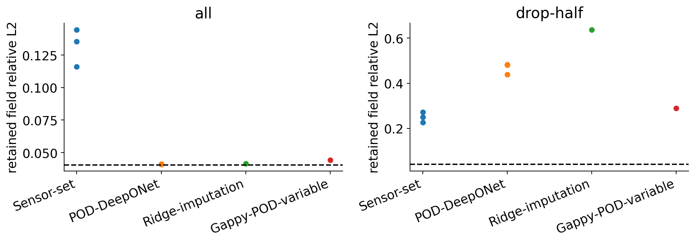

# Week 20 — Learning with missing sensors

[Course home](../../README.md) · [All weeks](../README.md) · [← Week 19](../week19/README.md) · [Week 21 →](../week21/README.md)

Sensor-to-field reconstruction, baselines and validation-only selection.

## Lecture and notebooks

**Lecture:** [Lecture 20](../../lectures/week20_cfd_transformer.pdf)

| Notebook | Read | Run / setup |
| --- | --- | --- |
| Learning with missing sensors | [Open notebook](../../notebooks/week20/W20_CFD_Transformer.ipynb) | [Setup and reproduction guide](../../notebooks/week20/README.md) |

## What you will work on

- Sensor-to-field learning with missing observations

## Suggested route

Read the lecture, then work through the notebooks in the listed order. Read each notebook’s setup instructions before running its cells; use the figures and evidence below to interpret the results.

## Experiment and results

**Problem:** Reconstruct a velocity field when some observations are unavailable. 
**CFD / data:** Re90/Re110 fitting, Re100 selection and previously inspected Re105 retained evaluation. 
**Learning method:** Compare SensorSet, POD-DeepONet, ridge imputation and variable-sensor gappy POD using the same observations.

The all-sensor and fixed half-sensor panels show the retained recipe tradeoff; the dashed line is the POD representation floor. A separate [paired three-seed augmentation ablation](../../results/transformer_sensor_ablation/README.md) helps distinguish training-recipe effects from architecture claims.

[Student notebook](../../notebooks/week20/W20_CFD_Transformer.ipynb) · [Lecture](../../lectures/week20_cfd_transformer.pdf) · [Setup and assignment](../../notebooks/week20/README.md)

---

[Course home](../../README.md) · [All weeks](../README.md) · [← Week 19](../week19/README.md) · [Week 21 →](../week21/README.md)
