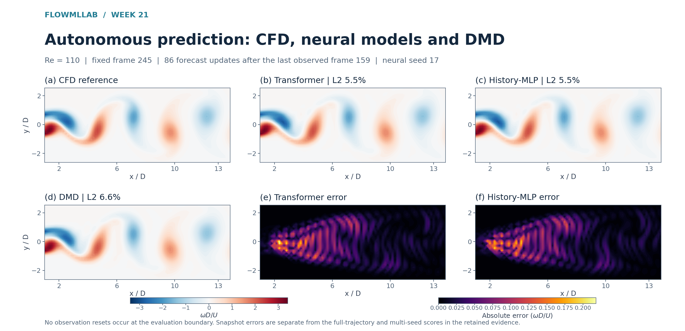

# Week 21 — Autonomous prediction and phase

[Course home](../../README.md) · [All weeks](../README.md) · [← Week 20](../week20/README.md) · [Week 22 →](../week22/README.md)

History-MLP/DMD comparisons, representation error and rollout diagnostics.

## Lecture and notebooks

**Lecture:** [Lecture 21](../../lectures/week21_cfd_transformer.pdf)

| Notebook | Read | Run / setup |
| --- | --- | --- |
| Autonomous prediction and phase | [Open notebook](../../notebooks/week21/W21_CFD_Transformer.ipynb) | [Setup and reproduction guide](../../notebooks/week21/README.md) |

## What you will work on

- Autonomous prediction: representation, phase and dynamics

## Suggested route

Read the lecture, then work through the notebooks in the listed order. Read each notebook’s setup instructions before running its cells; use the figures and evidence below to interpret the results.

## Experiment and results

**Problem:** Forecast an uninterrupted wake trajectory without subsequent observation resets. 
**CFD / data:** Re110 fitting frames 0–159, autonomous validation 160–209 and retained evaluation 210–280. 
**Learning method:** Compare a causal Transformer, History-MLP, DMD and persistence; separate representation error from dynamics and inspect frequency/phase fits.

Vorticity contours compare the CFD reference, causal Transformer, History-MLP and DMD at frame 245, 86 forecast updates after the last observed frame 159. The two spatial-error panels share a scale. Panel L2 values describe this snapshot; full-trajectory, representation and multi-seed comparisons remain in the notebook and retained evidence.

[Student notebook](../../notebooks/week21/W21_CFD_Transformer.ipynb) · [Lecture](../../lectures/week21_cfd_transformer.pdf) · [Setup and assignment](../../notebooks/week21/README.md)

---

[Course home](../../README.md) · [All weeks](../README.md) · [← Week 20](../week20/README.md) · [Week 22 →](../week22/README.md)
