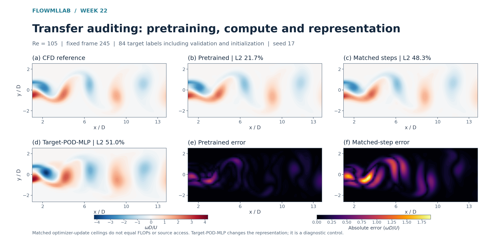

# Week 22 — Transfer and information budgets

[Course home](../../README.md) · [All weeks](../README.md) · [← Week 21](../week21/README.md)

Target-label accounting, matched updates and representation controls.

## Lecture and notebooks

**Lecture:** [Lecture 22](../../lectures/week22_cfd_transformer.pdf)

| Notebook | Read | Run / setup |
| --- | --- | --- |
| Transfer and information budgets | [Open notebook](../../notebooks/week22/W22_CFD_Transformer.ipynb) | [Setup and reproduction guide](../../notebooks/week22/README.md) |

## What you will work on

- Audit transfer before calling it a foundation model

## Suggested route

Read the lecture, then work through the notebooks in the listed order. Read each notebook’s setup instructions before running its cells; use the figures and evidence below to interpret the results.

## Experiment and results

**Problem:** Audit a transfer benefit before attributing it to pretraining. 
**CFD / data:** Re90 source and Re100/Re105/Re110 retained targets; budgets of 44, 84 and 154 target frames include validation and initialization observations. 
**Learning method:** Compare scratch, pretrained, matched-update, target-POD-MLP and DMD controls under fixed rollout initialization.

This fixed Re105 frame-245 example uses 84 total target labels and seed 17. Vorticity contours compare pretrained, matched-update scratch and target-POD-MLP predictions with CFD; shared error scales show the pretrained and matched-update residuals. Matched update ceilings do not equal FLOPs or source access, and target-POD-MLP changes the representation. The notebook and retained evidence cover all three Reynolds numbers, budgets and seeds.

[Student notebook](../../notebooks/week22/W22_CFD_Transformer.ipynb) · [Lecture](../../lectures/week22_cfd_transformer.pdf) · [Setup and assignment](../../notebooks/week22/README.md)

---

[Course home](../../README.md) · [All weeks](../README.md) · [← Week 21](../week21/README.md)
